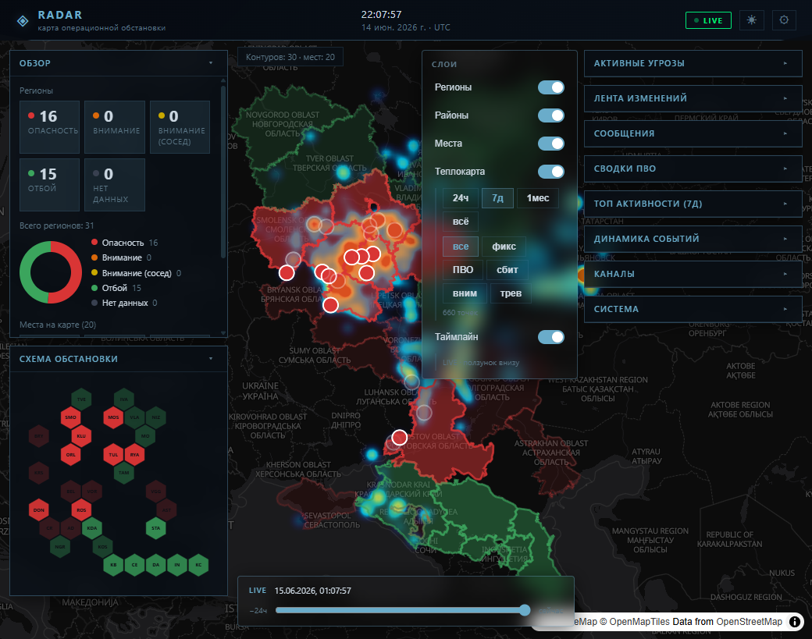
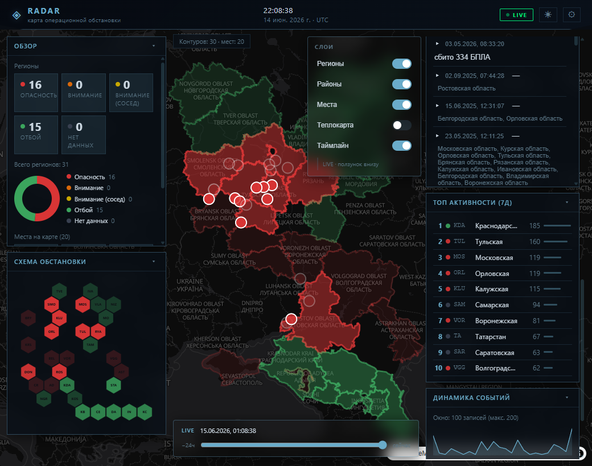
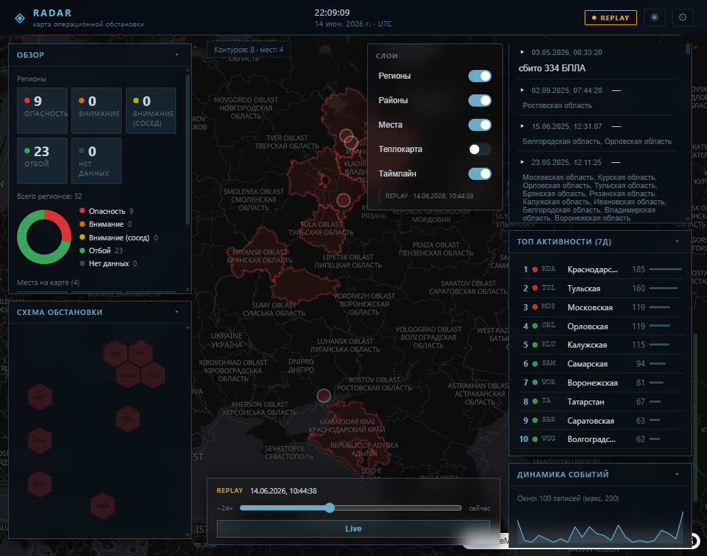
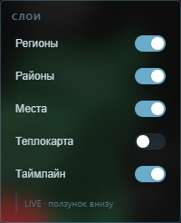
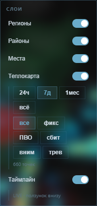
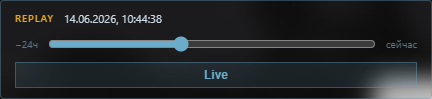
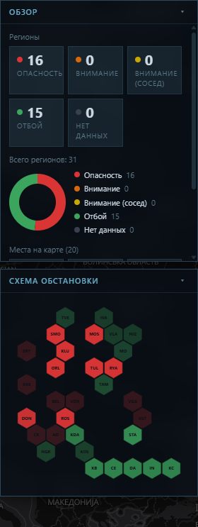
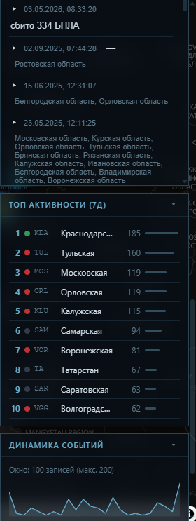
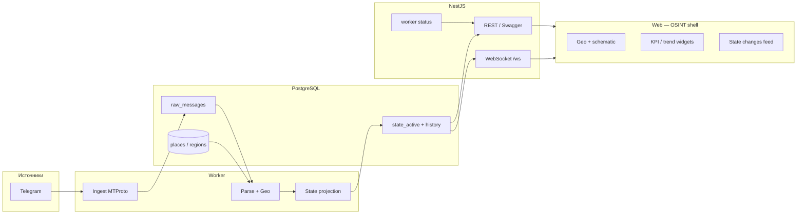

# Radar

**OSINT-платформа оперативной обстановки:** разрозненные текстовые источники → структурированные **геопривязанные события** → **live-карта (COP)** и интерфейс принятия решений.

Не BI и не «ещё один чат-агрегатор». Это **Common Operational Picture (COP)** / situational awareness для OSINT: ingest из разных каналов, parse pipeline с типами событий, trust-aware geo, operational fold статусов, WebSocket-дельты и glass-дашборд поверх MapLibre.

Тип события **не зашит в платформу** — домен задаётся парсером и словарём (`event_type`, `stateLevel`). Сейчас в проде хорошо отработаны каналы воздушных угроз (Telegram), но та же архитектура принимает любые источники с текстом и координатами/топонимами: RSS, admin-ingest, backfill, будущие адаптеры.

**Запуск и настройка:** [docs/setup-and-configuration.md](docs/setup-and-configuration.md) · **Quickstart:** [docs/getting-started.md](docs/getting-started.md) · **Шпаргалка:** [docs/cheatsheet.md](docs/cheatsheet.md) · **Доки:** [docs/README.md](docs/README.md) · **План:** [docs/plan.md](docs/plan.md) · **Домен:** [docs/domain/README.md](docs/domain/README.md) · **Trust мест:** [docs/place-trust-explained.md](docs/place-trust-explained.md)



---

## Что это

| Измерение | Radar |
|-----------|--------|
| **Класс продукта** | OSINT COP / operational awareness / СППР-lite |
| **Вход** | Telegram (MTProto), ручной admin-ingest, backfill; расширяемые провайдеры |
| **Ядро** | Parse pipeline + geo enrichers + region/place state projection |
| **События** | Любые типы с геопривязкой (`event_type` + `stateLevel`), не только «воздушные» |
| **Выход** | REST + WS, карта, KPI-виджеты, журнал смен, heatmap, Time Machine, лента системных событий |
| **Не делает** | Не заменяет официальные оповещения; не юридическое «доказательство» |

**Миссия:** сократить путь от «увидел сигнал в источнике» до «понял, где событие и как менялась обстановка» — в секунды, на одном экране.

---

## Для кого

| Аудитория | Ценность |
|-----------|----------|
| Граждане и локальные сообщества | Карта и лента по региону без ручного мониторинга десятков каналов |
| Мониторинговые команды | Единый COP по геопривязанным событиям, ingest-провайдеры, worker probe |
| Аналитики | История смен статусов, heatmap, Time Machine, batch parse reports |
| Разработка | Монорепо `worker → API → web`, воспроизводимые geo-артефакты, Zod-контракты |

---

## Конвейер данных

1. **Ingest** — GramJS live + poll fallback, backfill, dedup raw.
2. **Parse** — классификация и типизация события (`event_type`, `stateLevel`), извлечение локаций → `event_locations`.
3. **Geo** — artifacts-first, enrichers (`cache → dadata → nominatim → llm`), place trust.
4. **Read-line** — `foldMapState(facts, asOf)` → snapshot карты (live и historical).
5. **Delivery** — REST snapshot, WS diff poller, UI **Time Machine** (`MapTimelineBar`) и **теплокарта** (`GET /map/events/heatmap`).

> Сервис повышает **наблюдаемость** и скорость понимания картины; решения пользователь принимает сам.

---

## Сейчас в продукте

### Web — OSINT-оболочка

- **Layout:** карта фоном, glass-рейлы слева/справа, ломаный header (UTC-часы, **LiveBadge** = WS + API/БД). Правый рейл — панели **свёрнуты по умолчанию**. Поверх карты — **панель «Слои»**, внизу — **таймлайн** (если слой включён), **лента системных событий** — правый нижний угол.
- **Виджеты** (реестр `widgetRegistry`, toggles в ⚙):
  - **Гео-карта** — MapLibre, контуры субъектов (fill + inset outline), маркеры places, HUD-статистика.
  - **Схема** — layout.json, heat по `stateLevel`.
  - **Обзор** — KPI по уровням + donut.
  - **Активные угрозы**, **Лента изменений** — `GET /api/map/events/recent` (только события с `event_locations`).
  - **Сообщения** — `GET /api/map/messages/recent` (все raw: шум/meta/parse/clear без loc). См. [docs/web-map-feeds.md](docs/web-map-feeds.md).
  - **Macro-сводки** — агрегированные отчёты (`GET /api/map/pvo-reports`, → D6: `/map/event-feed`).
  - **Топ активности**, **Динамика событий** — sparkline + BarMini по журналу.
  - **Каналы**, **Система** — ingest providers, worker probe, WS/db health.
- **Слои карты** (`MapLayersPanel`, toggle + вложенные настройки):
  - **Регионы / Районы / Места** — GeoJSON-контуры и маркеры operational fold.
  - **Теплокарта** — raise-события из `event_locations` (MapLibre heatmap + точки на zoom). Период: **24ч / 7д / 1мес / всё**. Фильтр типов: **все**, **фикс**, **перех**, **сбит**, **вним**, **трев**. Счётчик точек в панели. API: `GET /api/map/events/heatmap?period=&until=&eventTypes=`.
  - **Таймлайн** — вкл/выкл нижний док; подсказка LIVE / REPLAY в панели слоёв.
- **Time Machine** (`MapTimelineBar`): scrub по окну TTL (24 ч), режимы **LIVE** / **REPLAY**, `GET /api/map/snapshot?asOf=`. В replay WS отключён, heatmap и fold синхронизируются с маркером `until`. Кнопка **Live** — возврат к текущей карте.
- **Лента системных событий** (`AppLogOverlay`, `appLogStore`) — toast-стек в правом нижнем углу viewport: загрузка/ошибки REST по виджетам и слоям карты, reconnect WS, catch admin/store. Уровни **info · warn · error**, dedup 15 с, TTL 60 с, буфер до 30 записей. Порог: `VITE_APP_LOG_LEVEL` (default `warn`).
- **Детали региона** — оверлей по клику на субъект (история событий региона).
- **Realtime:** `mapStore` — fold snapshot + WS diff; historical mode через `historicalAsOf$`.
- **Тема:** light/dark (`data-theme`), design-system primitives, тонкие accent-скроллбары.

#### Скриншоты

**Полный экран**

Теплокарта (7д) + таймлайн LIVE:


Operational fold — регионы/places, без heatmap:



Time Machine REPLAY (`GET /map/snapshot?asOf=`):



**Панели**

Слои карты (toggle):



Слои + фильтры теплокарты:



Таймлайн LIVE:


Таймлайн REPLAY + кнопка «Live»:



Левый рейл — KPI и схема:



Правый рейл — ленты, топ активности, динамика:



Лента системных событий (правый нижний угол — загрузка/ошибки API, WS):


Ранний shell (до слоёв heatmap/timeline): [`dashboard-osint-shell.png`](docs/assets/dashboard-osint-shell.png)

Все файлы: [`docs/assets/`](docs/assets/).

### Backend / worker

- NestJS API, Swagger `/api/docs`, PostgreSQL + TypeORM.
- WS gateway, `MapFoldRealtimePoller` (diff fold snapshot).
- Worker: parse pipeline, outbox events.
- **Live ingest fixes:** `getPeerId` для GramJS, poll fallback, orchestrator recovery.
- **Worker probe:** HTTP `:3010/status`, REST `GET /api/worker/status`.
- **Map state:** TTL на read-line (fold); каскадный place clear при региональном отбое — в fold loader.
- Geo CLI: `vendor → sync → seed → db:apply`.

---

## Roadmap (ещё не в UI / в работе)

- 🎯 ETA / курс / траектория подлёта (Kalman, Deck.gl — см. [docs/roadmap-tracking-forecasting.md](docs/roadmap-tracking-forecasting.md)).
- 🔔 Push / геозонные алерты.
- 🧾 Архив с полнотext search и карточкой события.
- 📊 Расширенная аналитика и экспорт срезов.
- 🗺️ Треки, эллипсы прогноза, слои Kill/Pass (RFC tracking pipeline).

---

## Архитектура (упрощённо)


```mermaid
flowchart LR
  subgraph src[Источники]
    TG[Telegram]
  end

  subgraph worker[Worker]
    ING[Ingest MTProto]
    PAR[Parse + Geo]
    PRJ[State projection]
  end

  subgraph data[PostgreSQL]
    RAW[raw_messages]
    ST[state_active + history]
    GEO[(places / regions)]
  end

  subgraph api[NestJS]
    REST[REST / Swagger]
    WS[WebSocket /ws]
    PROBE[worker status]
  end

  subgraph ui[Web — OSINT shell]
    MAP[Geo + schematic]
    KPI[KPI / trend widgets]
    FEED[State changes feed]
  end

  TG --> ING --> RAW
  RAW --> PAR --> PRJ --> ST
  GEO --> PAR
  ST --> REST
  ST --> WS
  REST --> ui
  WS --> ui
  PROBE --> REST
```

### Макет UI

Скриншоты — в [§ Скриншоты](#скриншоты) и hero выше. Схема зон:

```
header: UTC · LiveBadge · theme · widget toggles
left rail:   Обзор (KPI + donut) · Схема          [развёрнуты]
background:  Гео-карта (MapLibre) + HUD stats/log
map overlay: Панель «Слои» (регионы · районы · места · теплокарта · таймлайн)
bottom dock: MapTimelineBar (−24ч … сейчас, LIVE/REPLAY)  [если слой «Таймлайн» вкл]
log rail:    AppLogOverlay — toast info/warn/error (правый нижний угол)
right rail:  Угрозы · Лента · Сообщения · Macro · Топ · Динамика · Каналы · Система  [свёрнуты]
```

---

## Шпаргалка (операции)

**SSOT команд:** [docs/radar-cli.md](docs/radar-cli.md) · ingest/SQL/UI: [docs/cheatsheet.md](docs/cheatsheet.md) · REST: [docs/shpargalka-operacii.md](docs/shpargalka-operacii.md)

```powershell
npm run radar -- <domain> <action>   # корень репо, PowerShell
```

**Минимум `.env`:** `DATABASE_URL`, `RADAR_STORAGE_MODE=db`, `RADAR_SESSIONS_DIR=.radar/sessions`

### Частые команды

| Задача | Команда |
|--------|---------|
| Первый запуск | `npm run radar -- stack cold-up` |
| Dev + worker | `npm run radar -- stack dev --full` |
| Миграции | `npm run radar -- stack migrate` |
| Geo-каталог | `npm run radar -- geo catalog:import` |
| Backfill | `npm run radar -- ingest backfill -- --all-bindings --batch-size=100` |
| **Reparse / карта** | `npm run radar -- parse run` |
| Статус очередей | `npm run radar -- pipeline status` |

Таблицы **radar ↔ legacy** по всем доменам — только в [radar-cli.md](docs/radar-cli.md).

| URL | Ожидание |
|-----|----------|
| http://127.0.0.1:3000/api/ready | `"status":"ready"` |
| http://127.0.0.1:5173 | OSINT-дашборд |
| http://127.0.0.1:3000/api/docs | Swagger |
| http://127.0.0.1:3000/api/worker/status | probe worker |

```powershell
node scripts/ws-smoke.mjs   # или: npm run radar -- dev ws-smoke
curl.exe -s "http://127.0.0.1:3000/api/map/snapshot" | node -e "let d='';process.stdin.on('data',c=>d+=c);process.stdin.on('end',()=>{const j=JSON.parse(d);console.log('regions',j.regions?.length,'places',j.places?.length)})"
curl.exe -s "http://127.0.0.1:3000/api/map/events/heatmap?period=7d" | node -e "let d='';process.stdin.on('data',c=>d+=c);process.stdin.on('end',()=>{const j=JSON.parse(d);console.log('heatmap',j.meta?.count,'points')})"
```

### Ingest (Telegram → БД)

```powershell
npm run radar -- ingest session:deploy
npm run radar -- ingest manifest:import
npm run radar -- ingest backfill -- --all-bindings --batch-size=100
npm run worker:dev
```

Подробно: [cheatsheet § Ingest](docs/cheatsheet.md#ingest-от-нуля-до-live) · [ingest-providers.md](docs/ingest-providers.md).

### Parse / geo

См. [radar-cli.md § Частые](docs/radar-cli.md#частые-команды) и [§ pipeline / geo](docs/radar-cli.md#pipeline--parse-очереди-сбросы).

### Диагностика

| Симптом | Действие |
|---------|----------|
| Карта пустая после ingest | `npm run radar -- parse run` |
| Ingest не в БД | `RADAR_STORAGE_MODE=db`, перезапуск worker |
| Нет каналов | `radar ingest manifest:import`, provider `active` |
| `[api] EBUSY` при dev | stop node → удалить `packages/api/dist` → `radar stack dev` |

```powershell
node scripts/query-ingest-status.mjs
```

---

## CQRS + Domain Events

- Write-side публикует доменные события в outbox `domain_events`.
- Read-side отдает агрегированные данные через `api/events`, `api/regions`, `api/admin/*`.
- `OutboxRelay` доставляет новые события во внутренний `InProcessEventBus`.
- В воркере подключены встроенные подписчики `ParseAttemptLogger` и `MetricsAggregator`.
- Для телеметрии и админ-операций добавлен HLD-каркас `packages/admin-bot`.

### Runtime geo enrichment (актуальный контур)

- `raw` сначала проходит классификацию (`noise/meta/event`).
- Если это event: берется базовый регион из локальных артефактов/словаря.
- Далее запускается цепочка enrichers (`cache -> dadata -> nominatim -> llm`).
- Ответ провайдера матчится с каталогом (`fias -> alias -> name+region`).
- Если place найден: добавляется alias из сырого текста и дозаполняются missing-поля.
- Если place не найден, но валидация проходит: place создается и становится searchable для следующих сообщений.
- Для place хранится trust/provenance: `trust_state`, `is_trusted`, `trust_score`, `evidence_providers`.
- `place_evidence` хранит append-only историю подтверждений/кандидатов (`candidate|confirm|reject|enrich`) по провайдерам.
- `place_cache` хранит provider-aware техлог запросов и не заменяет основной каталог `places`.

### Place trust policy (runtime)

- `active` и `trusted` разделены: `active` — эксплуатационный флаг, `trusted` — уровень подтвержденности.
- Realtime правило:
  - `matched_existing` -> пишется evidence `confirm`, place обновляет trust-поля.
  - `created_new` -> пишется evidence `candidate`, trust остается на уровне policy-оценки источника.
- Базовые trust-score источников: `catalog=1.00`, `dadata=0.95`, `nominatim=0.80`, `llm=0.55`, `operator=1.00`, `system=0.70`.
- Для UI/read-side неподтвержденные места должны помечаться предупреждением (`needsAttention` в итерации 2).

## ⚙️ Статус репозитория

- **Монорепо:** `api`, `worker`, `web`, `shared` — cold start, dev-стек, TypeScript strict.
- **Web:** OSINT glass-shell, 10 виджетов, dual-theme DS, LiveBadge (WS + health), **AppLogOverlay**.
- **Карта:** MapLibre + schematic layout; read-line fold (`event_locations` → snapshot); inset contours; **слои** (регионы/районы/места/теплокарта/таймлайн); **Time Machine** + **heatmap** с фильтром типов.
- **Realtime:** WS `/ws` — `snapshot`, `region-state`, `place-state`, `warning`; GeoJSON — `GET /api/map/regions-geojson`.
- **Worker:** live MTProto + poll, probe `:3010`, fold read-line (без projection daemon).
- **Geo:** `vendor → artifacts → manifest → geo:seed → geo:db:apply`.
- **Ingest/parse:** db-mode, backfill V2, offline snapshots в `tests/`.

## Стек

- **Монорепозиторий:** npm workspaces — `packages/api`, `packages/worker`, `packages/web`, **`packages/shared`** (общие Zod-схемы и типы)
- **API:** NestJS, TypeORM, PostgreSQL, Swagger UI по адресу `/api/docs`
- **Adminer:** в Docker, см. [docker/adminer/README.md](docker/adminer/README.md) (порт по умолчанию **8080**)
- **pgAdmin:** в Docker, см. [docker/pgadmin/README.md](docker/pgadmin/README.md) (порт по умолчанию **5050**)
- **Worker:** GramJS (user MTProto), сессия в корне репозитория (см. ниже)
- **Web:** Vite + React; прокси **`/api`** и **`/ws`** → `http://127.0.0.1:3000`

## Запуск (Windows / PowerShell)

Полный сценарий (ingest, backfill, troubleshooting): **[docs/setup-and-configuration.md](docs/setup-and-configuration.md)**.

### Режимы одной строкой

| radar | Legacy | Процессы | Когда |
|-------|--------|----------|--------|
| **`stack cold-up`** | `cold:up` | install + build shared + **миграции** | первый раз |
| **`stack up`** | `up` | shared + API + web | UI без Telegram |
| **`stack dev --full`** | `dev` | + worker | полный стек |
| **`stack dev`** | `dev:app` | без worker | отладка карты/API |
| **`stack docker-dev`** | `docker:dev` | api/web/worker в Docker | dev hot-reload |
| **`stack docker-prod`** | `docker:prod` | baked dist + nginx | [docker-prod-stack.md](docs/docker-prod-stack.md) |

Подробнее: [docs/docker-dev-stack.md](docs/docker-dev-stack.md).

Перед `dev` / `dev:app` скрипты **`predev`** собирают `@radar/shared` и `@radar/api`. Web стартует **после** `http://127.0.0.1:3000/api/ready` (`scripts/dev-stack.mjs`).

### Первый запуск

```powershell
cd C:\path\to\radar
Copy-Item .env.example .env
npm run radar -- stack cold-up
npm run radar -- stack dev
# или с worker: npm run radar -- stack dev --full
```

Опции `stack cold-up` (legacy `cold:up`, можно комбинировать):

| Флаг | Эффект |
|------|--------|
| **`-Geo`** | `geo:vendor` → `geo:sync` → `geo:seed` → `geo:db:apply` (долго, нужен интернет) |
| **`-Tiles`** | self-host OSM basemap (`tiles:sync`, 30–90 мин, ≥30 GB) — [map-tiles-selfhost.md](docs/map-tiles-selfhost.md) |
| **`-Verbose`** | подробный вывод CLI (`RADAR_CLI_VERBOSE`) |
| **`-Dev`** | сразу запустить dev-стек после cold |
| **`-Llm`** | Docker profile `llm` (ollama + auto-pull `RADAR_LLM_MODEL` в volume) |
| **`-LlmUi`** | + Open WebUI |

Пример: `npm run radar -- stack cold-up -- -Geo -Dev`

### Проверка после старта

| URL | Ожидание |
|-----|----------|
| [http://127.0.0.1:3000/api/health](http://127.0.0.1:3000/api/health) | health без БД |
| [http://127.0.0.1:3000/api/ready](http://127.0.0.1:3000/api/ready) | `"status":"ready"` |
| [http://127.0.0.1:3000/api/docs](http://127.0.0.1:3000/api/docs) | Swagger |
| [http://127.0.0.1:5173](http://127.0.0.1:5173) | OSINT-дашборд (geo + KPI + feed) |
| [http://127.0.0.1:3000/api/worker/status](http://127.0.0.1:3000/api/worker/status) | probe worker (если поднят) |
| [http://127.0.0.1:8080](http://127.0.0.1:8080) | Adminer (PostgreSQL) |
| [http://127.0.0.1:5050](http://127.0.0.1:5050) | pgAdmin |

Проверка карты (PowerShell):

```powershell
curl.exe -s http://127.0.0.1:3000/api/map/snapshot | node -e "let d='';process.stdin.on('data',c=>d+=c);process.stdin.on('end',()=>{const j=JSON.parse(d);console.log('regions',j.regions?.length,'places',j.places?.length)})"
node scripts/ws-smoke.mjs
```

### Карта: REST + WebSocket

```text
Старт UI:  GET /api/map/snapshot  →  mapStore (регионы, places)
Replay:    GET /api/map/snapshot?asOf=ISO  →  fold на маркере; WS не применяется
Подключение:  WS /ws  →  snapshot (повтор) + дельты
Live:  region-state | place-state | warning  →  патч store (не refetch snapshot)
Гео-контуры:  GET /api/map/regions-geojson  →  только активные субъекты (≠ grey)
Теплокарта:  GET /api/map/events/heatmap?period=24h|7d|30d|all&until=&eventTypes=
```

| Слой UI | Источник данных |
|---------|-----------------|
| **Гео-карта / схема** | `regionsByCode$`, `placesById$` (snapshot + WS) |
| **Теплокарта** | `GET /api/map/events/heatmap` + `heatmapStore` (period, eventTypes, `until=asOf`) |
| **Time Machine** | `historicalAsOf$` → snapshot `?asOf=`; ползунок TTL 24 ч |
| **KPI / donut / топ** | `regionsByCode$` (derivations) |
| **Лента / динамика / сообщения / macro-сводки** | `stateChanges$`, `messagesFeed$`, `pvoReports$` (REST + WS / poll) |
| **Каналы / система** | `providersStore` (REST poll 30s) + `connectionStatus$` (WS) |
| **LiveBadge** | WS open + `/api/health` + `/api/ready`; в REPLAY — «исторический срез» |

Поллер WS читает diff fold snapshot(now). События **до перезапуска API** по WS не переигрываются — только snapshot при connect.

Данные на карте после ingest: `npm run radar -- parse run` (или phase pipeline).

**TTL карты (24 ч по умолчанию):** на read-line — факты старше окна не участвуют в fold. Env: `RADAR_MAP_STATE_TTL_HOURS` / `RADAR_MAP_STATE_TTL_MS`. Legacy `MapStateExpiryDaemon` и `*_status_read_model` удалены.

### LLM (опционально)

```powershell
docker compose --profile llm up -d
docker compose --profile llm-ui up -d
```

- Ollama: [http://127.0.0.1:11434/api/tags](http://127.0.0.1:11434/api/tags)
- Open WebUI: [http://127.0.0.1:3001](http://127.0.0.1:3001) (`OPEN_WEBUI_PORT`)

---

### Пошагово вручную

1. **`.env.example` → `.env`** в корне (`DATABASE_URL` обязателен).
2. `docker compose up -d`
3. `npm install` → `npm run radar -- stack migrate`
4. `npm run radar -- stack dev --full` или `stack dev` (см. таблицу режимов выше).

Подробности transpile/watch: Nest + `shared/dist` для API; Vite тянет схемы из `packages/shared/src`.

## Локальные GeoJSON (без submodules)

См. [data/geo/README.md](data/geo/README.md): **`vendor/`** (не в git) → **`geo:sync`** → **`artifacts/`** (коммитимые файлы + манифест).

### Geo tooling: что за что отвечает

- `geo:vendor` — скачивает/обновляет внешние репозитории регионов в `data/geo/vendor`.
- `geo:sync` — режет и переносит нужные файлы в `data/geo/artifacts` + пишет `manifest.json`.
- `geo:verify` — проверяет SHA-256 каждого артефакта против манифеста.
- `geo:seed` — заносит метаданные артефактов в `geo_dataset_file`.
- `geo:db:plan` — dry-run diff синка справочников (что добавится/обновится/деактивируется).
- `geo:db:apply` — применяет diff, пишет audit (`geo_sync_log`) и события outbox.

### Enrichers: use-cases

- **Dadata**: основной провайдер точного адресного обогащения (город/село/FIAS/координаты).
- **Nominatim**: fallback, когда Dadata не дала уверенный матч.
- **LLM enricher**: OpenAI-compatible адаптер (Ollama по умолчанию), работает как fallback и валидирует ответ через Zod.
- **CompositeEnricher**: цепочка провайдеров по приоритету.
- **CachingEnricher**: сначала cache (`place_cache`/in-memory), потом внешние вызовы.
- Базовый сценарий: если регион найден локально, используем словарь; если в тексте есть уточнение — добираем через enrichers.
- Для карт/time-machine статусы place вычисляются read-side из fold (`event_locations`); `cleared` — action=clear или отсутствие raise в TTL-окне.

### LLM runtime config (env)

- `RADAR_STORAGE_MODE`: режим хранилища worker (`memory|db|fs`), по умолчанию `memory`.
- `RADAR_LLM_GEOCODER_ENABLED`: включает/выключает LLM fallback.
- `RADAR_LLM_PROVIDER`: `ollama` или `openai-compatible`.
- `RADAR_LLM_BASE_URL`: endpoint OpenAI-compatible API, по умолчанию `http://127.0.0.1:11434/v1`.
- `RADAR_LLM_MODEL`: имя модели в runtime (`qwen2.5:3b` и т.п.).
- `RADAR_LLM_TIMEOUT_MS`, `RADAR_LLM_RETRY_COUNT`: сетевые guardrails.
- `RADAR_LLM_MAX_TOKENS`, `RADAR_LLM_TEMPERATURE`, `RADAR_LLM_JSON_MODE`: режим генерации.

Подробный гайд по параметрам семплинга, гибридному CPU+GPU режиму и сравнению локальных/облачных моделей:
- [docs/ollama-sampling-and-model-tuning.md](docs/ollama-sampling-and-model-tuning.md)

## Batch parser report

- `worker:parse:report` использует тот же production `ParsePipelineService`, что и Telegram write-side.
- CLI — это transport-обертка для оффлайн проверки качества парсинга и георезолва.
- Дефолты: `--input tests --outdir reports --format json --div file`.
- Для batch-репортов дефолтный режим хранения: `--storage-mode=fs`.
- Поддерживаются форматы: `json|yaml|csv`; режим деления: `file|record`.
- Флаг `--use-providers` включает enrich-цепочку поверх локального artifacts-first резолва.
- Для Ollama snap-check: `npm run worker:parse:snap:ollama -- --input tests/snap_001.txt` (проверяет `/api/tags` и запускает parse через LLM-enabled runtime).

## Parse inspect (agent debug)

- `worker:parse:inspect` — raw → groom/candidates/locations в `--out` dir для разбора агентом (не CI).
- SSOT: [docs/parse-inspect.md](docs/parse-inspect.md).
- Отличие от `parse:report`: inspect = один кейс + human trace; report = batch metrics.

## Worker и Telegram

- Сессии **не в `.env`**: только volume-слоты **`RADAR_SESSIONS_DIR`** (см. `worker:session:deploy`).
- **`TELEGRAM_API_ID` / `TELEGRAM_API_HASH`** — опционально; без них TEST ONLY `api_id` из доки tdesktop (ограничен). Свои — с [my.telegram.org](https://my.telegram.org).
- Первый вход — интерактивный deploy (TTY):

  ```bash
  npm run radar -- ingest session:deploy -- --slot tg-user-1 --kind mtproto_user
  npm run radar -- ingest session:probe -- --slot tg-user-1
  ```

### Raw Ingest Providers (db mode)

- **`RADAR_STORAGE_MODE=db`** — провайдеры и bindings в PostgreSQL, `IngestOrchestrator` + live Telegram adapters.
- Session slots на volume: **`RADAR_SESSIONS_DIR`** (см. [docs/ingest-providers.md](./docs/ingest-providers.md)).
- Admin: **`POST /api/admin/ingest/messages`** — ручной ingest; Swagger: `/api/docs` → `admin-ingest`.
- CLI (все параметры): **[docs/ingest-providers.md](./docs/ingest-providers.md#cli--справочник-команд)** — session, manifest, backfill.
- Backfill V2 (демон, схемы, эксплуатация): **[docs/backfill-v2-pipeline.md](./docs/backfill-v2-pipeline.md)**.
- CLI: `npm run radar -- ingest session:deploy`, `radar ingest manifest:import`, `radar ingest backfill -- --all-bindings --batch-size=100`.
- Docker worker (profile): `docker compose --profile worker up -d worker`.

## Секреты и dotenv-vault

- Пакет **`dotenv-vault` на npm** — это в основном **CLI** (`npx dotenv-vault`), а не замена `dotenv.config()` для расшифровки в рантайме.
- Локально приложения читают **`dotenv`** и корневой **`.env`** (не коммитится).
- Для зашифрованного репозиторного следа секретов используйте рабочий процесс **dotenv-vault / dotenvx** по их документации и пробрасывайте уже расшифрованные переменные в процесс (или подключите, например, **`@dotenvx/dotenvx`** при необходимости). Файл **`.env.vault`** можно коммитить; ключи — нет.

## Миграции TypeORM

Генерация (пример имени — последний аргумент):

```bash
npm run migration:generate -- src/migrations/RenameMe
```

Применение:

```bash
npm run radar -- stack migrate
```

Команды выполняются в пакете `@radar/api` через корневые npm-скрипты.

## Полезные скрипты (корень)

Полный список — **[docs/cheatsheet.md](docs/cheatsheet.md)** и **[docs/shpargalka-operacii.md](docs/shpargalka-operacii.md)**. Частые:

| radar | Legacy | Назначение |
|-------|--------|------------|
| `stack cold-up` / `up` / `dev` / `dev --full` | `cold:up`, `up`, `dev:app`, `dev` | см. [§ Шпаргалка](#шпаргалка-операции) |
| `parse run` | `parse-engine:rebuild:drain` | reparse + drain → карта |
| `geo catalog:import` | `geo:catalog:import -w @radar/api` | geo-каталог в БД |
| `map fold` | `map:fold:status` | диагностика fold |
| `stack migrate` | `migration:run` | миграции TypeORM |
| `npm run build` / `lint` / `typecheck` | — | CI-локально |
| `stack db:up` / `db:down` | `db:up` / `db:down` | Docker Postgres |
| `docker compose --profile llm up -d` | Ollama (опционально) |
