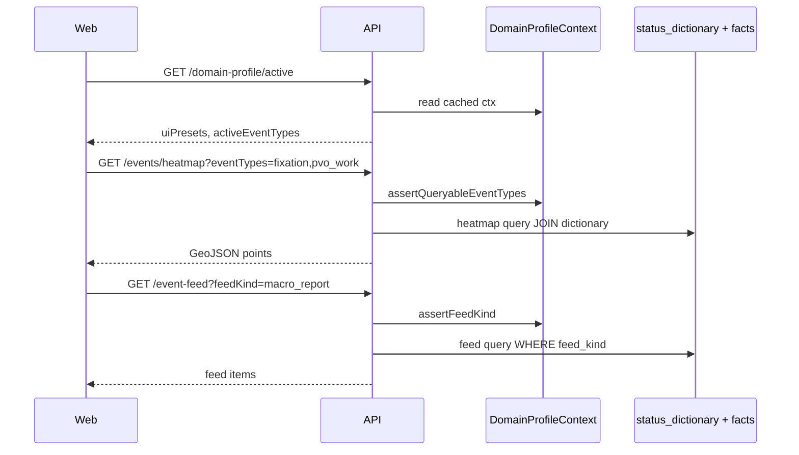

> **Имена таблиц:** актуальные — [database-table-naming.md](./database-table-naming.md). Ниже — исторический контекст.`n`n# ADR-014: Вынос доменной Р·РѕРЅС‹ БПЛА (Operational Domain Profile)

Дата: 2026-06-14  
Статус: **Предложено**

Связано: [ADR-003](./adr-003-phase-enrichment-accumulator.md), [ADR-008](./adr-008-kinematic-vs-static-events.md), [rfc/parse-processor-workspace.md](./rfc/parse-processor-workspace.md), [sdd/odp/](./sdd/odp/README.md), [sdd/tracking/](./sdd/tracking/README.md)

---

## Контекст

Продукт исторически заточен под **один OSINT-домен** (радар, Telegram-каналы, перехват, фиксации). Это проявилось в коде как **жёсткая привязка к одному домену**, хотя архитектурно уже есть задел под конфигурацию (`status_dictionary`, phase manifest, parse workspace RFC).

**Цель:** UI, парсеры и tracking настраиваются **фильтрами и манифестами**, без правки TypeScript при добавлении типа события, смене лексики или запуске второго домена (ракеты-only, другой регион, другой язык).

**Не цель:** переписать весь parse big-bang или сделать Turing-complete DSL правил в v1.

> 📖 **Пошагово простым языком:** [operational-domain-profile-walkthrough.md](./rfc/operational-domain-profile-walkthrough.md) — шаги D0–D5, **§13 карта миграции файлов**.

---

## Текущий coupling (аудит слоёв)

### Карта: где зашит «БПЛА-домен»

| Слой | Файл / артеfact | Coupling | Severity |
|------|-----------------|----------|----------|
| **Shared contracts** | `packages/shared/src/schemas/ingest/event-type.ts` | Закрытый `z.enum([fixation, …])` — новый тип = деплой | 🔴 высокий |
| **Shared UI filter** | `packages/shared/src/schemas/map/event-heatmap.ts` | `EVENT_HEATMAP_FILTER_TYPES` — хардкод подмножества | 🟠 средний |
| **Parse rules** | `packages/worker/src/domain/parsing/extractEventType.ts` | ~30 regex с `бпла`, `дрон`, `мвш`, `ракет` | 🔴 высокий |
| **Parse subject** | `extractEventSubject.ts` (same file) | Приоритет drone/rocket/mws | 🟠 средний |
| **Geo grooming** | `packages/worker/.../geoCatalog.ts` | Strip-prefix `(?:бпла\|фиксация\|…)` | 🟠 средний |
| **Dictionary DB** | `status_dictionary` | Есть `parser_hints[]`, но **не SSOT** для regex | 🟡 частично |
| **Map read** | `map-query.service.ts`, fold | JOIN по `status_dictionary` — **уже data-driven** | 🟢 OK |
| **Tracking (plan)** | `threatProfile: uav\|rocket\|balloon` | Enum в SDD; маппинг не в dictionary | 🟠 средний |
| **Product copy** | `docs/plan.md`, README | «радар по БПЛА» — маркeting, не код | 🟢 OK |

### Вывод по слоям

```text
в”Њв”Ђв”Ђв”Ђв”Ђв”Ђв”Ђв”Ђв”Ђв”Ђв”Ђв”Ђв”Ђв”Ђв”Ђв”Ђв”Ђв”Ђв”Ђв”Ђв”Ђв”Ђв”Ђв”Ђв”Ђв”Ђв”Ђв”Ђв”Ђв”Ђв”Ђв”Ђв”Ђв”Ђв”Ђв”Ђв”Ђв”Ђв”Ђв”Ђв”Ђв”Ђв”Ђв”Ђв”Ђв”Ђв”Ђв”Ђв”Ђв”Ђв”Ђв”Ђв”Ђв”Ђв”Ђв”Ђв”Ђв”Ђв”Ђв”Ђв”Ђв”Ђв”ђ
│  UI / API read-side     — частично OK (status_dictionary)   │
├─────────────────────────────────────────────────────────────┤
│  Shared Zod enums       — ЖЁСТКИЙ coupling (event types)    │
├─────────────────────────────────────────────────────────────┤
│  Worker parse domain    — ЖЁСТКИЙ coupling (regex rules)    │
├─────────────────────────────────────────────────────────────┤
│  Facts (mat_parse_event)  — нейтральны (event_type = string)  │
└─────────────────────────────────────────────────────────────┘
```

**Граница decouple:** между **domain pack (конфиг)** и **platform core (shared + worker shell)**.  
Facts остаются append-only; меняется **интерпретация** и **набор активных правил/фильтров**.

---

## Решение

### 1. Operational Domain Profile (ODP)

Единая сущность конфигурации «какой мир мы мониторим»:

```typescript
type OperationalDomainProfile = {
  id: string;                    // e.g. "uav_osint_ru_v1"
  title: string;                 // "БПЛА OSINT (РФ)"
  locale: string;                // "ru"
  isDefault: boolean;
  /** Активные коды из status_dictionary */
  activeEventTypes: string[];
  /** UI presets: heatmap, map layers, widgets */
  uiPresets: UiFilterPreset[];
  /** Маппинг для tracking threat_profile (ADR-007/013) */
  threatProfileRules: ThreatProfileRule[];
  /** Ссылки на rule packs парсера */
  parserRulePackIds: string[];
  /** Geo grooming: noise prefixes, promo patterns */
  geoGroomingPackId?: string;
};
```

**SSOT v1:** JSON-манifest в репо + Zod + import CLI (паттерн как `phase_definitions`).  
**v2:** строка в БД `operational_domain_profiles`, toggle в админке (enabled profile per deployment).

### 2. Разделение: Platform Core vs Domain Pack

| Platform Core (не знает про БПЛА) | Domain Pack `uav_osint_ru` |
|----------------------------------|----------------------------|
| `mat_parse_event`, `mat_parse_location` | Regex / processor rules |
| `status_dictionary` schema | Entries + hints для домена |
| `mapStateFold`, Time Machine | `state_level` mapping per type |
| Generic map API | UI filter presets |
| Tracking worker shell | `threatProfileRules`, kinematics profile |
| Parse workspace contract | EventTypeProcessor config |

Domain pack **не импортируется** в core как `if (бпла)` — только через **injected config** при bootstrap worker/web.

### 3. Event types — от open enum к dictionary-validated string

**Проблема:** `eventTypeSchema = z.enum([...])` блокирует новые коды.

**Путь (incremental):**

| Этап | Изменение |
|------|-----------|
| **E1** | `eventTypeCodeSchema = z.string().min(1)` в persistence; enum остаётся для **legacy compile-time** в worker tests |
| **E2** | Runtime validate: `status_dictionary.code` exists + active + in current ODP |
| **E3** | Убрать enum из public API; клиенты читают dictionary |

`EventType` type alias в†’ `string` СЃ branded optional `EventTypeCode` РёР· dictionary snapshot.

### 4. Parser rules — external rule pack

**Проблема:** `extractEventType.ts` — монолит regex.

**Решение:** Rule Pack manifest (YAML/JSON):

```yaml
# data/domains/uav_osint_ru/parser-rules.v1.yaml
schemaVersion: 1
domainProfileId: uav_osint_ru_v1
rules:
  - id: cleared_threat
    priority: 10
    pattern: "отбой.*(опасност|внимани|тревог|угроз)"
    flags: is
    eventType: cleared
  - id: pvo_stats_destroyed
    priority: 20
    pattern: "уничтожен[а-яё]*\\s+\\d+\\s+(?:украинских\\s+)?(?:бпла|беспилотн)"
    flags: i
    eventType: pvo_report
  # …
```

**Runtime:**

```typescript
/** Загружает упорядоченные правила из pack; SSOT в data/, не в TS. */
function classifyEventType(text: string, pack: ParserRulePack): string | null;
```

`extractEventType.ts` → thin wrapper / re-export для BC; golden tests остаются, источник правил — файл.

**Связь с parse RFC:** `EventTypeProcessor` читает тот же pack; workspace не дублирует regex.

### 5. UI filters — data-driven presets

**Проблема:** `EVENT_HEATMAP_FILTER_TYPES` захардкожен.

**Решение:**

```typescript
type UiFilterPreset = {
  id: string;                    // "heatmap_operational"
  surface: "heatmap" | "timeline" | "tracks" | "widgets";
  eventTypes: string[];          // codes from dictionary
  eventCategories?: string[];
  label: string;
  defaultEnabled?: boolean;
};
```

Web при старте:

```text
GET /map/status-dictionary?domainProfile=uav_osint_ru_v1
GET /map/domain-profile/active   в†’ uiPresets
```

`MapHeatmapControls` строит кнопки из **preset + dictionary titles**, не из const в shared.

### 6. Tracking threat_profile — mapping table, не хардкод в resolve

**Проблема (planned):** `resolveThreatProfile()` с литералами rocket/mws.

**Решение:** правила в ODP:

```typescript
type ThreatProfileRule = {
  threatProfile: "uav" | "rocket" | "balloon" | "unknown";
  when: {
    eventTypes?: string[];
    eventSubjects?: string[];
    eventCategories?: string[];
  };
};
```

Worker tracking загружает rules из active ODP; fallback `unknown`.

Kinematics (`PROFILE_KINEMATICS`) остаётся в shared как **physics SSOT**, не лексика БПЛА.

### 7. Geo grooming pack

Вынести prefix-strip из `geoCatalog.ts`:

```yaml
# data/domains/uav_osint_ru/geo-grooming.v1.yaml
stripLinePrefixes:
  - "^(?:бпла|угроза|опасность|внимание|фиксация|отбой)\\s+(?:по|на)?\\s*"
commercialNoisePatterns: [...]
```

### 8. Multi-domain (future, РЅРµ v1)

РћРґРёРЅ deployment = **РѕРґРёРЅ active ODP** (default).  
Позже: channel-level override (`ingest_bindings.domain_profile_id`) для смешанных инсталляций.

---

## Где живёт ODP: bundled vs on-premise

ODP — **данные**, не код. Платформа только **загружает pack** при старте; **откуда** читать — решает деплой.

### Три уровня (не путать)

| Уровень | Что | Кто владелец | Меняется как |
|---------|-----|--------------|--------------|
| **Platform core** | worker, api, web, shared | продукт / git | релиз monorepo |
| **Domain pack (ODP)** | manifest, parser-rules, geo-grooming, presets | продукт **или** заказчик | файлы / import, **без** форка core |
| **Runtime dictionary** | `status_dictionary` в БД | общий | миграции + admin/import |

Facts (`mat_parse_event`) нейтральны; ODP влияет на **parse + UI + tracking mapping**, не на схему facts.

### Режим A — Bundled (default, «из коробки»)

Pack **вшит в артеfact** деплоя:

```text
radar/
  data/domains/uav_osint_ru_v1/     в†ђ git + Docker image
    profile.manifest.json
    parser-rules.v1.yaml
    geo-grooming.v1.yaml
```

| | |
|---|---|
| **Когда** | managed SaaS, типовой «Радар БПЛА», dev/staging |
| **Env** | `DOMAIN_PACKS_PATH=data/domains` (default) |
| **Обновление** | релиз образа / git pull + restart worker |
| **Плюс** | zero-config, CI golden tests = bundled pack |

Опционально v2: npm `@radar/domain-uav-osint-ru` — тот же контент отдельным пакетом (лицензирование домена).

### Режим B — On-premise / customer-owned

Pack **вне** образа — volume или каталог заказчика:

```text
/opt/radar/domains/uav_osint_ru_v1/
  profile.manifest.json
  parser-rules.v1.yaml
  ...
```

| | |
|---|---|
| **Когда** | закрытый контур, свои каналы/лексика, правки без нашего git |
| **Env** | `DOMAIN_PACKS_PATH=/opt/radar/domains` |
| **Обновление** | правка YAML у заказчика → validate CLI → restart worker (v1) / reload (v2) |
| **Плюс** | core закрыт, домен настраивает SI/заказчик |

On-premise **≠ fork repo** — меняется только `domains/`, бинарники те же.

### Режим C — Hybrid (рекомендуем для prod)

```text
1. Bundled pack в образе     → fallback / demo / первый boot
2. DOMAIN_PACKS_PATH         → если каталог есть, читаем его (override)
3. OPERATIONAL_DOMAIN_PROFILE_ID → активный подкаталог
```

Loader:

```text
if DOMAIN_PACKS_PATH задан и существует → customer path
else → bundled data/domains внутри image
```

Starter pack в образе + override mount без пересборки.

### Режим D — Import в БД (v2)

```bash
domain:manifest:import --path /opt/radar/domains/uav_osint_ru_v1
```

→ `operational_domain_profiles` (+ опционально rules snapshot в JSONB).

| | |
|---|---|
| **Когда** | политика «no bind mounts», только DB |
| **Authoring** | git у заказчика → import CLI |
| **Runtime SSOT** | БД |

Один deployment — **один** source: `DOMAIN_PACK_SOURCE=file|db` (не оба одновременно как SSOT).

### Кто что настраивает (on-premise)

| Роль | Меняет | Не трогает |
|------|--------|------------|
| Vendor | core, bundled pack | — |
| Заказчик / SI | pack YAML, `DOMAIN_PACKS_PATH`, import dictionary | TypeScript |
| Аналитик (v2) | titles / ui_group в dictionary | regex rules |

### Docker (on-prem)

```yaml
worker:
  environment:
    OPERATIONAL_DOMAIN_PROFILE_ID: uav_osint_ru_v1
    DOMAIN_PACKS_PATH: /etc/radar/domains
  volumes:
    - ./customer-domains:/etc/radar/domains:ro
```

Web читает ODP **только через API** (`GET /map/domain-profile/active`), не filesystem.

### Default для «Радар»

| Среда | Режим |
|-------|--------|
| dev / CI | **A** bundled |
| managed prod | **C** bundled + optional mount |
| on-prem контракт | **B** или **C** |

**v1:** file loader + `DOMAIN_PACKS_PATH` (режимы **A + C**). DB import (**D**) — v2.

---

## Покрытие: ODP ≠ один manifest

**Честный ответ:** один `profile.manifest.json` **не снимает** весь coupling. ODP — это **набор pack-файлов + dictionary + доработка loader в core**.

### Что покрывает только manifest

| Область | Поля ODP |
|---------|----------|
| Какие типы событий активны в домене | `activeEventTypes` |
| Кнопки/фильтры heatmap, виджеты | `uiPresets` |
| БПЛА vs ракета vs шар для треков | `threatProfileRules` |
| Ссылки на другие файлы | `parserRulePackIds`, `geoGroomingPackId` |

≈ **30–40%** текущего domain coupling.

### Что требует отдельных pack-файлов (не manifest)

| Сейчас в коде | Pack | Фаза |
|---------------|------|------|
| `extractEventType.ts` (~30 regex) | `parser-rules.v1.yaml` | D1 |
| `extractEventSubject()` | тот же pack или subject rules | D1 |
| `geoCatalog.ts` prefix strip | `geo-grooming.v1.yaml` | D1 |
| `classifyContentKind.ts` (EVENT_HINTS, бпла…) | `content-kind.v1.yaml` (v2, опционально) | backlog |
| `extractPvoStats.ts` | `pvo-stats-rules.v1.yaml` (v2) | backlog |

### Что требует правки core (не конфиг)

| Место | Почему не manifest | Фаза |
|-------|-------------------|------|
| `eventTypeSchema` z.enum | тип системы + API validation | D4 |
| Loader: read pack → inject classifier | инфраструктура | D1–D2 |
| Web: читать presets из API | UI wiring | D3 |
| `map-query` literal `event_type = '…'` | generic filter by `feed_kind` / dictionary | D6 |
| `PROFILE_KINEMATICS` (max velocity…) | **физика**, не лексика — **остаётся в core** | — |
| fold / Time Machine | уже через `status_dictionary` | OK |

### Итоговая матрица

```text
                    manifest   full ODP pack   code refactor
Parse regex            —            ✅              ✅ loader
UI heatmap filters     вњ…           вњ…              вњ… D3
Threat mapping         вњ…           вњ…              вњ… D5
Geo grooming           —            ✅              ✅ loader
Event type enum        —            —               ✅ D4
Content kind / noise   —            partial v2      ✅
Macro stats parse        —            v2              ✅
API read routes          —            —               ✅ D6
Kinematics physics     —            —               stays in core
```

**Реально привести coupling в порядок — да**, но это **программа D1–D5**, не один JSON. Manifest — **дирижёр**, не вся оркестровка.

---

```text
Worker start / API start
  в†’ load active OperationalDomainProfile (env OPERATIONAL_DOMAIN_PROFILE_ID)
  в†’ load linked parser rule pack + geo grooming
  в†’ inject into RuleBasedEventClassifier / ParseWorkspace registry
  в†’ inject uiPresets exposure via API

Web start
  в†’ fetch active domain profile + status_dictionary
  в†’ hydrate heatmapStore / layer panels from presets
```

Env:

| Key | Default | Назначение |
|-----|---------|------------|
| `OPERATIONAL_DOMAIN_PROFILE_ID` | `uav_osint_ru_v1` | id активного pack |
| `DOMAIN_PACKS_PATH` | `data/domains` | каталог packs (bundled или mount) |
| `DOMAIN_PACK_SOURCE` | `file` | `file` \| `db` (v2) |

---

## Миграции / хранение (v1)

```sql
-- v1 optional: только manifest file, без таблицы
-- v2:
operational_domain_profiles (
  id            text PRIMARY KEY,
  title         text NOT NULL,
  manifest      jsonb NOT NULL,
  is_default    boolean DEFAULT false,
  enabled       boolean DEFAULT true,
  created_at    timestamptz,
  updated_at    timestamptz
);
```

`status_dictionary` расширить (additive):

| Column | Purpose |
|--------|---------|
| `domain_profile_id` | nullable; NULL = all domains |
| `event_category` | threat / movement / impact / … (SSOT вместо extras-only) |
| `affects_kinematics` | ADR-008 |
| `threat_profile` | optional mapping for tracking |
| `ui_group` | heatmap / operational / hidden |

---

## План внедрения (не блокирует tracking фазу 1)

Подробное описание каждого шага: [operational-domain-profile-walkthrough.md](./rfc/operational-domain-profile-walkthrough.md).

| Phase | Deliverable | Coupling снимается |
|-------|-------------|-------------------|
| **D0** | ADR + walkthrough + manifest schema Zod | — |
| **D1** | Rule pack YAML + loader; `extractEventType` в†’ delegate | Parse regex |
| **D2** | ODP manifest + CLI import; API `GET /domain-profile/active` | Bootstrap |
| **D3** | UI heatmap/layers from presets + dictionary | UI const |
| **D4** | `eventType` runtime validation; deprecate z.enum | Shared enum |
| **D5** | Threat profile rules in ODP | Tracking resolve |
| **D6** | [API read-side decoupling](#api-read-side-decoupling-фаза-d6) | Domain routes, SQL literals, Swagger enum |

**Параллельно с Tracking P1:** D1 можно начать сразу (parser pack); D3–D6 — после или вместе с tracking.

---

## API read-side decoupling (фаза D6)

**Проблема:** ODP (D1–D5) снимает coupling в parse/UI/tracking, но **HTTP read-layer остаётся domain-hardcoded**: отдельные маршруты под один домен, SQL с литералами типов, Swagger с `z.enum`, DTO с domain-полями. Это **второй полноценный endpoint pack** — без D6 смена домена потребует правки API.

### Анти-patterns (запрещено после D6)

| Anti-pattern | Пример сейчас | Почему плохо |
|--------------|---------------|--------------|
| Domain-named route | `GET /map/pvo-reports` | новый домен → новый URL |
| Literal РІ SQL | `event_type = 'pvo_report'` | РѕР±С…РѕРґРёС‚ dictionary |
| Closed enum в query | `eventTypeSchema` z.enum | деплой на новый код |
| Swagger examples | `fixation,pvo_work,...` | документация ≠ active ODP |
| Widget title hardcode | название feed в UI | не из preset/dictionary |

### Целевая модель

```text
Client
  в†’ GET /map/domain-profile/active
  в†’ GET /map/status-dictionary
  → GET /map/events/heatmap?eventTypes=…
  в†’ GET /map/event-feed?feedKind=macro_report
```

**SSOT:** `status_dictionary` + ODP. API — тонкий query layer.

| v0 | v1 |
|----|-----|
| `GET /map/pvo-reports` | `GET /map/event-feed?feedKind=macro_report` (+ deprecated alias) |
| Heatmap enum | validate вЉ† active ODP + dictionary (D4) |

Dictionary: `feed_kind`, `map_surface`, optional `extras_schema` (v2).

### Как API «замыкается» на ODP (без автоэндпоинтов)

**Ответ одной фразой:** через **общий loader в `packages/shared`** + **inject `DomainProfileContext` в API/worker** + **generic read-handlers с валидацией query** — **не** через генерацию маршрутов из `profile.manifest.json`.

#### Non-goals (явно не делаем)

| Подход | Почему отвергнут |
|--------|------------------|
| Auto-endpoint на каждый `uiPresets[]` | снова endpoint pack, только codegen; N presets → N controllers |
| Auto-endpoint на каждый `activeEventTypes` | explosion URL; типы меняются через dictionary, не через router |
| Web читает pack с диска | утечка deployment path; web = API client only |
| Domain concept в path (`/map/<lexicon>/…`) | новый домен = новые routes |
| Дублировать ODP loader в `packages/api` | два SSOT, drift worker vs API |

#### SSOT Рё bootstrap (D2)

```text
packages/shared/src/domain/domain-profile/
  resolveDomainPacksPath(env)
  loadOperationalDomainProfile(profileId, basePath)
  → DomainProfileContext   // singleton на процесс Nest/worker

Worker Module.onModuleInit / worker bootstrap:
  ctx = load…(OPERATIONAL_DOMAIN_PROFILE_ID, DOMAIN_PACKS_PATH)
  inject → RuleBasedEventClassifier, TrackingRebuild, …

API Module (Nest):
  DomainProfileModule provides DOMAIN_PROFILE_CONTEXT
  MapController / MapQueryService inject ctx
```

Web **не** импортирует loader — только HTTP:

```text
GET /map/domain-profile/active   в†’ uiPresets, activeEventTypes (public subset)
GET /map/status-dictionary       в†’ titles, feed_kind, map_surface, kinematics
```

#### Generic endpoints vs manifest-driven routes

Manifest **не порождает** URL. Он задаёт **политику**, которую **существующие** handlers применяют:

| Handler (фиксированный URL) | Что берёт из ODP / dictionary |
|-----------------------------|-------------------------------|
| `GET /map/events/heatmap` | `eventTypes` query вЉ† `activeEventTypes` + dictionary validate |
| `GET /map/event-feed` | `feedKind` в†’ JOIN `status_dictionary.feed_kind` |
| `GET /map/tracks` | threat filter опционально из preset; kinematics из dictionary |
| `GET /map/domain-profile/active` | явная выдача manifest subset клиенту |

Новый тип события или feed = **строка в dictionary** (+ опционально preset в manifest), **без** нового `@Get()` в controller.

#### Validation layer (D4 + D6)

Единая точка перед SQL — не размазанная по controller:

```typescript
// packages/shared или packages/api/src/map/domain-profile/
assertQueryableEventTypes(codes: string[], ctx: DomainProfileContext): void;
assertFeedKind(feedKind: string, ctx: DomainProfileContext): void;

// Nest: guard или MapQueryService private method
// Reject 400 если code ∉ activeEventTypes или нет в dictionary для profile
```

SQL **только** через dictionary flags:

```sql
-- ✅ после D6
JOIN status_dictionary sd ON sd.code = pe.event_type
WHERE sd.feed_kind = $1
  AND (sd.domain_profile_id IS NULL OR sd.domain_profile_id = $profileId)

-- ❌ запрещено
WHERE pe.event_type = 'pvo_report'
```

#### Поток read-request (сквозной)



#### Расширение домена (checklist без деплоя API)

1. Добавить код в `status_dictionary` (+ `feed_kind` / `map_surface` при необходимости).
2. Добавить код в `activeEventTypes` и preset в manifest pack.
3. `domain:manifest:import` или reload mount (v2).
4. Клиент подхватывает preset через `/domain-profile/active`.

**Не требуется:** новый controller method, правка `z.enum`, правка Swagger enum list в TS.

#### Deprecated alias (переходный)

`GET /map/pvo-reports` → thin delegate на `listEventFeed({ feedKind: 'macro_report' })` + `@ApiDeprecated` одна версия. Удаление — отдельный gate (см. открытые вопросы §6).

#### Где живёт код (ориентир)

| Слой | Путь |
|------|------|
| Loader + types | `packages/shared/src/domain/domain-profile/` |
| Nest provider | `packages/api/src/map/domain-profile/domain-profile.module.ts` |
| Query validate | `packages/api/src/map/domain-profile/assert-queryable.ts` |
| Generic feeds | `packages/api/src/map/event-feed/` |

SDD детали: [phase-d6-api-read-decoupling.md](./sdd/odp/phase-d6-api-read-decoupling.md).

---

## Не делаем

- Полная i18n всех regex в v1
- Admin UI редактор правил (только manifest в git v1)
- Несколько active ODP на один deployment в v1
- Удаление `status_dictionary` в пользу только YAML (БД остаётся SSOT для runtime edits)
- Auto-generation HTTP routes из ODP manifest (см. [§ D6 Non-goals](#non-goals-явно-не-делаем))

---

## Последствия

| Плюс | Минус |
|------|-------|
| Новый event type без деплоя core | Два источника правды до D4 (YAML + enum) — нужен import sync |
| Второй домен = новый pack, не fork repo | Миграция golden tests на YAML packs |
| UI фильтры согласованы с parse | Bootstrap сложнее |
| Tracking kinematics отделён от лексики | v1 всё ещё один default ODP |

---

## Критерии принятия

- [ ] Новое правило parse добавляется в YAML + `parser-rules:validate` без правки `extractEventType.ts`
- [ ] Heatmap UI строится из ODP preset + dictionary (нет `EVENT_HEATMAP_FILTER_TYPES` hardcode)
- [ ] `GET /map/status-dictionary` фильтрует по active domain profile
- [ ] Golden tests parse проходят на pack `uav_osint_ru_v1` (parity с текущим behavior)
- [ ] `GET /map/event-feed` без domain literals; deprecated aliases документированы (D6)

---

## Связь с существующими ADR

| ADR | Изменение |
|-----|-----------|
| ADR-003 | ODP = ещё один manifest рядом с phase_definitions |
| ADR-008 | `affects_kinematics` + `event_category` РІ status_dictionary |
| Parse RFC | EventTypeProcessor в†ђ parser rule pack |
| Tracking SDD | `resolveThreatProfile` в†ђ ODP rules, РЅРµ literals |

---

## Открытые вопросы

1. YAML vs JSON для rule packs в репо?
2. Versioning pack: `uav_osint_ru_v1` vs semver файлов?
3. Channel-level ODP override — нужен ли в v1?
4. Когда удалять `z.enum` event types полностью (D4 gate)?
5. Bundled-only vs customer pack licensing (отдельный npm domain package)?
6. D6: срок удаления `/map/pvo-reports` alias?

---

## См. также

- [operational-domain-profile-walkthrough.md](./rfc/operational-domain-profile-walkthrough.md) — **пошагово человеческим языком**
- [sdd/tracking/plan.md](./sdd/tracking/plan.md)
- [place-trust-explained.md](./place-trust-explained.md) — аналогия: policy в data, не в коде

