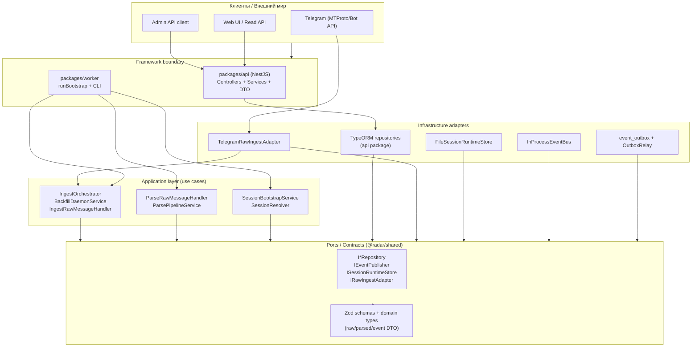
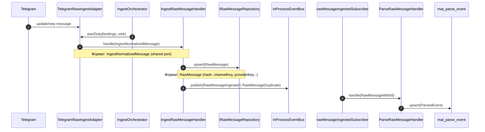
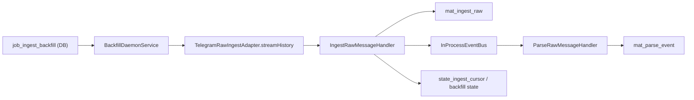
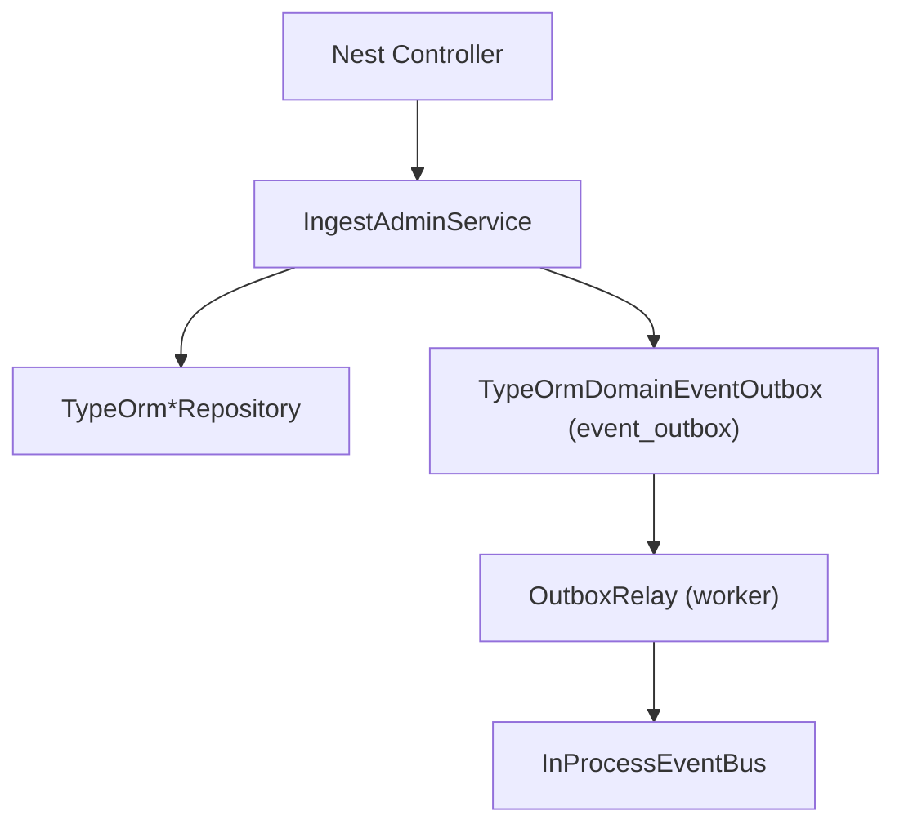

# Архитектура слоев и wiring (DIP)

Документ показывает:
- какие слои есть в `radar`;
- где именно происходит runtime wiring;
- в каком формате данные переходят между слоями;
- где используется Nest, а где свой DI/composition.

---

## 1) Карта слоев

---

## 2) Где проходит DIP и runtime wiring

### Worker: собственный composition root (без Nest DI)

Точка сборки: `packages/worker/src/application/createWorkerCompositionRoot.ts`.

Что происходит:
1. Читается `RADAR_STORAGE_MODE` (`memory`/`db`/`fs`).
2. В `db`-режиме подключается `DataSource` + TypeORM repos.
3. Поднимается `InProcessEventBus`.
4. Собираются use-case классы и в конструкторы прокидываются интерфейсы/адаптеры.
5. Поднимаются `IngestOrchestrator` и `BackfillDaemonService` (если `db` и включен daemon).

Именно здесь domain/application получает реализации портов в рантайме.

### API: Nest как framework-слой

`packages/api/src/app.module.ts` поднимает `ConfigModule`, `TypeOrmModule`, модули `health/read-side/ingest-admin`.

Nest используется как HTTP/container слой для API.

---

## 3) Потоки и форматы данных

## 3.1 Live ingest (Telegram -> raw -> parse)

Ключевые форматы:
- На границе адаптера: `IngestNormalizedMessage`.
- В raw-хранилище: `RawMessage`.
- Между ingest и parse: domain event (`RawMessageIngested`).
- Итог parse: `ParsedEvent`.

## 3.2 Backfill V2 (job -> streamHistory -> тот же ingest/parse)

Backfill не делает отдельный путь парсинга: использует тот же pipeline, что и live.

## 3.3 Admin/API поток

---

## 4) Где используется Nest, а где свой слой DIP

| Зона | Механизм DI | Комментарий |
|------|--------------|-------------|
| `packages/api` | Nest DI + TypeORM module | Framework/container на API границе |
| `packages/worker` | Свой composition root | Чистый runtime wiring в `createWorkerCompositionRoot` |
| `@radar/shared` | Без DI, только контракты | Порты, схемы, типы, инварианты форматов |

Итого: в проекте комбинированный подход — Nest на API-границе, и собственный DIP/composition в worker.

---

## 5) Памятка по точкам расширения

- Добавить новый ingest-источник:
  1) реализовать `IRawIngestAdapter` в infrastructure;
  2) зарегистрировать в `adapterRegistry`;
  3) не менять use-case слой.

- Заменить хранение сессий:
  1) реализовать `ISessionRuntimeStore`;
  2) подложить в `SessionResolver`/composition root.

- Заменить persistence:
  1) новая реализация `I*Repository`;
  2) wiring в composition root (worker) или Nest module (api).

