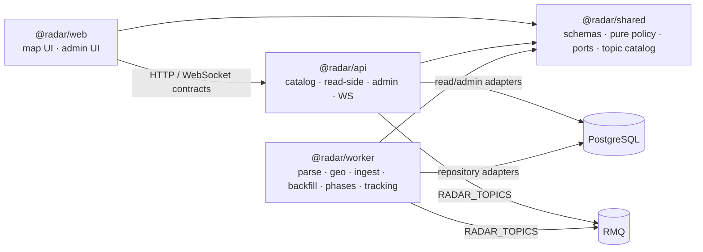

# Domain inventory

**Version:** 0.2.0
**Status:** Waves 1–7 completed in the working tree — 2026-07-17
**Scope:** first-party packages `@radar/worker`, `@radar/api`, `@radar/web`, `@radar/shared`.

## Ownership

| Bounded context | Owner / layer | SSOT and boundary | Current state |
| --- | --- | --- | --- |
| Parse | `worker`: parse application/domain; `api`: administration | `ParseExternalEnricher` is an application port; `createParseExternalEnricher` composes geo and provider adapters. | **Resolved (Wave 1):** parse domain no longer constructs or imports external enrichers. |
| Phases | `worker`: lifecycle/scheduling; `api`: phases administration | `PhaseOperationalDeps` is the lifecycle dependency set; bootstrap projects persistence into it through `OperationalSql`. | **Resolved (Waves 1, 5):** phase use cases no longer accept `WorkerDbRepositories` or TypeORM `DataSource`. |
| Test infrastructure | `worker`: infrastructure/testing | In-memory repositories implement shared repository ports and remain outside application/domain code. | **Resolved (Wave 1):** test doubles no longer live beside production handlers. |
| Geo | `worker`: parse-geo application/domain; `api`: catalog application/infrastructure | Shared geo contracts and pure rules; catalog persistence and provider adapters at infrastructure boundaries. | Keep catalog ownership in API and geo orchestration in worker. |
| Ingest, tracking, backfill | `worker`: application pipelines; `api`: administration/read boundary | Shared context-specific ports and schemas; package-local persistence, transport and Telegram adapters. | No confirmed ownership issue. |
| Map / read-side | `api`: read-model application and presentation | Snapshot and GeoJSON queries are separate services; API owns TypeORM projections and HTTP/WS delivery. | **Resolved (Wave 2):** GeoJSON querying is no longer part of `MapQueryService`. |
| Admin and geo-sync | `api`: application boundary and composition | Admin dependency providers compose persistence/transport adapters; geo-sync owns draft identity and apply/diff orchestration. | **Resolved (Wave 2):** ingest and phases administration receive composed dependencies. |
| Map UI | `web`: map presentation, state and runtime adapters | App shell starts live/replay effects; map data sync, live/replay coordination and pointer interactions are explicit modules. | **Resolved (Waves 3, 7):** data fetching, global live/replay effects and MapLibre pointer interactions are outside the lifecycle hook. |
| Shared contracts and transport | `shared`: schemas, pure policy, ports and topic catalog | Context-specific port modules have a type-oriented public barrel; runtime event bus/transport adapters are package-local infrastructure. | **Resolved (Wave 4):** shared no longer owns in-process runtime bus or transport adapters. |

## Dependency map

## Dependency rules

- `@radar/shared` is the only cross-package source for public schemas, reusable pure policy, ports and `RADAR_TOPICS`.
- `@radar/api` owns persisted catalog and map/read-side queries; `@radar/web` consumes them only through API contracts.
- Worker application use cases may depend on shared contracts and narrow ports. Database, transport and external-provider implementations belong to infrastructure/composition.
- API and worker may share topics through the catalog, not concrete RMQ clients or factories.

## Resolved backlog

| Wave | Resolved item | Evidence |
| --- | --- | --- |
| 1 | Worker external-enrichment composition, phase operational dependencies and in-memory test infrastructure | `packages/worker/src/composition/bootstrap/createParseExternalEnricher.ts`; `packages/worker/src/application/phases/phaseOperationalDeps.ts`; `packages/worker/src/infrastructure/testing/inMemoryRepositories.ts` |
| 2 | API GeoJSON read queries, admin composition and geo-sync boundaries | `packages/api/src/map/map-geojson-query.service.ts`; `packages/api/src/ingest-admin/ingest-admin.providers.ts`; `packages/api/src/phases-admin/phases-admin.providers.ts`; `packages/api/src/application/geo-sync/place-draft-key.ts` |
| 3 | Web map data, effects and runtime coordination | `packages/web/src/shared/state/mapLiveReplayEffects.ts`; `packages/web/src/widgets/geo-map/geoMapDataSync.ts`; `packages/web/src/widgets/geo-map/geoMapLiveReplayCoordination.ts` |
| 4 | Shared port split and runtime adapter removal | `packages/shared/src/ports/{ingest,geo,phase,event}-repositories.ts`; `packages/shared/src/ports/index.ts`; `packages/shared/src/transport/index.ts` |
| 5 | Worker phase lifecycle transactional SQL boundary | `packages/worker/src/application/phases/operationalSql.port.ts`; `packages/worker/src/infrastructure/persistence/typeOrmOperationalSql.ts`; `packages/worker/src/application/phases/phaseOperationalDeps.ts` |
| 6 | API source-message and common feed read queries | `packages/api/src/map/map-message-feed-query.service.ts`; `packages/api/src/map/map.controller.ts`; `packages/api/src/map/map.module.ts` |
| 7 | Web MapLibre pointer interactions | `packages/web/src/widgets/geo-map/geoMapInteractions.ts`; `packages/web/src/widgets/geo-map/useGeoMapLifecycle.ts` |

## Prioritised backlog

| Priority | Next implementation slice | Why it is high-confidence | Paths |
| --- | --- | --- | --- |
| — | No remaining P3 extraction. | `useGeoMapLifecycle` now orchestrates map bootstrap, style recovery, layer construction and cleanup; `geoMapInteractions` owns selection, hover popups and locus focus. Further splitting would only move bootstrap-local rendering declarations without a distinct lifecycle. | `packages/web/src/widgets/geo-map/useGeoMapLifecycle.ts`; `packages/web/src/widgets/geo-map/geoMapInteractions.ts`; `packages/web/src/widgets/geo-map/geoMapRuntime.ts` |

## Validation

- Inventory reflects the current working-tree ownership moves from Waves 1–6.
- Wave 5 keeps TypeORM and transaction mechanics in worker infrastructure; application lifecycle use cases depend only on `OperationalSql`.
