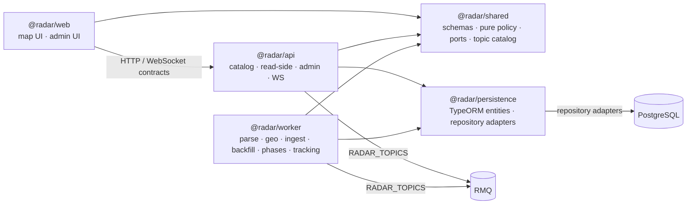

# Domain inventory

**Version:** 0.5.4
**Status:** Waves 1–10 and persistence extraction completed; monotonic tracking replay-tail implemented; first-party typecheck and lint baseline clean — 2026-07-18
**Scope:** first-party packages `@radar/worker`, `@radar/api`, `@radar/web`, `@radar/shared`, `@radar/persistence`.

## Ownership

| Bounded context | Owner / layer | SSOT and boundary | Current state |
| --- | --- | --- | --- |
| Parse | `worker`: parse application/domain; `api`: administration | `ParseExternalEnricher` is an application port; `createParseExternalEnricher` composes geo and provider adapters. | **Resolved (Wave 1):** parse domain no longer constructs or imports external enrichers. |
| Phases | `worker`: lifecycle/scheduling; `api`: phases administration | `PhaseOperationalDeps` is the lifecycle dependency set; bootstrap projects persistence into it through `OperationalSql`. | **Resolved (Waves 1, 5):** phase use cases no longer accept `WorkerDbRepositories` or TypeORM `DataSource`. |
| Test infrastructure | `worker`: infrastructure/testing | In-memory repositories implement shared repository ports and remain outside application/domain code. | **Resolved (Wave 1):** test doubles no longer live beside production handlers. |
| Persistence | `persistence`: TypeORM entities and repository adapters | `@radar/persistence` is the single runtime owner of entity metadata and TypeORM repository implementations; API and worker compose it at their infrastructure boundaries. | **Resolved:** worker no longer reads `api/dist`; API Nest modules retain their routes and `TypeOrmModule` wiring. |
| Geo | `worker`: parse-geo application/domain; `api`: catalog application/infrastructure | Shared geo contracts and pure rules; catalog persistence and provider adapters at infrastructure boundaries. | Keep catalog ownership in API and geo orchestration in worker. |
| Ingest, tracking, backfill | `worker`: application pipelines; `api`: administration/read boundary | Shared context-specific ports and schemas; package-local persistence, transport and Telegram adapters. | **Resolved (Wave 10):** tracking read-model выделена в `TrackingAdminQueryService`; команды config/enable/rebuild/reset/run-control — application use cases через узкий persistence port. |
| Map / read-side | `api`: read-model application and presentation | Snapshot and GeoJSON queries are separate services; API owns TypeORM projections and HTTP/WS delivery. | **Resolved (Wave 2):** GeoJSON querying is no longer part of `MapQueryService`. |
| Admin and geo-sync | `api`: application boundary and composition | Admin dependency providers compose persistence/transport adapters; geo-sync owns draft identity and apply/diff orchestration. | **Resolved (Wave 2):** ingest and phases administration receive composed dependencies. |
| Map UI | `web`: map presentation, state and runtime adapters | App shell starts live/replay effects; map data sync, live/replay coordination and pointer interactions are explicit modules. | **Resolved (Waves 3, 7):** data fetching, global live/replay effects and MapLibre pointer interactions are outside the lifecycle hook. |
| Shared contracts and transport | `shared`: schemas, pure policy, ports and topic catalog | Context-specific port modules have a type-oriented public barrel; runtime event bus/transport adapters are package-local infrastructure. | **Resolved (Wave 4):** shared no longer owns in-process runtime bus or transport adapters. |

## Dependency map

## Dependency rules

- `@radar/shared` is the only cross-package source for public schemas, reusable pure policy, ports and `RADAR_TOPICS`.
- `@radar/persistence` owns TypeORM entity metadata and repository adapters; API and worker must not import each other's build output.
- `@radar/api` owns persisted catalog and map/read-side queries; `@radar/web` consumes them only through API contracts.
- Worker application use cases may depend on shared contracts and narrow ports. Database, transport and external-provider implementations belong to infrastructure/composition.
- API and worker may share topics through the catalog, not concrete RMQ clients or factories.

## Event delivery (RMQ) и dormant outbox

**Текущий hot path:** все operational producers (worker ingest/parse и API
`manualIngest`) публикуют через `IEventTransport` → RMQ `publishConfirmed`
(3 retry). При исчерпании retry manual ingest возвращает ошибку в UI; пользователь
ретраит руками. Periodic DB catch-up / drain-таймеры покрывают потерянный wake
для живого пайплайна.

**OutboxRelay снят с runtime.** Таблица `event_outbox` и `IDomainEventRepository.append`
остаются как dormant audit/journal (сейчас пишет geo-sync). Wipe/clear по-прежнему
чистит таблицу.

**Похоронено на будущее (не включать без явного флага и DoD):** outbox как
transfer или fallback гарантия доставки между сервисами — либо вместо RMQ, либо
рядом с RMQ, с дедупликацией сообщений. До включения нужен cancel/visibility/
max-retry policy и единая atomicity raw+outbox, иначе ручной retry плодит дубли.

## Resolved backlog

| Wave | Resolved item | Evidence |
| --- | --- | --- |
| 1 | Worker external-enrichment composition, phase operational dependencies and in-memory test infrastructure | `packages/worker/src/composition/bootstrap/createParseExternalEnricher.ts`; `packages/worker/src/application/phases/phaseOperationalDeps.ts`; `packages/worker/src/infrastructure/testing/inMemoryRepositories.ts` |
| 2 | API GeoJSON read queries, admin composition and geo-sync boundaries | `packages/api/src/map/map-geojson-query.service.ts`; `packages/api/src/ingest-admin/ingest-admin.providers.ts`; `packages/api/src/phases-admin/phases-admin.providers.ts`; `packages/api/src/application/geo-sync/place-draft-key.ts` |
| 3 | Web map data, effects and runtime coordination | `packages/web/src/shared/state/mapLiveReplayEffects.ts`; `packages/web/src/widgets/geo-map/geoMapDataSync.ts`; `packages/web/src/widgets/geo-map/geoMapLiveReplayCoordination.ts` |
| 4 | Shared port split and runtime adapter removal | `packages/shared/src/ports/{ingest,geo,phase,event}-repositories.ts`; `packages/shared/src/ports/index.ts`; `packages/shared/src/transport/index.ts` |
| 5 | Worker phase lifecycle transactional SQL boundary | `packages/worker/src/application/phases/operationalSql.port.ts`; `packages/worker/src/infrastructure/persistence/typeOrmOperationalSql.ts`; `packages/worker/src/application/phases/phaseOperationalDeps.ts` |
| 6 | API source-message and common feed read queries | `packages/api/src/map/map-message-feed-query.service.ts`; `packages/api/src/map/map.controller.ts`; `packages/api/src/map/map.module.ts` |
| 7 | Web MapLibre pointer interactions | `packages/web/src/widgets/geo-map/geoMapInteractions.ts`; `packages/web/src/widgets/geo-map/useGeoMapLifecycle.ts` |
| 10 | API tracking admin commands and read boundary | `packages/api/src/application/tracking-admin/tracking-admin-commands.ts`; `packages/api/src/tracking-admin/tracking-admin.service.ts`; `packages/api/src/tracking-admin/tracking-admin.controller.ts` |
| Persistence | Shared TypeORM entity metadata and repository adapters | `packages/persistence/src`; `packages/worker/scripts/verify-persistence-boundary.mjs` |

## Wave 8 — DRY inventory

Проверены `worker`, `api`, `web` и `shared`. В инвентарь попали только повторения
одного решения; одинаковая форма данных или локальный infrastructure-код не считаются
DRY smell сами по себе.

### Подтверждённые кандидаты

| Priority | Решение и дублирующие владельцы | Drift сейчас / риск | SSOT и consumers | Риск миграции |
| --- | --- | --- | --- | --- |
| P1 | Полный `RmqEventTransport` продублирован в `api` и `worker`: topology exchange/DLX/queue, `ack`/`nack`, dedup, shutdown и serialisation. | Устранено: `@radar/transport-rmq` — единственный runtime-adapter; локальны только factory и PG dedup. | `packages/transport-rmq/src/index.ts`; consumers — API и worker factories. | Выполнено: queue names, DLQ, dedup и graceful shutdown перенесены без изменения. |
| P1 | Geo-catalog composition вручную создаёт один набор TypeORM repositories в `GeoCatalogImportService`, `scripts/geo-sync/cli` и seed/import entry points. | Устранено для полного geo-sync набора; entry points с подмножеством остаются отдельными. | `createGeoSyncPersistenceDeps`; consumers — catalog import и geo-sync CLI. | Выполнено: use-case получает порты, CLI output не менялся. |
| P2 | Дефолты terminal policy заданы дважды: `phasePolicySchema` (`maxAttempts: 3`, `retryFailed: true`) и `workQueueTerminalPolicy` (`DEFAULT_*`). | Устранено: schema и terminal resolver используют один `DEFAULT_PHASE_TERMINAL_POLICY`. | `schemas/enrichment/phaseTerminalPolicy.ts`; consumers — manifest normalisation и terminal resolver. | Выполнено: проверена граница `attempts = maxAttempts - 1`. |
| P2 | Ранг `StateLevel` задан в web `LEVEL_SEVERITY` и shared `STATE_LEVEL_RANK`. | Устранено: web читает shared rank, поэтому эскалация place повторяет доменную шкалу. | `packages/shared/src/schemas/geo/state-level.ts`; consumer — `effectivePlaceLevel`. | Выполнено: только read-side consumer; контракт не менялся. |
| P2 | Поиск ε-соседей ST-DBSCAN скопирован в dedup и magnetize. | Устранено: обе фазы используют одну пространственно-временную окрестность. | `packages/shared/src/domain/tracking/stdbscan/stdbscanNeighbors.ts`; consumers — dedup и magnetize. | Выполнено: алгоритм и параметры не менялись. |
| P2 | Retry budget для contended PostgreSQL read задаётся литералами в `mapFactsLoader` и `tracking-admin`, поверх общего `withPgContendedReadRetry`. | Семантика retry уже единая, но `3/60`, `3/120`, `3/200` не имеют именованной policy. Это риск неявного drift, не доказанный behavioral bug. | Оставить algorithm в `shared`; при подтверждении SLO — package-local named policies рядом с read-model owner, не глобальный default. Consumers — только соответствующие map/tracking queries. | Низкий, но требует согласовать latency/lock budget; не переносить автоматически. |
| P3 | Tracking pipeline remaining count повторён в worker и API admin. | SQL совпадает, но API добавляет contention retry, а worker читает напрямую. | Пока нет: `TRACKING_PIPELINE_NOT_PROCESSED_SQL` покрывает условие, не query policy. | Next: узкий query port в persistence после решения о retry budget. |
| P3 | Temporal `EVENT_AT_SQL` повторён в tracking и map read queries. | Tracking учитывает `pe.parsed_at`; map feed — нет. | Нет: это разные read-модели, совпадает лишь часть SQL. | Next: сначала разделить contracts tracking/read-side, не выносить общий литерал. |
| P3 | Publish `RawMessage*` events реализован в ingest worker и API manual ingest. | Topic/type совпадают, payload разный: worker содержит ingest context, API — phase wake ids. | Частично: topic catalog и hash есть в shared; payload contract не согласован. | Next: согласовать payload, затем решать о factory. |
| P3 | SQL pipeline state повторён в worker repository и API tracking admin. | API дополняет запросы metrics, terminate blockers и lite mode. | Нет узкого persistence port для admin read/command boundary. | Next: выделить port в `@radar/persistence` отдельной поставкой. |

### Исключено намеренно
- **Outbox и RMQ publish:** hot path — только RMQ `publishConfirmed`. Таблица
  `event_outbox` dormant (audit/journal); relay не в runtime. См. секцию
  «Event delivery» выше про возможный будущий flag-gated fallback.
- **Map/read-model и web derivations:** API строит authoritative `MapSnapshot` и
  GeoJSON read models, web хранит presentation cache, lazy geometry и MapLibre data.
  Это разные bounded contexts, поэтому `FeatureCollection` builders и snapshot
  transforms не объединять.
- **Retry/error semantics:** Nominatim 429 backoff, PostgreSQL contention retry и RMQ
  publisher confirm retry имеют разные failure domains. Объединять можно только
  механизм ожидания, но не policy.
- **Трёхчасовые окна:** calm visibility, fade длительность и critical panel имеют
  одинаковое число, но разные владельцы и последствия. Общая константа создала бы
  ложную связь между domain visibility и presentation.
- **Composition providers:** `ingest-admin` и `phases-admin` используют один
  `createApiDeploymentEventTransport`; одинаковые provider arrays отражают разные
  use-case dependency sets, а не повторное решение.

## Wave 9 result

1. **RMQ adapter:** `@radar/transport-rmq` владеет topology, nack→DLQ, dedup,
   serialisation и shutdown. API/worker сохранили только локальное создание PG dedup
   и role suffix.
2. **Geo-sync persistence composition:** factory полного набора репозиториев
   обслуживает `GeoCatalogImportService` и legacy geo-sync CLI. Seed/import entry
   points с неполным набором не мигрировались.
3. **Terminal defaults:** `DEFAULT_PHASE_TERMINAL_POLICY` — источник defaults
   schema и terminal resolver; legacy public `DEFAULT_*` сохранены как aliases.
4. **Skipped — PostgreSQL contention retry budgets:** литералы имеют общую механику,
   но отражают разные latency/lock budgets map и tracking. Без согласованного SLO
   перенос в общую policy изменил бы поведение, поэтому кандидат остаётся в backlog.
5. **State level rank:** web удалил локальную шкалу и использует
   `STATE_LEVEL_RANK` из shared.
6. **ST-DBSCAN neighbourhood:** dedup и magnetize используют
   `findStdbscanNeighbors`; параметры также определены один раз.

## Validation

- Inventory reflects the current working-tree ownership moves from Waves 1–6.
- Wave 5 keeps TypeORM and transaction mechanics in worker infrastructure; application lifecycle use cases depend only on `OperationalSql`.
- Wave 8/9 changes preserve public contracts; plan file was not changed.
