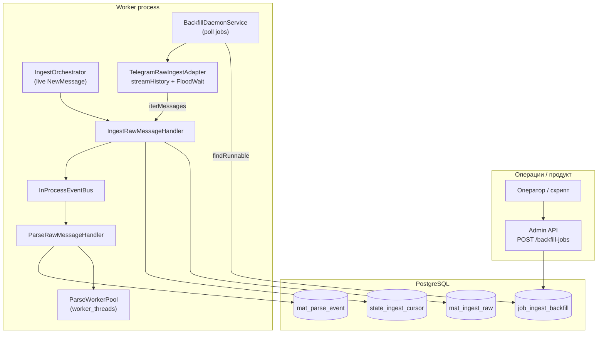
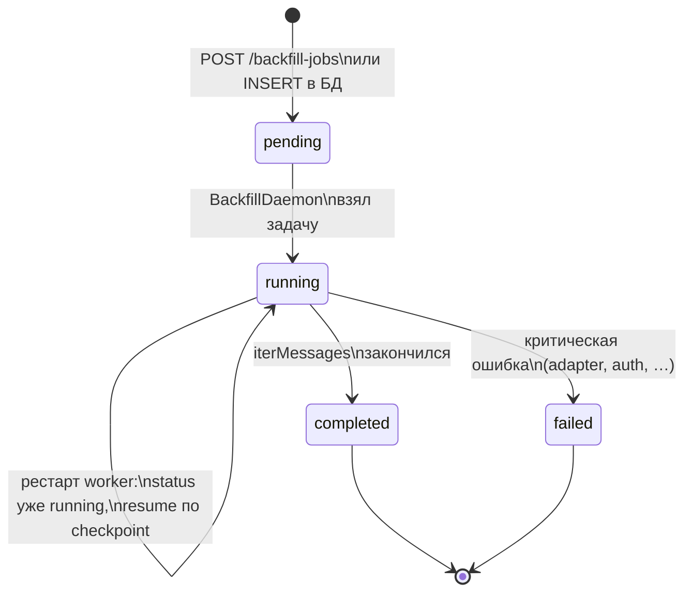
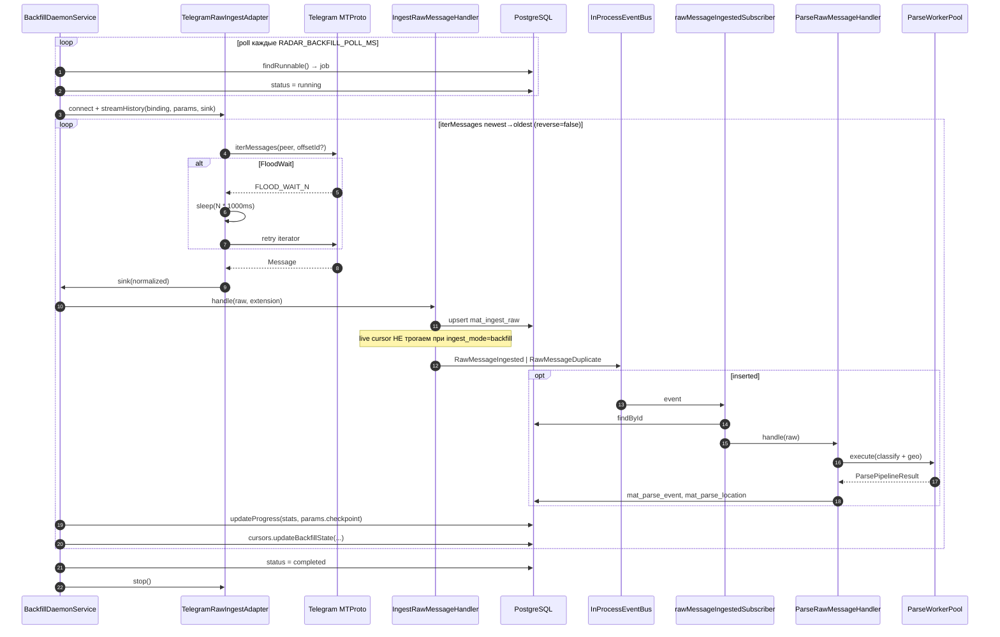
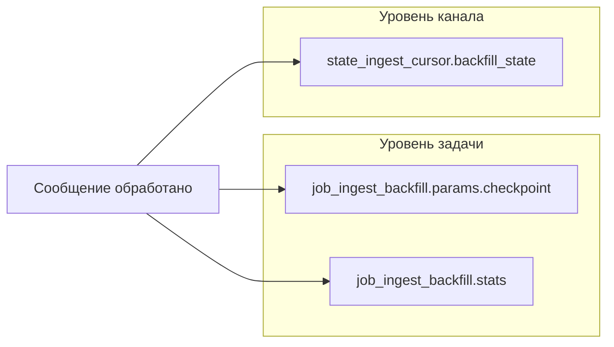
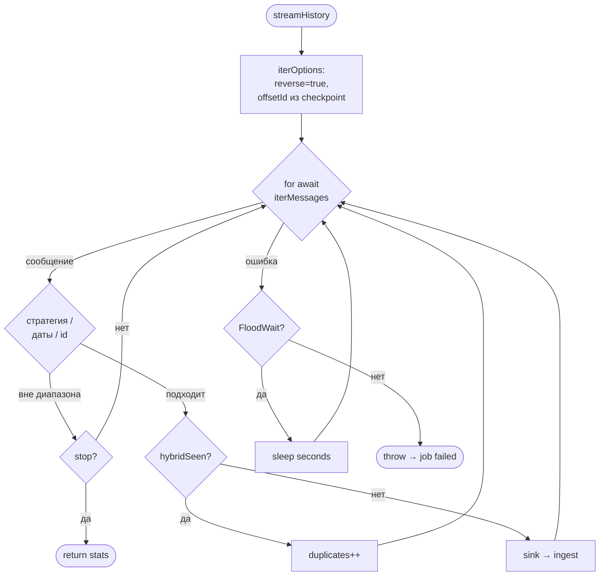
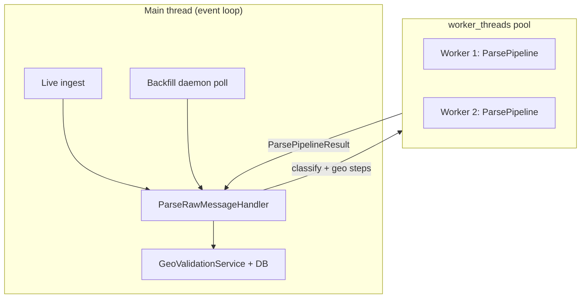
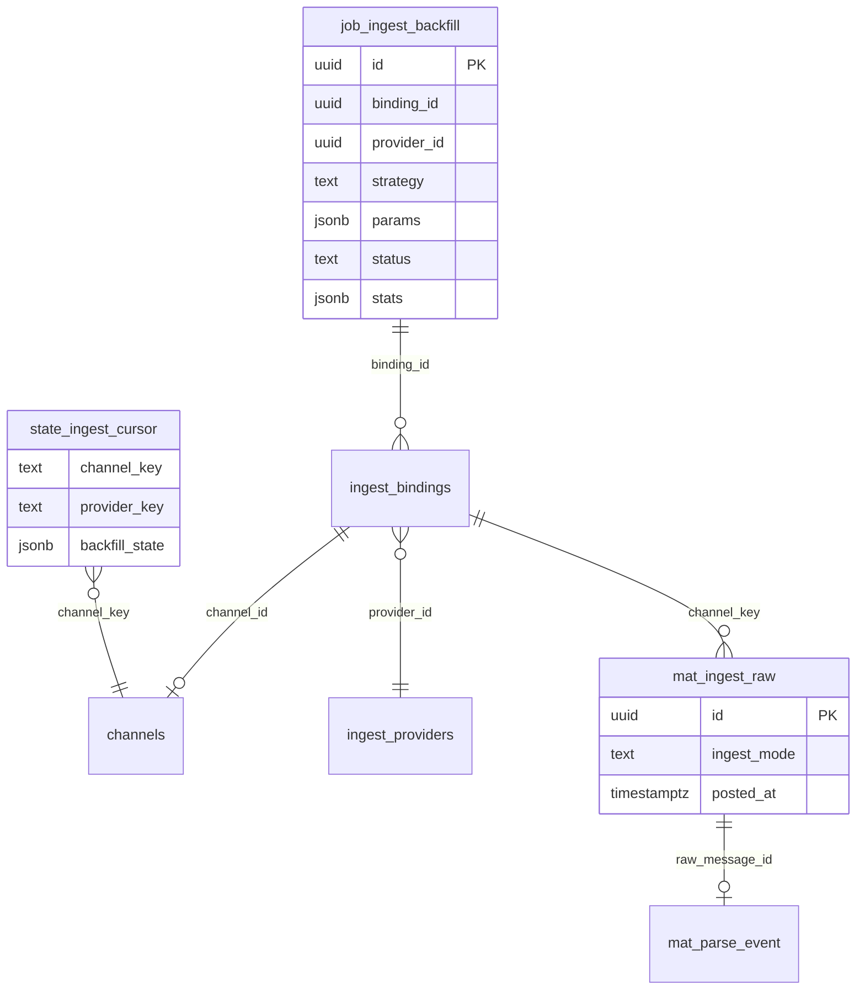

# Backfill V2 — автоматическая докачка истории

**CLI:** [`radar-cli.md`](./radar-cli.md) — `npm run radar -- ingest backfill`, `ingest session:*`, `stack migrate`.

Документ для **бизнеса** (что получаем в продукте) и **разработки** (как устроено в коде).  
Связанные материалы: [ingest-providers.md](./ingest-providers.md), [domain/how-it-works.md](./domain/how-it-works.md#ingest-flow), [domain/contexts/ingest.md](./domain/contexts/ingest.md).

---

## Инструкция по запуску (Backfill V2)

Полный цикл: **подготовка → worker в db mode → задача в БД → демон качает историю**.

### Предусловия

| # | Что нужно | Зачем |
|---|-----------|--------|
| 1 | PostgreSQL, `DATABASE_URL` в `.env` | Задачи, `mat_ingest_raw`, parse |
| 2 | `npm run radar -- stack migrate` | Таблица `job_ingest_backfill` и остальное |
| 3 | `TELEGRAM_API_ID`, `TELEGRAM_API_HASH` | MTProto (история **не** через bot token) |
| 4 | User-сессия на диске | `npm run radar -- ingest session:deploy` → слот = `credentialRefs.mtprotoSessionSlot` |
| 5 | Provider + binding в БД | Manifest import или Admin API; binding с **user MTProto** (`user_mtproto_channel` / `group`) |
| 6 | Provider `status = active` (для live; backfill job — отдельно) | Live опционален; backfill идёт по job |

**Не подходит для V2 backfill:** provider только с `botTokenSlot` и `bot_api_dm` / `bot_api_group` — архив через Bot API не качается (см. раздел про бота ниже в [ingest-providers.md](./ingest-providers.md)).

### Переменные `.env` (минимум для V2)

```env
DATABASE_URL=postgresql://...
RADAR_STORAGE_MODE=db
TELEGRAM_API_ID=...
TELEGRAM_API_HASH=...
# опционально:
# RADAR_SESSIONS_DIR=.radar/sessions
# RADAR_BACKFILL_POLL_MS=15000
# RADAR_BACKFILL_DAEMON_ENABLED=1
```

### Шаг 1 — сессия (один раз)

Из **корня репозитория** (PowerShell):

```powershell
npm run radar -- ingest session:deploy -- --slot tg-user-1 --kind mtproto_user
npm run radar -- ingest session:probe -- --slot tg-user-1
```

В provider в БД должно быть: `"credentialRefs": { "mtprotoSessionSlot": "tg-user-1" }`.

Подробнее: [ingest-providers.md § Session](./ingest-providers.md#1-session--логин-в-telegram).

### Шаг 2 — конфиг ingest в БД

Либо manifest import, либо Admin API — как в [ingest-providers.md § Manifest](./ingest-providers.md#2-manifest--провайдеры-и-bindings).

Узнать UUID для backfill:

```sql
SELECT p.id AS provider_id, p.key, b.id AS binding_id, b.binding_key, b.binding_mode, c.key AS channel_key
FROM ingest_bindings b
JOIN ingest_providers p ON p.id = b.provider_id
LEFT JOIN channels c ON c.id = b.channel_id
WHERE b.enabled = true;
```

Для backfill V2 бери binding с **`user_mtproto_*`** (не чистый `bot_api_*`).

### Шаг 3 — запустить worker

Из корня репо (должен быть `RADAR_STORAGE_MODE=db`):

```powershell
npm run worker:dev
```

В логах ожидается:

```text
Режим хранилища worker: db.
Запуск IngestOrchestrator ...
BackfillDaemon запущен (job_ingest_backfill).
```

Без этих строк задача останется в `pending`.

**API для создания job** (опционально, если не вставляешь SQL вручную):

```powershell
npm run api:dev
```

Swagger: `http://localhost:3000/api/docs` → `admin-ingest` → `POST /api/admin/ingest/backfill-jobs`.

### Шаг 4 — создать задачу backfill

**Вариант A — HTTP** (API должен быть запущен):

```powershell
$body = @{
  bindingId = "11111111-2222-3333-4444-555555555555"
  strategy  = "all"
  params    = @{}
} | ConvertTo-Json

Invoke-RestMethod `
  -Method Post `
  -Uri "http://localhost:3000/api/admin/ingest/backfill-jobs" `
  -ContentType "application/json" `
  -Body $body
```

`strategy`: `all` / `full_history` — вся доступная история; `by_date_range` — см. примеры ниже в [Admin API](#admin-api).

**Вариант B — только worker + SQL** (без API): вставка в `job_ingest_backfill` не описана в схеме миграции как публичный контракт — **рекомендуется API**.

### Шаг 5 — наблюдать прогресс

```sql
SELECT id, status, strategy, stats, params->'checkpoint' AS checkpoint, updated_at
FROM job_ingest_backfill
ORDER BY created_at DESC
LIMIT 5;
```

| status | Значение |
|--------|----------|
| `pending` | Worker ещё не взял (нет worker / демон выключен) |
| `running` | Идёт выкачка, растут `stats.inserted` / `duplicates` |
| `completed` | История по стратегии пройдена |
| `failed` | Смотреть лог worker (session, FloodWait, binding) |

Проверка сырых сообщений:

```sql
SELECT count(*) FROM mat_ingest_raw WHERE ingest_mode = 'backfill';
```

### Альтернатива — CLI (одна пачка, без демона)

Разовый chunk, **не** V2 job:

```powershell
# один binding
npm run radar -- ingest backfill -- `
  --provider-id="<uuid>" `
  --binding-id="<uuid>" `
  --batch-size=100

# все enabled bindings
npm run radar -- ingest backfill -- --all-bindings --batch-size=100
```

См. [ingest-providers.md § CLI backfill](./ingest-providers.md#3-backfill--докачка-истории) и [cheatsheet.md § Backfill](./cheatsheet.md#backfill-архив-сообщений).

### Чеклист «не работает»

1. `RADAR_STORAGE_MODE=db`?
2. Worker запущен, в логе есть `BackfillDaemon запущен`?
3. `RADAR_BACKFILL_DAEMON_ENABLED` не `0`?
4. У provider есть `mtprotoSessionSlot`, слот задеплоен?
5. `binding_mode` — user MTProto, не только bot?
6. Задача не `failed` — если да, лог worker в момент `running`.

---

## Кратко для бизнеса

| Вопрос | Ответ |
|--------|--------|
| **Зачем** | Заполнить архив сообщений канала **до** или **параллельно** с live-мониторингом, без ручного запуска CLI на каждую пачку. |
| **Кто запускает** | Оператор через Admin API (`POST /backfill-jobs`) или скрипт, создающий строку в `job_ingest_backfill`. |
| **Кто выполняет** | Worker в режиме `RADAR_STORAGE_MODE=db`: фоновый **BackfillDaemon** подхватывает задачу и качает историю. |
| **Что на выходе** | Строки в `mat_ingest_raw` (`ingest_mode=backfill`), затем те же **mat_parse_event**, что и для live — единый пайплайн анализа. |
| **Надёжность** | После **каждого** сообщения сохраняется чекпоинт: при падении worker продолжит с последнего ID, без повторной массовой выкачки. |
| **Live не ломаем** | Курсор «последнее live-сообщение» **не** сдвигается от backfill; архив и «сейчас» разделены. |

**Два способа докачки (сосуществуют):**

```text
┌─────────────────────────────────────┬──────────────────────────────────────┐
│ Backfill V2 (рекомендуется)         │ CLI chunk (разовый ручной проход)    │
├─────────────────────────────────────┼──────────────────────────────────────┤
│ Задача в БД → демон worker          │ `npm run radar -- ingest backfill`   │
│ Поток iterMessages + чекпоинты      │ Одна пачка getMessages (batch)       │
│ До конца истории / по стратегии     │ `--all-bindings` — все каналы сразу  │
└─────────────────────────────────────┴──────────────────────────────────────┘
```

---

## Глоссарий

| Термин | Смысл |
|--------|--------|
| **Binding** | Привязка провайдера к конкретному чату/каналу (`ingest_bindings`). |
| **Backfill job** | Запись операции докачки (`job_ingest_backfill`): стратегия, прогресс, статус. |
| **Checkpoint** | `{ offsetId, postedAt }` последнего **успешно обработанного** сообщения в `job.params`. |
| **backfillState** | JSON в `state_ingest_cursor.backfill_state` — зеркало прогресса на уровне канала+провайдера. |
| **Sink** | Колбек «одно нормализованное сообщение → ingest»; демон вешает на него сохранение чекпоинта. |
| **Parse worker pool** | Отдельные потоки Node.js для тяжёлого classify/geo, чтобы не блокировать live и демон. |

---

## Контекст в системе



**Граница ответственности:** API только **ставит задачу**; вся выкачка и чекпоинты — в worker. Parse и запись в БД — те же use case, что для live.

---

## Жизненный цикл задачи (статусы)



| Статус | Что видит бизнес | Что делает система |
|--------|------------------|-------------------|
| `pending` | Задача в очереди | Ждёт следующего тика демона (~15 с по умолчанию). |
| `running` | Идёт докачка | Стрим сообщений; в `stats` растут `inserted` / `duplicates`. |
| `completed` | Архив по стратегии выкачан | Итератор дошёл до границы (начало истории / даты / id). |
| `failed` | Нужно вмешательство | Смотреть логи worker; исправить session/лимиты; создать новую задачу при необходимости. |

**Поля прогресса** (`job_ingest_backfill.stats`):

| Поле | Смысл |
|------|--------|
| `inserted` | Новые строки в `mat_ingest_raw` (прошли dedup). |
| `duplicates` | Уже были (hash / identity / telegram extension). |
| `parsed` | Зарезервировано под будущую явную метрику parse (сейчас parse идёт через события). |

---

## Сквозной поток (одно сообщение)



---

## Стратегии докачки

Значение `strategy` в задаче (схема `@radar/shared`):

| strategy | Алиас | Поведение | Типичный `params` |
|----------|-------|-----------|-------------------|
| `full_history` | — | От текущего «верха» чата до начала доступной истории; фильтры дат не обязательны | `{}` |
| `all` | = `full_history` | То же (удобный пресет для admin) | `{}` |
| `by_date_range` | — | Только сообщения в интервале `posted_at` | `fromPostedAt`, `toPostedAt` (ISO UTC) |
| `by_external_id_range` | — | Ограничение по Telegram message id | `fromExternalId`, `toExternalId` |

**Направление итерации:** `iterMessages` с `reverse: false` (default) — **с последнего сообщения к старым**; сначала закрывается «дыра» у верха канала, затем уход в архив. `streamReverse: true` в params — от старых к новым (legacy).  
При `by_date_range`, как только `posted_at` ушёл ниже `fromPostedAt`, стрим **останавливается**.

**Resume:** если в `job.params.checkpoint` есть `offsetId`, в Telegram уходит `offsetId` — продолжение **с того же места** (дубликаты от повторного касания гасит dedup в БД).

---

## Чекпоинты: два уровня хранения



| Хранилище | Пример содержимого | Зачем |
|-----------|-------------------|--------|
| `job.params.checkpoint` | `{ "offsetId": "12345", "postedAt": "2026-01-15T12:00:00.000Z" }` | Resume **конкретной** операции после рестарта. |
| `job.stats` | `{ inserted: 1200, duplicates: 40, parsed: 0 }` | Отчёт для операций / UI. |
| `cursors.backfill_state` | `{ jobId, lastExternalMessageId, lastPostedAt }` | Сводный прогресс по паре channel + provider (наблюдаемость, будущий UI). |

**Инвариант:** чекпоинт пишется **после** успешного `IngestRawMessageHandler.handle` (включая duplicate — сообщение «обработано», повторно не качаем с того же offset).

---

## Telegram: поток и лимиты



- **Память:** сообщения не накапливаются в массиве — обрабатываются по одному в sink.  
- **FloodWait:** из RPC (`FLOOD_WAIT_N` или `seconds`) → пауза → **повтор** итератора.  
- **Legacy:** `fetchHistoryBatch` (пачка `getMessages`) остаётся для `radar ingest backfill`.

---

## Parse: почему отдельные потоки

Backfill может давать **сотни сообщений в минуту**. Classify + geo (каталог, Dadata, LLM) нагружают CPU и сеть. Если выполнять это в главном потоке Node.js, **live ingest** и таймер демона задерживаются.



| Слой | Где выполняется |
|------|-----------------|
| Classify + geo pipeline (`ParsePipelineService`) | **Пул worker_threads** (если не отключён env) |
| Валидация мест, `mat_parse_event`, события `MessageParsed` | **Main thread** (нужен доступ к TypeORM repos) |

**Отключение пула:** `RADAR_PARSE_USE_WORKER_THREADS=0` — всё снова в main thread (отладка).

---

## Admin API

| Method | Path | Тело (пример) |
|--------|------|----------------|
| POST | `/api/admin/ingest/backfill-jobs` | `{ "bindingId": "<uuid>", "strategy": "full_history", "params": {} }` |

Стратегии и валидация — `createBackfillJobSchema` в `@radar/shared`.  
Swagger: `/api/docs` → `admin-ingest`.

**Пример — вся история канала:**

```json
{
  "bindingId": "11111111-2222-3333-4444-555555555555",
  "strategy": "all",
  "params": {}
}
```

**Пример — окно дат:**

```json
{
  "bindingId": "11111111-2222-3333-4444-555555555555",
  "strategy": "by_date_range",
  "params": {
    "fromPostedAt": "2026-01-01T00:00:00.000Z",
    "toPostedAt": "2026-03-01T00:00:00.000Z"
  }
}
```

UUID binding/provider: см. SQL в [ingest-providers.md § Backfill](./ingest-providers.md#3-backfill--докачка-истории).

---

## Переменные окружения (worker)

| Переменная | Default | Назначение |
|------------|---------|------------|
| `RADAR_STORAGE_MODE` | — | Должен быть `db` для демона и пула. |
| `RADAR_BACKFILL_DAEMON_ENABLED` | включён | `0` / `false` — не стартовать демон. |
| `RADAR_BACKFILL_POLL_MS` | `15000` | Интервал опроса `job_ingest_backfill`. |
| `RADAR_PARSE_USE_WORKER_THREADS` | включён | `0` — parse только в main thread. |
| `RADAR_PARSE_WORKER_POOL_SIZE` | `2` | Число потоков (1–8). |
| `TELEGRAM_API_ID`, `TELEGRAM_API_HASH` | — | MTProto для `streamHistory`. |
| `TELEGRAM_MTPROXY_*` | — | Опционально MTProxy. |

Демон стартует в `runBootstrap` после `IngestOrchestrator.start()`.

---

## Модель данных (логическая)



---

## Карта кода

| Компонент | Файл |
|-----------|------|
| Демон, poll, checkpoint | `packages/worker/src/application/ingest/backfillDaemonService.ts` |
| Поток Telegram + FloodWait | `packages/worker/src/infrastructure/ingest-adapters/telegram/telegramRawIngestAdapter.ts` |
| Порт `streamHistory` | `packages/shared/src/ports/ingest-adapters.ts` |
| Репозиторий задач | `packages/api/src/infrastructure/persistence/typeorm-ingest-backfill-job.repository.ts` |
| Пул parse threads | `packages/worker/src/application/parse/parseWorkerPool.ts` |
| Worker entry parse | `packages/worker/src/application/parse/parsePipeline.worker.ts` |
| SSOT сборки pipeline | `packages/worker/src/application/parse/createParsePipeline.ts` |
| Parse use case | `packages/worker/src/application/handlers/parseRawMessageHandler.ts` |
| Wiring | `packages/worker/src/application/createWorkerCompositionRoot.ts` |
| Старт демона | `packages/worker/src/application/runBootstrap.ts` |
| CLI chunk (legacy) | `packages/worker/src/cli/ingestBackfillCli.ts` |

---

## Эксплуатация и типичные сбои

| Симптом | Вероятная причина | Действие |
|---------|-------------------|----------|
| Задача долго `pending` | Worker не в `db` mode / демон выключен | `RADAR_STORAGE_MODE=db`, проверить лог «BackfillDaemon запущен». |
| `failed` сразу | Нет session / неверный binding | `radar ingest session:deploy`, проверить `credentialRefs` |
| Долго `running`, мало `inserted` | Много дубликатов или FloodWait | Смотреть `duplicates` в stats; в логах `Telegram FloodWait: sleep`. |
| После рестарта дубли в логе ingest | Нормально у границы offset | Dedup в БД; checkpoint смещается вперёд. |
| Live «тормозит» при backfill | Пул выключен, тяжёлый parse в main | Включить `RADAR_PARSE_USE_WORKER_THREADS`, увеличить `POOL_SIZE`. |

**Рекомендация:** одна активная `running` задача на binding — демон обрабатывает задачи по очереди (`created_at ASC`).

---

## Что остаётся за рамками V2

| Тема | Статус |
|------|--------|
| Gap recovery после простоя **live** | Отдельная будущая задача (`IngestGapRecoveryService`), см. [ingest-providers.md § ограничения](./ingest-providers.md#текущие-ограничения-и-будущие-задачи). |
| Приоритет parse live vs backfill | Пока одинаковый pipeline; `ingestMode` не меняет приоритет очереди. |
| Точный total / ETA backfill | Только ~% по id-слотам Telegram (preflight probe). |

---

## Admin UI (`/admin` → Backfill)

Виджет **Backfill V2** (`BackfillRunnerWidget`):

- Общая форма стратегии + **«Все каналы»** (аналог `--all-bindings`: N jobs, демон стримит **по одному**).
- Список каналов с binding — кнопка **«Докачать»** на канал.
- Грид карточек jobs: `~%` по id (preflight + checkpoint), inserted/dup, **Отмена** (`pending`/`running`).
- `completed` ≠ карта готова: raw в БД; parse — **Обогащение → Фазы** и статистика канала (PE 2.0).

Preflight: перед `streamHistory` демон делает 2 запроса GramJS (`minId`/`maxId`) → `job.params.preflight`.

---

## Быстрый старт (оператор)

См. **[Инструкция по запуску](#инструкция-по-запуску-backfill-v2)** в начале документа (шаги 1–5, PowerShell, SQL).
