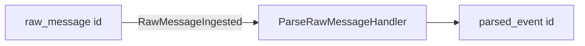

# Каталог логических агрегатов

## Зачем

«Агрегат» в Radar — **идентификатор потока** в доменных событиях, не класс. Таблица связывает `aggregateType`, таблицу БД, события и код, который задаёт `aggregateId`.

## Как читать таблицу

- **aggregateId** — обычно PK строки (uuid), иногда 
`null` для `system`.
- **Создаёт событие** — кто вызывает `publish` / `append` с этим типом.

---

## Каталог `aggregateType`

| aggregateType | Таблица / сущность | aggregateId | Ключевые DomainEvent.type | Кто создаёт событие |
|---------------|-------------------|-------------|---------------------------|---------------------|
| `raw_message` | `mat_ingest_raw` | `mat_ingest_raw.id` | `RawMessageIngested`, `RawMessageDuplicate`, `MessageParseFailed`, `MessageParsed` (частично), `EnricherInvoked`, `EnricherCacheHit`, `EnricherFailed` | `IngestRawMessageHandler`, `ParseRawMessageHandler`, `ingest-admin` (outbox) |
| `parsed_event` | `mat_parse_event` | `mat_parse_event.id` | `MessageParsed` | `ParseRawMessageHandler` |
| `ingest_provider` | `ingest_providers` | `ingest_providers.id` | `IngestSourceUnavailable` | `IngestOrchestrator` (ошибка duty) |
| `ingest_binding` | `ingest_bindings` | `ingest_bindings.id` | `IngestBackfillChunkCompleted` | `IngestOrchestrator.runBackfillChunk` |
| `geo_sync` | `log_geo_sync` (audit) | id строки audit | `GeoSyncCompleted`, `GeoSyncFailed` | `GeoSyncApplyService` (API, outbox) |
| `channel` | `channels` | (зарезервировано в enum) | — | *в коде присвоений не найдено* |
| `session_slot` | (volume, не ORM) | (зарезервировано) | `SessionSlot*` в enum | *publish не найден* |
| `system` | — | 
`null` | `MetricSampleEmitted`, … | *зарезервировано* |

Enum SSOT: `packages/shared/src/schemas/events/domain-event.ts`.

---

## Ingest-агрегаты (инварианты)

Детальная таблица инвариантов и dedup — **[docs/ingest-providers.md](../ingest-providers.md)** (не дублируем).

Краткая сверка с кодом:

| Логический агрегат | Инвариант в docs | Где в коде |
|--------------------|------------------|------------|
| `RawMessage` | append-only, dedup hash + identity | `TypeOrmRawMessageRepository.upsert` |
| `RawMessage` | duplicate → событие, parse не вызывается | `IngestRawMessageHandler` + subscriber только на `RawMessageIngested` |
| `IngestCursor` | live cursor только для `ingest_mode=live` | `advanceLive` early return если не live; handler вызывает cursor только при `inserted && live` |
| `IngestProvider` | active при enabled bindings | ops/admin + orchestrator (см. ingest-providers) |

---

## Связи между потоками

- `raw_message` → `parsed_event`: не через общий aggregate object, а `rawMessageId` в `mat_parse_event` + событие `MessageParsed` с новым `aggregateId`.

---

## События в enum без publish в коде

Типы объявлены в `domainEventTypeSchema`, но **присвоение `aggregateType` в runtime не найдено** (аудит):

- `IngestCursorAdvanced`, `IngestProviderCreated`, `IngestProviderActivated`, …
- `SessionSlotDeployed`, `SessionSlotInvalidated`
- `channel`, `system` (кроме резерва в enum)

См. [validation-report.md](./validation-report.md).

---

## Где в коде

| Файл | Роль |
|------|------|
| `domain-event.ts` | enum `aggregateType`, envelope |
| `ingestRawMessageHandler.ts` | `raw_message` |
| `parseRawMessageHandler.ts` | `raw_message`, `parsed_event` |
| `ingestOrchestrator.ts` | `ingest_provider`, `ingest_binding` |
| `geo-sync-apply.service.ts` | `geo_sync` |
| `ingest-admin.service.ts` | `raw_message` → outbox |

Сквозной поток: [how-it-works.md](./how-it-works.md).
