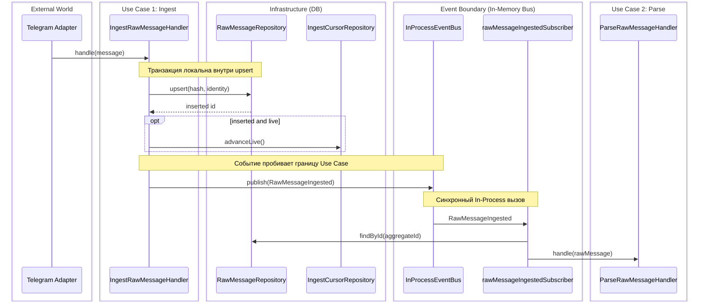
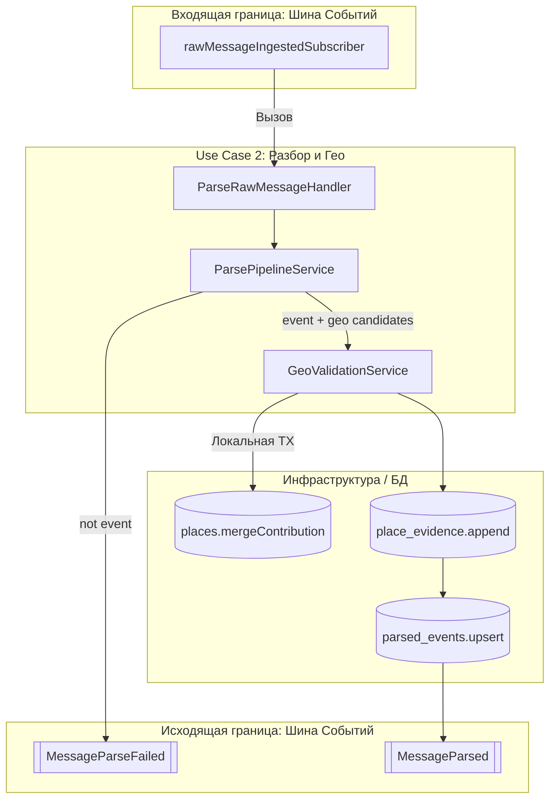

# Как это работает (сквозные сценарии)

## Зачем

Один документ для навигации по потокам данных: от сообщения в канале до `parsed_event` и доменных событий — без чтения всех entity подряд.

---

## Ingest-flow {#ingest-flow}

**Цель:** сохранить сырое сообщение один раз (dedup) и запустить parse только для новых.

### Шаги

1. **Адаптер (Слухач)** — висит на сокете Telegram или API, собирает базовый формат и вызывает `IngestRawMessageHandler.handle(...)`.
2. **Оркестрация в Хэндлере** — `IngestRawMessageHandler` считает хэш текста `ingestMessageHash()` (если не передан) и просит репозиторий сохранить.
3. **Репозиторий (БД)** — `IRawMessageRepository.upsert`:
   - проверка по `hash` и identity `(channel, provider, external_message_id, revision_key)`;
   - для Telegram — проверка duplicate в `raw_message_telegram`;
   - при новом сообщении открывает **локальную транзакцию** `dataSource.transaction`, пишет в таблицы и возвращает ID.
4. **Курсор** — если сообщение новое (`inserted: true`) и режим `live`, хэндлер просит базу обновить курсор `cursors.advanceLive(...)` (чтобы после рестарта не читать старое).
5. **Доменное событие** — хэндлер формирует `DomainEvent` (`RawMessageIngested` или `RawMessageDuplicate`) с `aggregateType: raw_message` и `aggregateId` = ID строки.
6. **Публикация** — хэндлер вызывает `IEventPublisher.publish`, который в воркере является `InProcessEventBus`.
7. **Подписчик (Клей)** — шина мгновенно дёргает подписчика `rawMessageIngestedSubscriber`, который читает текст из БД по ID и передаёт его в цепочку Parse.



### Где в коде

| Шаг | Файл |
|-----|------|
| Use case ingest | `packages/worker/.../ingestRawMessageHandler.ts` |
| Dedup + TX | `packages/api/.../typeorm-raw-message.repository.ts` |
| Cursor | `packages/api/.../typeorm-ingest-cursor.repository.ts` |
| Подписчик → parse | `packages/worker/.../rawMessageIngestedSubscriber.ts` |
| Admin ingest + outbox | `packages/api/.../ingest-admin.service.ts` |

Подробнее: [contexts/ingest.md](./contexts/ingest.md), инварианты — [docs/ingest-providers.md](../ingest-providers.md).

---

## Parse-flow {#parse-flow}

**Цель:** из `raw_messages` получить `parsed_events` + геопривязку.

### Шаги

1. **Подписчик** — получает только `raw.id` из базы, загружает текст и вызывает `ParseRawMessageHandler.handle(...)`.
2. **Хэндлер** — передаёт сырой текст в `ParsePipelineService.execute`.
3. **Пайплайн (Классификация + Geo)** — прогоняет текст через классификатор (угроза/спам) и энричеры (DaData, Nominatim, LLM) для поиска локаций.
4. **Отказ** — если это не событие (спам), хэндлер кидает `MessageParseFailed` в шину и выходит.
5. **Валидация (Trust)** — если событие, хэндлер передаёт найденные гео-кандидаты в `GeoValidationService.validate`. Тот проверяет базу: если место уже есть — обновляет статус доверия, вызывает `mergeContribution` (со своей БД транзакцией) и пишет журнал `place_evidence`.
6. **Сохранение** — хэндлер пишет итоговый результат в `parsed_events` и `eventLocations` (без общей транзакции с публикацией в шину).
7. **События** — хэндлер публикует телеметрию энричеров и финальное радостное событие `MessageParsed` (`aggregateType: parsed_event`) в шину.



| Шаг | Файл |
|-----|------|
| Use case | `packages/worker/.../parseRawMessageHandler.ts` |
| Pipeline | `packages/worker/.../parsePipelineService.ts` |
| Geo + trust | `packages/worker/.../geoValidationService.ts` |

---

## Events-flow {#events-flow}

**Два канала публикации:**

| Канал | Кто пишет | Кто читает | Персистентность | Устройство под капотом |
|-------|-----------|------------|-----------------|------------------------|
| **InProcessEventBus** | Worker handlers | Subscribers в том же процессе | Нет (живет в ОЗУ) | Обычная `Map` на чистом TS. Работает синхронно через `for...of` цикл с `await`. Без NestJS, без очередей. Упал подписчик — прервалась цепочка. |
| **Outbox (`domain_events`)** | API: admin, geo-sync | `OutboxRelay.tick` | Да (БД PostgreSQL) | Таблица. Relay поллит её раз в секунду и кидает события в тот же `InProcessEventBus`. |

Worker при `RADAR_STORAGE_MODE=db` поднимает **оба**: handlers шлют в bus напрямую; relay подтягивает **только** строки из БД.

```mermaid
flowchart LR
  subgraph WorkerProcess [Процесс Воркера (В памяти)]
    WH[Worker handlers]
    Bus[InProcessEventBus]
    Relay[OutboxRelay]
    Sub[Subscribers]
    
    WH -->|Прямой publish| Bus
    Relay -->|Трансляция| Bus
    Bus -->|Синхронный вызов| Sub
  end

  subgraph APIProcess [Процессы API]
    API[API services: admin, geo-sync]
  end

  subgraph DB [PostgreSQL]
    Table[(domain_events)]
  end

  API -->|INSERT (append)| Table
  Table -->|Polling (SELECT)| Relay
```

Подробнее: [domain-events-and-outbox.md](./domain-events-and-outbox.md).

---

## Composition-root-flow {#composition-root-flow}

**Worker:** `createWorkerCompositionRoot()` (при `storageMode=db`):

1. `createWorkerDataSource()` — один TypeORM `DataSource`.
2. `createWorkerDbRepositories(dataSource)` — репозитории на этот же source.
3. `new InProcessEventBus()`, подписки (`RawMessageIngested` → parse, метрики).
4. `new OutboxRelay(dataSource, bus)` + `start()` — poll раз в 1s.
5. Handlers, parse pipeline, опционально `IngestOrchestrator`.

**Не делается:** единая транзакция на весь use case; прокидывание `EntityManager` в handlers.

| Файл |
|------|
| `packages/worker/.../createWorkerCompositionRoot.ts` |

Подробнее: [unit-of-work-and-transactions.md](./unit-of-work-and-transactions.md).

---

## Place-trust-flow {#place-trust-flow}

При parse геокандидат может обновить `places`:

1. `GeoValidationService` строит `PlaceContribution`.
2. `IPlaceRepository.mergeContribution` — TX + pessimistic lock, внутри `mergePlaceContribution()` из shared.
3. `IPlaceEvidenceRepository.append` — журнал доказательств (отдельный вызов).

Подробнее: [contexts/geo-place.md](./contexts/geo-place.md), [docs/place-trust-explained.md](../place-trust-explained.md).

---

## С чем путают

| Вопрос | Ответ |
|--------|--------|
| Где создаётся агрегат? | Не `new Aggregate()` — запись в таблицу + `aggregateId` в событии |
| Composition root = UoW? | Нет, только wiring |
| Все события в outbox? | Нет — worker пишет в in-memory bus |
| Parse идёт после commit ingest? | В worker — да, синхронно в том же процессе после `upsert` |
