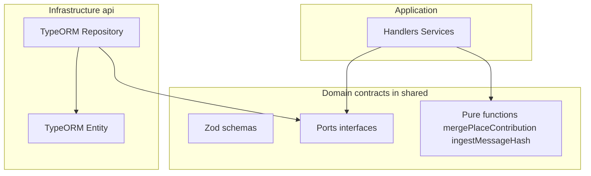

# Стиль доменной модели

## Зачем

Понять, «анемичная» ли модель и где искать бизнес-правила — не путая TypeORM entity с доменом.

## Как устроено

Три слоя с разной ответственностью:

| Слой | Богатое поведение? | Пример |
|------|-------------------|--------|
| `*Entity` | Нет — поля, декораторы | `RawMessageEntity` |
| `@radar/shared` | Да — pure functions, типы | `mergePlaceContribution`, `domainEventSchema` |
| Handlers | Да — сценарий, порядок шагов | `IngestRawMessageHandler`, `ParseRawMessageHandler` |

**Итог:** persistence анемичный; **правила** — в shared (переиспользуемые) и handlers (оркестрация). Это не DDD Aggregate Root, а **event-centric use cases + ports**.

## Логический агрегат vs класс

| Классический DDD | Radar сейчас |
|------------------|--------------|
| `class Order extends AggregateRoot` | Нет таких классов |
| Инварианты в методах entity | Инварианты в repo checks, handlers, pure functions |
| `aggregateId` внутри объекта | `aggregateId` в envelope `DomainEvent` |
| Загрузка графа через ORM | `findById` + отдельные repo |

Каталог потоков: [aggregates.md](./aggregates.md).

## Что делают хэндлеры и это ли CQRS?

В архитектуре Radar хэндлеры (`IngestRawMessageHandler`, `ParseRawMessageHandler`) — это **Use Cases (Сценарии использования)**. Это реализация паттерна Ports & Adapters (Clean Architecture). 

**Это НЕ классический CQRS.** Здесь нет объектов-команд (типа `IngestCommand`) и нет роутинга через `CommandBus` от фреймворка вроде NestJS.

| Свойство | Как это работает в Radar |
|----------|--------------------------|
| **Что это технически?** | Обычный TypeScript-класс с методом `handle(...)`. Ничего не знает про HTTP, Telegram или CQRS-библиотеки. |
| **Кто их вызывает?** | Либо напрямую из адаптера (как `IngestOrchestrator` дёргает инджест), либо клей-подписчик из шины (слушает событие `RawMessageIngested` и дёргает парсинг). |
| **Что внутри?** | Оркестрация. Хэндлер говорит репозиторию "сохрани", внешней ручке "распарси", валидатору "проверь". |
| **Зачем так сделано?** | Отвязка от фреймворка. Метод `handle(raw)` можно вызвать из WebSocket-адаптера, из cron-джобы или из CLI, не создавая фейковые CQRS-команды. |

---

## Почему нет `mergeObjectContext`

`mergeObjectContext` (TypeORM) связывает несколько entity в **одном persistence context**, чтобы каскадно сохранить граф.

У нас:

- нет объекта-агрегата с коллекциями entity;
- домен работает с **DTO/records** (`PlaceRecord`, `RawMessage`);
- в TX передаётся явный `manager` только внутри репозитория (`typeorm-raw-message.repository`, `typeorm-place.repository`).

Связь между частями — **id и события**, не ORM-граф.

## Composition root ≠ Unit of Work

| Composition root | Unit of Work (ожидание) |
|------------------|-------------------------|
| Создаёт `DataSource`, repos, bus | Одна граница изменений на use case |
| `createWorkerCompositionRoot` | Не открывает TX на весь `handle()` |
| Nest `AppModule` + TypeORM | То же |

Реальные границы TX: [unit-of-work-and-transactions.md](./unit-of-work-and-transactions.md).

## Где в коде

| Что | Путь |
|-----|------|
| Контракт события | `packages/shared/src/schemas/events/domain-event.ts` |
| Порты репозиториев | `packages/shared/src/ports/repositories.ts` |
| Merge place | `packages/shared/src/ports/placeContributionMerge.ts` |
| Worker wiring | `packages/worker/src/application/createWorkerCompositionRoot.ts` |

## FAQ

**Можно ли считать модель «богатой»?**  
Частично: логика есть, но не на entity — на shared + application.

**Нужен ли AggregateRoot?**  
Только если решите вводить явные объекты-агрегаты (см. [architecture-recommendations.md](./architecture-recommendations.md)).

**SSOT типов?**  
`@radar/shared`; ORM дублирует форму таблицы, маппинг в `typeorm-*-repository` / `*-mappers`.
