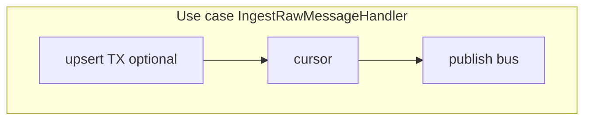

# Unit of Work и транзакции

## Зачем

Развести термины: что делает composition root и где реально garantируется атомарность.

## Как сейчас (факт)

### Composition root — только wiring

**Worker** (`createWorkerCompositionRoot`):

- один `DataSource`;
- набор репозиториев на этом source;
- `InProcessEventBus`, подписки;
- опционально `OutboxRelay.start()`.

**API** (`AppModule` + TypeORM): Nest DI, те же репозитории через providers.

Ни один root **не** открывает транзакцию на весь use case.

### Repo-level transactions

| Метод | TX | Что внутри |
|-------|-----|------------|
| `TypeOrmRawMessageRepository.upsert` | Да | insert `raw_messages` + optional `raw_message_telegram` |
| `TypeOrmPlaceRepository.mergeContribution` | Да | pessimistic lock + merge + save `places` |

Другие `dataSource.transaction` в репозитории **не найдены** (аудит).

### Use case без единой TX

Пример **ingest** (`IngestRawMessageHandler`):

1. `rawMessages.upsert` — может быть TX только на insert-ветку;
2. `cursors.advanceLive` — отдельные SQL;
3. `events.publish` — память, не БД.

Пример **parse** (`ParseRawMessageHandler`):

1. pipeline (внешние API, cache);
2. `parsedEvents.upsert`, `eventLocations.replace`;
3. `placeEvidence.append`, `mergeContribution` — по месту в geo validation;
4. `events.publish` — отдельно.

## Диаграмма границ

Нет общей обёртки `runInTransaction(() => { A; B; C })`.

## С чем путают

| Утверждение | Факт |
|-------------|------|
| «UoW в composition root» | Root собирает зависимости, не UoW |
| «Outbox = UoW» | Outbox — запись событий; не объединяет шаги use case |
| «TypeORM transaction = UoW на приложение» | Локально в одном методе repo |

## Что не атомарно (список для аудита)

| Сценарий | Риск при сбое между шагами |
|----------|----------------------------|
| ingest: insert ok, cursor fail | сообщение есть, cursor отстаёт |
| ingest: insert ok, publish не дошёл до subscriber | сообщение есть, parse не запущен (в worker publish синхронный — риск ниже) |
| parse: persist ok, event fail | данные есть, подписчики не видели событие |
| outbox relay: publish ok, publishedAt fail | повторная доставка при retry |
| merge place + evidence append | evidence может записаться вне TX merge (отдельные вызовы) |

## Где в коде

| Файл |
|------|
| `packages/worker/.../createWorkerCompositionRoot.ts` |
| `packages/api/.../typeorm-raw-message.repository.ts` |
| `packages/api/.../typeorm-place.repository.ts` |
| `packages/api/.../outboxRelay.ts` |

Рекомендации по сужению gaps: [architecture-recommendations.md](./architecture-recommendations.md).
