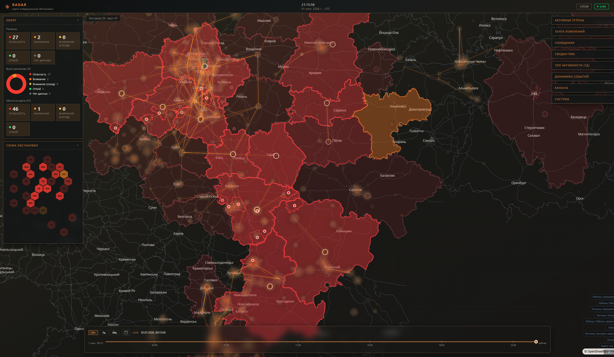
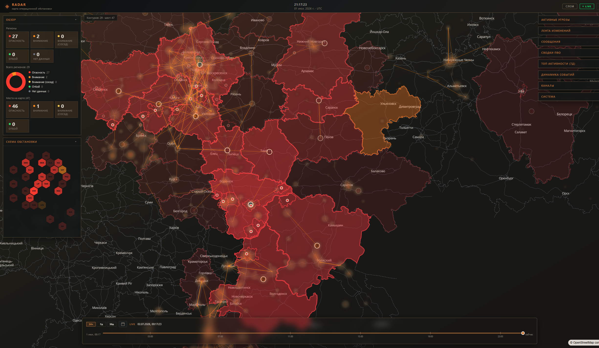
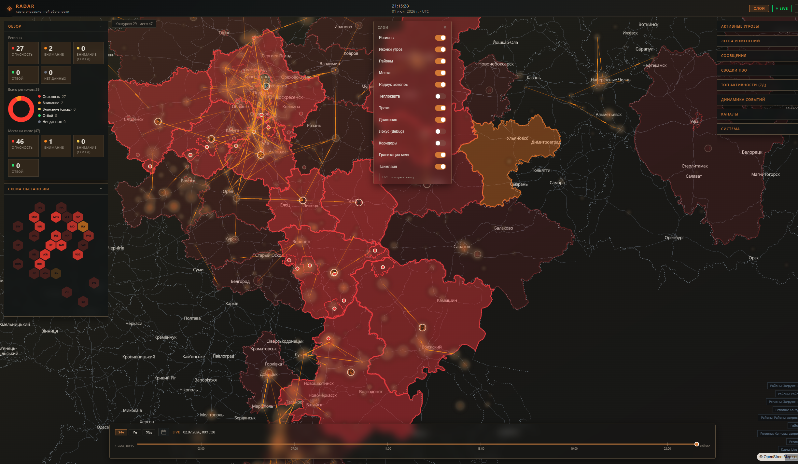
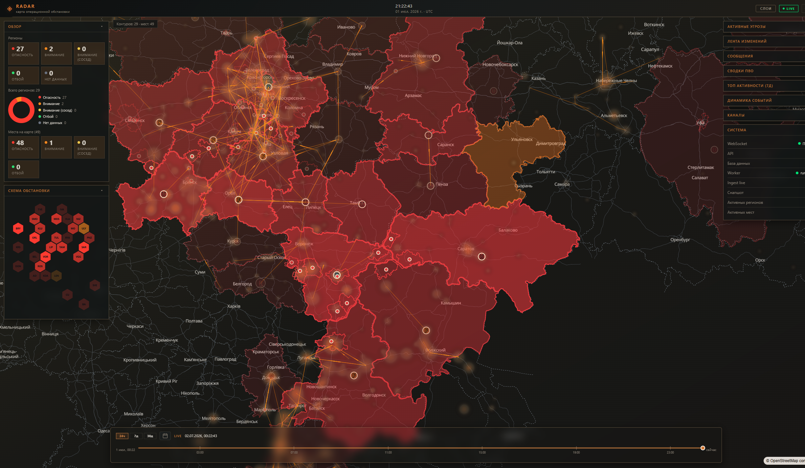

# Feature: tracking live-стабильность, locus debug и удобный hover

Связано: [phase-6-tracks-realtime](../sdd/tracking/phase-6-tracks-realtime.md), [ADR-015](../adr-015-data-association-reuse-and-locus.md)

---

## Цель

Закрыть два операционных сбоя в карте треков:

1. Треки "исчезают сами", пока карта просто открыта в live.
2. Locus debug трудно использовать: узкая зона наведения и неполная картина по последней ноде.

Результат фичи: live-рендер стабилен между тиками, причины отбраковки линков Ф3 видны в админке, по треку можно уверенно попасть мышью и увидеть локусы по всей цепочке, включая terminal-locus.

---

## Что изменено

### 1) Политика персиста треков

- **Очистка L1 только при rebuild**.
- Incremental/daemon тики работают только как upsert/append и consumed-mark.

Это убирает сценарий, где новый `rebuild_gen` в incremental run мог сносить уже материализованные треки.

### 2) Анти-фликер live snapshot на web

- В live-режиме (`asOf = null`) добавлен merge входящего snapshot с предыдущим краткоживущим буфером.
- Если трек не попал в один fetch (limit/оконная гонка), он не исчезает мгновенно с карты.

### 3) Диагностика Ф3 в админке

В `tracking run stats` добавлены счётчики:

- `phase3LinksConsidered`, `phase3LinksAccepted`, `phase3NodesSeeded`
- reject по причинам: `gap`, `distance`, `velocity`, `counter_flow`, `turn`, `kalman_innovation`

Это даёт прямой ответ, почему "гравитация есть, а соединяющих треков мало".

### 4) Locus debug по выбранному треку

- Locus строится для всех нод выбранного трека.
- Для последней ноды добавлен **terminal-locus** (прогноз следующей точки с оценочным `dt`).
- При отсутствии `kalmanState` у ноды включён безопасный debug-фолбэк состояния.

### 5) Расширенная зона наведения на трек

- Добавлены невидимые hit-layers (`tracks-lines-hit`, `tracks-lines-dashed-hit`) с широкой линией для pointer events.
- Визуальная толщина обычной линии не меняется, но наводиться и кликать по треку заметно проще.

---

## Скриншоты

### Tracks + gravity

### Locus debug на треке

### Панель слоёв (tracks / gravity / locus)

### Системные метрики tracking

---

## Быстрая проверка после деплоя

1. Включить `tracks`, `tracksGravity`, `locusDebug`.
2. Оставить карту открытой в live 3-5 минут.
3. Проверить, что треки не схлопываются до единичных.
4. Навести курсор на линию трека в мелком масштабе — hover должен ловиться без "пиксельной" точности.
5. В админке посмотреть строку Ф3: какой reject доминирует.

---

## Troubleshooting

- **`rej kalman` высокий**: смягчать innovation/locus gate профиля.
- **`rej flow` высокий**: ослаблять `counterFlowRejectCos` или штраф противотока.
- **`rej turn` высокий**: поднять `maxTurnDeg` или снизить `turnPenaltyWeight`.
- **`rej dist/vel` высокий**: пересмотреть `maxLinkDistanceM`, `maxVelocityMs`.

