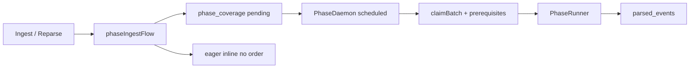

# Phase-pipeline v2 — операторский гайд

Единая модель: **фаза** = `enrichers[]` + merge в накопитель. ADR: [adr-003-phase-enrichment-accumulator.md](./adr-003-phase-enrichment-accumulator.md).

## Быстрый старт

```powershell
# 1. Миграции (один раз)
npm run migration:run

# 2. Манифест фаз → БД (upsert; enabled в БД не затирается)
npm run phase:manifest:import

# 3. Worker в db-режиме
# .env: RADAR_STORAGE_MODE=db, DATABASE_URL=...
npm run worker:dev
```

Шаблон манифеста: [examples/phase.manifest.default.json](./examples/phase.manifest.default.json).

## Поток



| trigger | Исполнение |
|---------|------------|
| `eager` | Сразу после ingest/reparse (`runPostIngestPhaseFlow`) |
| `scheduled` | `PhaseDaemonService`, `RADAR_PHASE_DAEMON_ENABLED` (default on в db) |
| `manual` | `worker:phase:run`, админка Run → enqueue; исполняет worker |

**Порядок фаз:** `order` в манифесте. Scheduled не claim'ит сообщение, пока все фазы с меньшим `order` не `done` для этого raw.

**Тик daemon:** `intervalMs` — «попробовать взять batch». Если предыдущий batch ещё идёт — тик пропускается (`running` lock). Пустой claim — норма (ждут prerequisite).

## Таблицы

| Таблица | Назначение |
|---------|------------|
| `phase_definitions` | SSOT фаз после import |
| `phase_coverage` | Покрытие per `(raw_message_id, phase_id)` |
| `phase_runs` | История тиков / manual run |

## CLI

```powershell
npm run worker:phase:run -- --phase=llm --batch=100 [--watch]
npm run worker:enrich:run -- --stage=llm          # алиас

# Полный reparse = invalidate + ingest-поток (не прямой catalog)
npm run worker:reparse:raw
```

## Env

| Переменная | Смысл |
|------------|--------|
| `RADAR_STORAGE_MODE` | `db` для pipeline |
| `RADAR_PHASE_DAEMON_ENABLED` | `0`/`false` — выключить scheduled (в db по умолчанию **вкл**) |
| `RADAR_PHASE_DAEMON_POLL_MS` | Обновление расписания фаз (default 15000) |
## Единственный оркестратор обогащения

```
ingest/backfill → RawMessageIngested → phaseIngestFlow (eager)
                                      → phase_coverage (pending)
PhaseDaemon (scheduled) → PhaseRunner → parsed_events
manual: worker:phase:run / админка Run
```

Таблицы `job_definitions` / `job_runs` и JobDaemon **удалены** (миграция `1748600000000`).

## Прогресс

- **SSOT бэклога:** `GET /api/admin/phases/runs/overview` → `coverage` per phase.
- **Тики:** `phase_runs` (в т.ч. `claimed=0` с честным `pendingRemaining`).
- **WS `phase-progress`:** не реализован (v1 — polling).

## Админка

Виджет **«Фазы обогащения»**, REST: [api/phases-admin.md](./api/phases-admin.md).


## Диагностика

| Симптом | Действие |
|---------|----------|
| Фазы не бегут | `phase:manifest:import`, `enabled=true`, worker db |
| llm pending не уходит | catalog `done` для raw? daemon включён? |
| Зависло в processing | `POST .../runs/:id/cancel` или force-stop |
| После reparse пустая карта | дождаться eager catalog + scheduled или смотреть coverage |

Статус внедрения: [phase-pipeline-status.md](./phase-pipeline-status.md).
