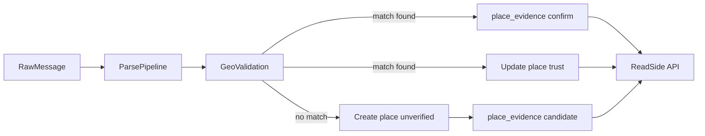

# Place trust: объяснение идеи

Дата: 2026-05-12

## Зачем это нужно

В Radar один и тот же населенный пункт может быть:
- найден по надежному справочнику/провайдеру;
- предложен эвристикой или LLM из текста сообщения;
- подтвержден позже другим источником.

Если показывать все такие места одинаково, оператор и пользователь не понимают, чему доверять в первую очередь.  
Поэтому мы разделяем:
- факт появления места в системе;
- степень его подтвержденности.

## Ключевая идея

Каждое место (`place`) имеет:
- текущее состояние доверия (`trust_state`, `is_trusted`, `trust_score`);
- историю подтверждений (`place_evidence`) — кто, когда и чем подтвердил или опроверг место.

Это позволяет:
- показывать предупреждение для неподтвержденных мест;
- объяснять, почему место считается надежным или спорным;
- в фоне повышать качество данных без остановки realtime-потока.

## Статусы доверия простым языком

- `unverified` — место найдено, но пока нет надежного подтверждения.
- `partially_verified` — есть частичное/косвенное подтверждение.
- `verified` — место подтверждено надежным источником.
- `rejected` — место признано ошибочным или нерелевантным.

Отдельно:
- `is_active` — участвует ли запись в рабочем контуре;
- `is_trusted` — подтверждена ли запись по policy.

Эти флаги не взаимозаменяемы.

## Что такое evidence

`place_evidence` — append-only журнал сигналов по месту:
- `provider`: `catalog|dadata|nominatim|llm|operator|system`
- `action`: `candidate|confirm|reject|enrich`
- `confidence`, `payload`, `trace_id`, `created_at`

Журнал не переписывается задним числом: это важно для аудита и объяснимости.

## Как это работает в realtime

## Что видит пользователь в интерфейсе

На уровне UI/Read-side должно быть понятно:
- место подтверждено или нет;
- есть ли предупреждение;
- какими источниками подтверждено.

Рекомендуемое производное поле:
- `needsAttention = !isTrusted || trustState === "unverified"`

Пользовательская логика:
- есть warning -> это не обязательно ошибка, это «требует подтверждения»;
- warning исчезает после подтверждения надежным источником.

## Пример жизненного цикла

1. В сообщении найдено новое место через LLM.  
2. Place создается как `unverified`, пишется evidence `candidate(provider=llm)`.  
3. Позже Dadata подтверждает место.  
4. Пишется evidence `confirm(provider=dadata)`, `trust_state` повышается до `verified`, warning в UI снимается.

## Базовая policy доверия

По умолчанию:
- `catalog = 1.00`
- `dadata = 0.95`
- `nominatim = 0.80`
- `llm = 0.55`
- `operator = 1.00`
- `system = 0.70`

Эти значения можно менять конфигурационно без смены общей модели.

## FAQ

### Почему место показано на карте с предупреждением?
Потому что место обнаружено, но еще не подтверждено надежным источником.

### Значит ли warning, что место ложное?
Нет. Это означает, что текущий уровень подтвержденности недостаточен.

### Почему сначала LLM, а потом Dadata?
Realtime должен быть быстрым. LLM может дать ранний кандидат, Dadata и другие провайдеры подтверждают позже.

### Можно ли скрывать неподтвержденные места?
Да. Для этого используются `trustState/isTrusted` и `needsAttention` в read-side.
