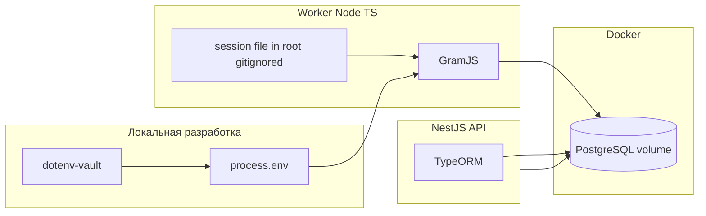

<!-- migrated from Cursor global plans; id: 58be8b8a-e363-4a51-94d8-9a861b1d1304 -->
---
todos:
  - id: "ts-monorepo-scaffold"
    content: "Monorepo (npm workspaces): packages api, worker, web; корневые скрипты dev/build/lint; tsconfig базовый"
    status: completed
  - id: "docker-db-volume"
    content: "docker-compose: PostgreSQL с именованным volume; env для DATABASE_URL; healthcheck"
    status: completed
  - id: "dotenv-vault"
    content: "Секреты: .env.example; workflow dotenv-vault/dotenvx и .env.vault (см. README); DOTENV_KEY вне репозитория"
    status: completed
  - id: "typeorm-bootstrap"
    content: "TypeORM DataSource; миграции; npm-скрипты migration:run/generate"
    status: completed
  - id: "mtproto-session-root"
    content: "Worker GramJS: сессия в корне (gitignored); StringSession в env; интерактивный вход"
    status: completed
  - id: "api-skeleton"
    content: "NestJS: TypeORM, GET /api/health и /api/ready, Swagger /api/docs"
    status: completed
  - id: "web-skeleton"
    content: "Vite+React заглушка, proxy /api к API"
    status: completed
  - id: "first-commit-scope"
    content: "Первый коммит: только инфраструктура и скелеты; без бизнес-логики карт и парсинга каналов (далее — архитектура)"
    status: completed
isProject: true
---
# План: сайт «радар по БПЛА» с картами и Telegram (итерация стека)

Файл лежит в репозитории: **`docs/plan.md`** — можно добавлять в контекст чата Cursor (@-mention или drag-and-drop).

## Контекст

- **Каркас первого этапа** уже в репозитории (см. [README.md](../README.md)): monorepo, Docker Postgres, NestJS+TypeORM+Swagger, worker GramJS, Vite+React.
- Модель данных из Telegram: **один технический user-аккаунт** на worker; вход посетителей на сайт — отдельная тема (позже).
- **Стек первого этапа:** TypeScript, Node.js, TypeORM, БД в Docker с volume, секреты через **dotenv-vault** / `.env`, политика **MTProto-сессии в корне репозитория (не в git)** и вывод **строки сессии** в vault (`TELEGRAM_STRING_SESSION`).
- Архитектурные и инфраструктурные решения (очереди, прод-деплой, домены) — **после** скелета.

## Цель продукта (без изменений по смыслу)

- Лента и карты (гео + псевдо), разметка событий, парсинг каналов — реализуются **после** готового каркаса.

## Стек первого коммита (зафиксировано)

- **Язык:** TypeScript везде.
- **API:** **NestJS** на Node.js; в первом коммите — рабочий каркас с **документацией API** и **скриптами запуска** (см. ниже).
- **Worker MTProto:** **GramJS** (user-клиент под Node, совместим с TS).
- **ORM:** **TypeORM** с миграциями.
- **БД:** **PostgreSQL** в Docker по умолчанию (позже удобно PostGIS для гео); **MySQL** возможен через TypeORM, но геослой проще на PG.
- **Секреты:** **dotenv-vault** — в репозитории зашифрованный `.env.vault`, ключ `DOTENV_KEY` только у окружения и людей, не в git.
- **Контейнеры:** `docker-compose` — сервис БД + volume на данные; сервис `api` в compose — опционально позже.

## MTProto: сессия в корне и «ключ»

- **Файл сессии** (например `.telegram/session` или имя из `TELEGRAM_SESSION_FILE`) лежит **в корне рабочей копии**, путь в **`.gitignore`** — **никогда не коммитить**.
- **Поведение worker при старте:**
  1. Если файл существует и **GramJS успешно подключается** (`connect` + проверка `checkAuthorization` / `getMe`) — работаем с этой сессией.
  2. Иначе — **интерактивный цикл авторизации MTProto** (запрос телефона, кода, при необходимости 2FA-пароля) в CLI; по успеху — **запись/обновление файла сессии** локально.
- **«Забрать ключ»:** после успешной авторизации дополнительно вывести **StringSession** (или эквивалент в GramJS) в stdout / подсказку «положить в vault как `TELEGRAM_STRING_SESSION`». В проде предпочтительно **только env из vault**, локально — файл; логика: если задана строка в env — использовать её, иначе — файл в корне.
- `API_ID` / `API_HASH` — только из env (vault), не в репозитории.

## Секреты и env

- Корневой **`.env.example`**: перечислить все переменные **без значений** (`DATABASE_URL`, `DOTENV_KEY` для локали при необходимости, `TELEGRAM_*`, порты, `NODE_ENV` и т.д.).
- Рабочий поток: `dotenv-vault pull` / `open` — по документации выбранного CLI; в CI — `DOTENV_KEY`.
- Дополнительно `.env*` с реальными значениями — в `.gitignore` (кроме политики vault-файлов, которые **можно** коммитить зашифрованными).

## Docker и БД

- Сервис `db`: образ `postgres:16` (или `mysql:8`) с **именованным volume** (например `radar_pg_data:/var/lib/postgresql/data`), порты проброшены на localhost, переменные `POSTGRES_USER/PASSWORD/DB` из env.
- Приложения на хосте в dev подключаются через `DATABASE_URL`; позже можно добавить сервис `api` в тот же compose.

## Бэкенд (NestJS) в коммите 1

- **Фреймворк:** NestJS + `@nestjs/config` для env (совместимо с dotenv-vault на этапе загрузки процесса), **TypeORM** через `@nestjs/typeorm` или явный `DataSource` — один стиль на весь проект.
- **Тестовые эндпоинты (smoke):** минимум два маршрута для проверки «всё живо»:
  - `GET /health` (или `/api/health`) — версия/время, без БД;
  - `GET /ready` (или `/api/ready`) — короткий запрос к БД (`SELECT 1` / репозиторий), чтобы убедиться, что `DATABASE_URL` и миграции на месте.
- **Документация:** **Swagger (OpenAPI)** через `@nestjs/swagger`, UI по умолчанию например `/api/docs` (путь зафиксировать в README); DTO с `@ApiProperty` для ответов smoke-эндпоинтов.
- **Скрипты (корень монорепы и/или `packages/api`):** `dev` / `start:dev` (`nest start --watch`), `build`, `start:prod` (`node dist/main`), плюс прокси-скрипты из корня (`npm run api:dev` и т.д.); опционально e2e-заготовка Nest на потом без обязательного полного набора тестов в коммите 1.
- **README (корень):** краткая инструкция: поднять БД (`docker compose up -d`), применить миграции, запустить API, открыть Swagger и проверить `/health` и `/ready`.

## Структура репозитория (ориентир под первый коммит)

- `docker-compose.yml` — БД + volume.
- `package.json` (workspaces) — скрипты: `dev`, `build`, `lint`, `typecheck`, `db:up` / `db:down`, `migration:run`, `migration:generate`, **`api:dev` / `api:build` / `api:start`** (делегирование в Nest-пакет).
- `packages/api` — приложение **NestJS**, TypeORM, модуль health/ready, **Swagger**, глобальный префикс при необходимости (`/api`).
- `packages/worker` — входная точка GramJS, логика сессии/авторизации (без полноценного парсинга каналов в коммите 1 — только подключение и «живой» ping).
- `packages/web` — минимальный фронт (страница + вызов health API).
- `tsconfig.base.json` + `references` / project references по пакетам.
- `.gitignore` — `node_modules`, локальные `.env`, **файлы сессии Telegram**, `dist`, логи.

## Диаграмма (целевой поток после скелета)

## Этапы (обновлено)

### Коммит 1 — только каркас

- Monorepo TS, Docker БД + volume, dotenv-vault, TypeORM + скрипты миграций, **NestJS** с **двумя smoke-эндпоинтами**, **Swagger**, скрипты dev/build/start, короткий **README** по запуску API, web-заглушка, worker с проверкой сессии / интерактивным логином и выводом StringSession.
- Без логики карт, без списка каналов, без модерации — только «проводка».

### Далее (как раньше, но на TS)

- Сущности домена, инжест каналов, публичные API для карты, MapLibre на фронте, псевдослой, модерация.

## Риски и заметки

- Интерактивный MTProto в Docker без TTY неудобен: для первого логина обычно запуск **worker на хосте** с `-it`, затем перенос строки сессии в vault.
- GramJS и TypeORM — следить за **ESM/CJS** и целевой `module` в tsconfig (единый выбор в реализации).

## Commit message (для тебя, без выполнения git)

`chore: scaffold TS monorepo with Docker DB, TypeORM, dotenv-vault, and GramJS session bootstrap`
