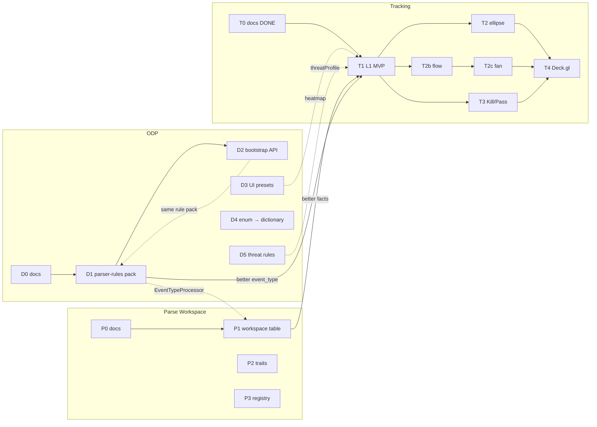

# Master roadmap: Parse · ODP · Tracking

Статус: **живой индекс** (2026-06-14)  
Назначение: **одна картина** — три параллельных потока, порядок шагов, ссылки на SDD/ADR.

См. также: [plan.md](../plan.md), [project-log.md](../project-log.md).

---

## Три потока (что строим)

| Поток | Зачем | Главный документ |
|-------|--------|------------------|
| **Parse Workspace** | стабильный parse, multi-event, heal/re-finalize | [parse-processor-workspace.md](./parse-processor-workspace.md), [sdd/parse/](../sdd/parse/README.md) |
| **ODP** | вынести БПЛА-лексику из TS в pack-файлы | [ADR-014](../adr-014-operational-domain-profile.md), [walkthrough](./operational-domain-profile-walkthrough.md), [sdd/odp/](../sdd/odp/README.md) |
| **Tracking** | треки, flow, fan, Kill/Pass, Deck.gl | [sdd/tracking/plan.md](../sdd/tracking/plan.md), [sdd/tracking/](../sdd/tracking/README.md) |

```text
         Parse Workspace          ODP                    Tracking
              │                    │                         │
   raw → workspace → facts    pack → classifier      facts → L1 → L2/L2b
              │                    │                         │
              └──────── facts (parsed_events, event_locations) ─┘
```

**Facts — общая граница.** Parse и ODP пишут interpretation; Tracking читает facts.

---

## Зависимости между потоками



| Связь | Смысл |
|-------|--------|
| **ODP D1 → Parse P1** | один `parser-rules` pack для classifier и EventTypeProcessor |
| **Parse P1 → Tracking T1** | stable IDs, multi-event, heal — качество `place_id` / facts |
| **ODP D5 → Tracking T1** | `threatProfileRules` вместо hardcode (можно временный hardcode до D5) |
| **ODP D3 ↔ Tracking T1** | heatmap filter — один preset; tracking heatmap filter в T1 |
| **Tracking T2b** | нужен `place_id` на nodes (T1) |

**Ничто не блокирует старт T1**, но **D1 + P1** улучшают качество треков.

---

## Рекомендуемый порядок работ (cross-stream)

### Сейчас (документация ✅)

| ID | Поток | Статус |
|----|-------|--------|
| T0 | Tracking docs + SDD | ✅ |
| D0 | ODP ADR + walkthrough + example manifest | ✅ |
| P0 | Parse RFC черновик | ✅ |

### Волна 1 — foundation (можно параллельно)

| Приоритет | ID | Что | Коммит |
|-----------|-----|-----|--------|
| 1 | **T1** | Tracking L1: DISTINCT, Kalman, API, heatmap filter | tracking MVP |
| 2 | **D1** | ODP parser-rules YAML + loader (parity extractEventType) | domain pack |
| 3 | **P1** | Parse workspace table + finalizer reconcile (минимум) | parse workspace |

### Волна 2 — read-side аналитика

| ID | Что |
|----|-----|
| **T2b** | Flow corridors |
| **T3** | Kill/Pass |
| **D2** | ODP bootstrap + `GET /domain-profile/active` |
| **D3** | UI presets из ODP (heatmap) |

### Волна 3 — прогноз и UX

| ID | Что |
|----|-----|
| **T2** | Ellipse + Time Machine |
| **T2c** | Path fan |
| **T4** | Deck.gl unified |
| **D4** | z.enum → dictionary validation |
| **D5** | threatProfile из ODP |

### Волна 4 — parse зрелость

| ID | Что |
|----|-----|
| **P2** | Trait processors (Repeat, Mass) |
| **P3** | Processor registry |
| **P4** | Semantic segmenter |

---

## Детальные шаги по потокам

### Tracking (фазы T0–T4)

| Фаза | SDD | Ключевые deliverables |
|------|-----|------------------------|
| T0 | — | ADR 007–013, SDD комплект |
| **T1** | [phase-1](../sdd/tracking/phase-1-l1-mvp.md) | worker rebuild, `trajectory_*`, `GET /map/tracks`, heatmap filter |
| T2 | [phase-2](../sdd/tracking/phase-2-ellipse-prediction.md) | `/map/tracks/prediction`, MapLibre ellipse |
| T2b | [phase-2b](../sdd/tracking/phase-2b-flow-corridors.md) | `/map/tracks/flow`, rollup |
| T2c | [phase-2c](../sdd/tracking/phase-2c-path-fan.md) | path-fan API + UI |
| T3 | [phase-3](../sdd/tracking/phase-3-kill-pass.md) | Kill/Pass layers |
| T4 | [phase-4](../sdd/tracking/phase-4-deckgl-ux.md) | Deck.gl overlay |

Решения T1: [sdd/tracking/README § D1–D8](../sdd/tracking/README.md) (DISTINCT, profiles, …).

---

### ODP (фазы D0–D5)

| Фаза | SDD | Ключевые deliverables |
|------|-----|------------------------|
| D0 | [walkthrough](./operational-domain-profile-walkthrough.md) | ADR-014, example manifest, §13 migration map |
| **D1** | [phase-d1](../sdd/odp/phase-d1-parser-rules-pack.md) | `parser-rules.v1.yaml`, loader, validate CLI |
| D2 | [phase-d2](../sdd/odp/phase-d2-bootstrap-api.md) | `profile.manifest.json`, env, API active profile |
| D3 | [phase-d3](../sdd/odp/phase-d3-ui-presets.md) | heatmap из presets, dictionary titles |
| D4 | [phase-d4](../sdd/odp/phase-d4-event-type-dictionary.md) | event_type string + runtime validate |
| D5 | [phase-d5](../sdd/odp/phase-d5-threat-profile-rules.md) | `threatProfileRules` → tracking worker |
| D6 | [phase-d6](../sdd/odp/phase-d6-api-read-decoupling.md) | generic read API, no domain routes |

Bundled vs on-prem: [ADR-014 § deployment](../adr-014-operational-domain-profile.md#где-живёт-odp-bundled-vs-on-premise).

---

### Parse Workspace (фазы P0–P4)

| Фаза | SDD | Ключевые deliverables |
|------|-----|------------------------|
| P0 | [RFC](./parse-processor-workspace.md) | контракт ParseWorkspace, черновик |
| **P1** | [phase-p1](../sdd/parse/phase-p1-workspace-finalizer.md) | `message_parse_workspace`, finalizer reconcile, heal CLI |
| P2 | [phase-p2](../sdd/parse/phase-p2-trait-processors.md) | Trait processors + AttachRule |
| P3 | [phase-p3](../sdd/parse/phase-p3-processor-registry.md) | Processor registry |
| P4 | [phase-p4](../sdd/parse/phase-p4-semantic-segmenter.md) | Semantic segmenter |

Связь ODP: EventTypeProcessor читает **тот же** parser-rules pack (D1).

---

## Что отражено где (индекс документов)

| Вопрос | Где смотреть |
|--------|--------------|
| Общая картина 3 потоков | **этот файл** |
| Продуктовый plan / итерации | [plan.md](../plan.md) §4–6 |
| Tracking vision | [roadmap-tracking-forecasting.md](../roadmap-tracking-forecasting.md) |
| Tracking фазы DoD | [tracking-pipeline-phases.md](./tracking-pipeline-phases.md) |
| Tracking SDD | [sdd/tracking/](../sdd/tracking/README.md) |
| ODP человеческим языком | [operational-domain-profile-walkthrough.md](./operational-domain-profile-walkthrough.md) |
| ODP архитектура | [adr-014](../adr-014-operational-domain-profile.md) |
| ODP SDD | [sdd/odp/](../sdd/odp/README.md) |
| Parse архитектура | [parse-processor-workspace.md](./parse-processor-workspace.md) |
| Parse SDD | [sdd/parse/](../sdd/parse/README.md) |
| Индекс SDD | [sdd/README.md](../sdd/README.md) |
| Файл кода → куда (ODP) | walkthrough **§13** |

---

## Gaps / честный статус

| Тема | В plan.md до правки | Статус |
|------|---------------------|--------|
| Tracking T1–T4 | ✅ итерация 4 | отражено |
| ODP D0–D5 | ✅ SDD комплект | [sdd/odp/](../sdd/odp/README.md) |
| Parse P0–P4 | ✅ SDD комплект | [sdd/parse/](../sdd/parse/README.md) |
| Cross-dependencies | ❌ | **mermaid выше** |

---

## Следующий шаг (одной строкой)

**T1 + D1 параллельно** → затем **T2b / T3** и **D2–D3** → **T2 / T2c / T4** и **D4–D5**; **P1** когда готовы трогать parse storage.
