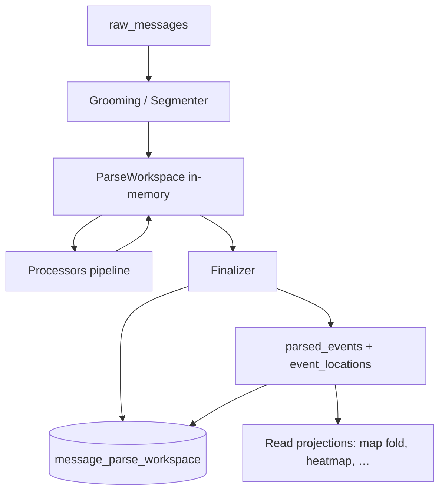

# RFC: Parse Processor Workspace — сегментация, процессоры, персист

Статус: **черновик** (обсуждение, без реализации)  
Связано: [ADR-003](../adr-003-phase-enrichment-accumulator.md), [ADR-012](../adr-012-geo-scan-without-aliases.md), [ADR-014](../adr-014-operational-domain-profile.md), [domain/how-it-works.md](../domain/how-it-works.md#parse-flow), [ADR-006](../adr-006-map-read-line-fold.md)

---

## Проблема (сейчас)

1. Parse завязан на **строку/regex**, а не на **смысловые блоки** сообщения.
2. Один `raw` технически может породить **несколько events** (город + область + разная meta).
3. `extras` (repeat, mass, count…) размазаны — нет правил «кому из кандидатов клеить признак».
4. После persist идёт **мутация** через enrich/merge — сложно ревалидировать при смене правил процессора.
5. Повторный прогон **только по raw** не даёт стабильной обратной связи: старые `parsed_events` становятся сиротами.
6. Geo spawn завязан на **построчный fallback** и `place_aliases` — теряются валидные топонимы (класс дефектов: Таганрог). Контракт исправления: [ADR-012](../adr-012-geo-scan-without-aliases.md).

---

## Целевая модель (одной фразой)

> **raw → grooming → processors → живой workspace (in-memory) → finalize → facts в БД.**  
> Workspace **персистится** как отдельная сущность; ID порождённых events **записываются обратно** в неё.

---

## Поток



---

## Сегментация: блоки, не строки

Сообщение делится на **блоки по роли**, не по `\n`:

| kind | Примеры |
|------|---------|
| `signal` | опасность, работа ПВО, фиксация |
| `geo` | Балашов, Саратовская область |
| `stats` | сводка ПВО за ночь |
| `promo` / `footer` | подписки, 24/7, ссылки → **drop на grooming** |

Grooming отсекает рекламу/футеры **до** процессоров. Полезный текст (`groomedText`) видят все processors.

---

## Два типа процессоров

| Тип | Действие | Пример |
|-----|----------|--------|
| **Spawning** | добавляет **EventCandidate** (якорь) | GeoProcessor → `place: Балашов`, `region: Саратовская обл` |
| **Enriching** | добавляет **Trait** + **AttachRule** | RepeatProcessor → `repeat: true`; VicinityProcessor → ареал вокруг place |

Процессор **не мутирует** уже финализированные events. Только append в workspace.

### AttachRule (кому клеить trait)

```typescript
type AttachRule =
  | { scope: "all_candidates" }
  | { scope: "by_kind"; kind: "place" | "region" }
  | { scope: "by_event_type"; type: EventType }
  | { scope: "first" | "last" }
  | { scope: "system" };  // общесистемный meta-слой (см. ниже)
```

**Пример:** «Балашов, Саратовская область, повторная опасность, приготовиться летит очень много»

| Processor | Результат | Attach |
|-----------|-----------|--------|
| Geo (spawn) | candidate place Балашов; candidate region Саратовская | — |
| EventType | `danger` | all_candidates |
| Repeat | `repeat: true` | all_candidates (или только region — в конфиге процессора) |
| Mass | `mass: true` | `by_kind: place` → только Балашов |

Finalizer собирает: `candidate + resolved traits → ParsedEvent`.

### EventCandidate — единица промежуточного состояния

Кандидат — **не raw**, **не финальный event**, а строка workspace до finalize:

```typescript
type EventCandidate = {
  id: string;                    // стабильный id внутри workspace-run
  anchor: {
    kind: "place" | "region" | "system";
    name: string;                // canonical из DB после resolve (ADR-012)
    placeId?: string;
    regionCode?: string;
    placeFias?: string;
    lat?: number;
    lon?: number;
    span: {                      // позиция в groomedText — SSOT для relations
      start: number;
      end: number;
      matchedText: string;       // как в тексте; name может отличаться
    };
  };
  eventType: EventType;          // тип может быть свой у каждого кандидата
  occurredAt?: string;           // time (из raw / block / default postedAt)
  extras: Record<string, unknown>; // repeat, mass, count, direction, vicinity, …
  provenance: {
    eventTypeSource: string;     // processorId
    anchorSource: string;
    blockId?: string;
  };
};
```

**Правило по типу события:**

| Сценарий | Поведение |
|----------|-----------|
| Один статус на всё сообщение | EventTypeProcessor вешает **один** `eventType` на **все** candidates (`AttachRule: all_candidates`) |
| Мульти-событие в одном raw | Разные типы **на разных candidates** — норма: «Саратовская — отбой» + «Самарская — внимание» → два кандидата, два `eventType` |
| Общий статус чаще | Default: один тип на всех; мульти — исключение, но контракт поддерживает |

**Привязка типа к гео (контекст, не глобальный soup):**

- **По умолчанию:** тип на всех candidates (общий operational статус).
- **По контексту:** processor сопоставляет фрагмент типа с anchor через:
  - соседние блоки в `groomedText`;
  - сегмент до/после запятой или `|` в одной строке;
  - явный block `kind: signal` рядом с block `kind: geo`.
- Правила живут в **processor + block context**, не в finalizer.

Промежуточный materialize (workspace JSONB) **спокойно хранит разные `eventType` у разных candidates** — это ожидаемо, не конфликт.

### Конфликты traits / eventType (снято с рисков)

| Ситуация | Решение |
|----------|---------|
| Два processor дали **разный тип одному candidate** | Priority table по `processorId` (как trust в geo-merge) или явный `provenance.eventTypeSource` + winner |
| Разный тип **разным candidates** | Не конфликт — штатный мульти-event |
| Trait без anchor | `AttachRule` + опционально `scope: system` |

---

## ParseWorkspace (общий контракт)

Аналог `GeoEnrichmentArtifact` — namespaces, только для parse.

```typescript
type ParseWorkspace = {
  schemaVersion: number;
  rawMessageId: string;
  groomedText: string;
  blocks: MessageBlock[];

  candidates: EventCandidate[];
  traitAttachments: TraitAttachment[];

  namespaces: {
    geo?: GeoSlice;           // совместим с текущим catalog/dadata/llm
    eventType?: EventTypeSlice;
    quantity?: QuantitySlice;
    meta?: MetaSlice;
  };

  processorLog: Array<{ id: string; ok: boolean; durationMs: number }>;
};
```

Каждый processor:
- читает `groomedText`, `blocks`, уже заполненные `namespaces` и `candidates`;
- пишет **только свой slice** (как шаг geo-pipeline).

**Registry:** `processorId → ProcessorImpl` + `processorRegistryRevision` для версионирования прогонов.

Новый кейс = новый processor в registry. Старые не трогаем.

---

## GeoProcessor и каталог (ADR-012)

Детали match без `place_aliases` — в [ADR-012](../adr-012-geo-scan-without-aliases.md). Здесь — место в workspace.

### Источники

| Каталог | Роль |
|---------|------|
| DB `places` ← `03_all_cities.xlsx` | Primary scan + stem resolve |
| DB `places(kind=region)` | Субъекты |
| `places.json` (frontline) | Hot-set / override, **не** полнота справочника |
| OSM artifacts | Геометрия, не spawn имён |

### GeoProcessor (spawning)

1. Читает **`groomedText`** (promo/footer уже вырезаны grooming).
2. Full-text scan по индексу имён/stem из DB — **без** построчного noise-skip.
3. На каждый hit: resolve с `regionScope` (region из текста) или `kindFloor=city` без scope (ADR-012 §2).
4. Сырая канальная подпись — только в `matchedText`, не в `name`.

### Geo-topography collapse (ADR-012 §8)

Если в тексте **и** place, **и** region, и `place.regionCode === regionFromText.code` — **region-anchor из текста убираем** (дубль).  
**Region в facts всё равно создаётся** — `deriveRegionFromPlace` при finalize (§8.1).  
При `geoConflict` (коды не совпали) — оба anchor, collapse нет (§8.2).

### VicinityProcessor (enriching)

Маркеры «близлежащие / пригород» → trait на **уже найденный** place по `span` (centroid + radius в extras). Отдельный place «НП и близлежащие» не создаётся.

### Relations по позиции

Processors привязывают traits к candidates через `anchor.span` (offset), соседние candidates и blocks — без повторного угадывания по raw. Повторный scan текста — fallback.

### Приёмочные фикстуры (регрессия)

- `Таганрог\nРостовская область\nОпасность` → workspace: 1 place-anchor; facts: place + region из place.region
- `Таганрог\nОпасность` (без области) → facts: place + region из place.region (как выше)
- `Таганрог и близлежащие\nРостовская область\n…`
- `Таганрог, сбитие БПЛА в море`
- `Таганрог Ростовская область работа ПВО`

---

## GeoPolicy (валидатор после процессоров)

Не все типы требуют точечную гео (см. обсуждение audit):

| Policy | Типы | Требование |
|--------|------|------------|
| `strict` | fixation, attention, danger, pvo_work, intercept, impact… | region или place |
| `region_only` | cleared, mass_warning… | субъект / список |
| `macro_ok` | pvo_report, strategic… | macroZone / regions в extras |
| `none` | служебные | без гео |

Finalizer применяет policy **per candidate**, не per raw.

---

## Персист: зачем промежуточный слой в БД

### Варианты (отвергнутые)

| Подход | Минус |
|--------|-------|
| Только in-memory до finalize | нет re-heal, нет аудита промежуточного состояния |
| Каждый раз только raw → reparse | при смене processor логики — сироты `parsed_events`, нет lineage |
| Мутировать events после создания | ненадёжно, теряется provenance (противоречит ADR-003) |

### Принятое решение: сущность `message_parse_workspace`

**Отдельная таблица** (имя TBD), 1..N строк на `raw_message_id` (версии прогона).

| Поле | Назначение |
|------|------------|
| `id` | PK workspace-run |
| `raw_message_id` | FK → raw_messages |
| `parser_revision` | версия registry / pipeline |
| `status` | `draft` \| `finalized` \| `superseded` \| `invalid` |
| `groomed_text` | после grooming |
| `workspace` | JSONB — полный `ParseWorkspace` |
| `spawned_event_ids` | `uuid[]` — ID `parsed_events`, порождённых/обновлённых **последним finalize** |
| `candidate_event_map` | JSONB — `{ [candidateId]: parsedEventId }` для стабильного re-upsert |
| `finalized_at` | timestamp |
| `created_at` | timestamp |

Поле `candidate_event_map` связывает **стабильный `EventCandidate.id`** с `parsed_events.id`.  
Без этой связи re-finalize после LLM не сможет идемпотентно upsert — только слепой INSERT.

---

## Finalizer: первый прогон и re-finalize

### Когда запускать finalizer

| Триггер | Действие |
|---------|----------|
| Eager parse завершён (catalog + rule processors) | `finalize()` |
| **LLM / dadata / lazy enrich** обновил `workspace.namespaces` или candidates | **`finalize()` снова** |
| Смена `parser_revision` на том же workspace | новый finalize-run или supersede (TBD) |

**Правило:** enrich processors **не пишут** в `parsed_events` напрямую.  
Любое дообогащение → обновление workspace → **повторный finalizer**.

```
processors (llm) → workspace′  →  finalize(existingIds?)  →  facts′ + spawned_event_ids′
```

### Поведение при уже существующих `spawned_event_ids`

**Требование v1:** finalizer **сразу** умеет работать с персистентными IDs.  
Не «сначала только INSERT, heal потом» — reconcile (upsert + delete/deactivate) **в ядре finalize**.

Finalizer принимает контекст:

```typescript
type FinalizeMode = "initial" | "refinalize" | "heal";

type FinalizeContext = {
  mode: FinalizeMode;
  existingSpawnedIds: string[];              // из message_parse_workspace
  candidateEventMap: Record<string, string>; // candidateId → parsedEventId
  /** heal / refinalize: что делать с сиротами и невалидными */
  orphanPolicy: "deactivate" | "hard_delete";
};
```

**Алгоритм reconcile (не только upsert):**

1. **Resolve** — для каждого `EventCandidate` из workspace:
   - если `candidateEventMap[candidate.id]` есть и строка в БД жива → **UPDATE**;
   - иначе match по стабильной сигнатуре `(rawMessageId, anchor, eventType)` → **UPDATE**;
   - иначе → **INSERT**.

2. **Upsert** — поля candidate + traits + geo (в т.ч. после LLM).

3. **Orphan sweep** — id из `existingSpawnedIds`, для которых нет candidate после resolve:
   - **`deactivate`** — по умолчанию для refinalize/heal (карта гасит, lineage сохраняется);
   - **`hard_delete`** — когда upsert/deactivate не помогает (см. ниже);
   - обновить `spawned_event_ids` / `candidate_event_map`.

4. **Invalid sweep** — candidate не прошёл GeoPolicy / validator:
   - если был `parsed_event_id` в map → deactivate или delete по `orphanPolicy`;
   - не оставлять «живой» event без валидного workspace-якоря.

5. **Persist workspace meta** — актуальные ids, map, `finalized_at`, `status`.

| Изменение в workspace | Поведение finalizer |
|-----------------------|---------------------|
| LLM уточнил place/coords | UPDATE того же `parsed_event_id` |
| Тип на candidate изменился | UPDATE `event_type` + locations |
| Появился новый candidate | INSERT + append в map |
| Candidate исчез | orphan sweep |
| Candidate стал invalid (geo policy) | deactivate/delete прежнего id |
| Все candidates invalid | deactivate/delete всех `existingSpawnedIds` |

### Когда upsert недостаточен — нужен delete

| Ситуация | Upsert | Нужен delete/deactivate |
|----------|--------|-------------------------|
| Уточнили coords/extras | ✅ | — |
| Сменился eventType на том же anchor | ✅ | — |
| Было 3 candidates → стало 1 | частично | ✅ sweep 2 сирот |
| Workspace `invalid` / raw переклассифицирован в noise | — | ✅ все spawned |
| Дубликат INSERT до появления map | — | ✅ heal по `spawned_event_ids` |
| Смена `parser_revision`, старый workspace superseded | — | ✅ sweep старого набора ids |

**Heal-скрипты** — по сути вызов того же `finalize(mode: "heal")`, не отдельная логика мутации events.

### Инварианты finalizer

- **Не мутировать** workspace — только читать.
- **Не создавать** facts вне finalize (в т.ч. LLM).
- **Reconcile обязателен:** upsert + orphan/invalid sweep в одной транзакции (логической).
- Один workspace-run → один актуальный набор `spawned_event_ids` после каждого finalize.
- `candidate.id` стабилен внутри workspace-run между re-finalize.

---

## Heal CLI (операционные скрипты)

Отдельные «ручные» правки `parsed_events` **не делаем**. Heal = загрузить workspace + вызвать finalizer.

| Команда (концепт) | Что делает |
|-------------------|------------|
| `parse-engine:workspace:finalize` | finalize для workspace id / raw id |
| `parse-engine:workspace:heal` | `finalize(mode: heal)` — reconcile spawned ids |
| `parse-engine:workspace:heal --channel=…` | пакетно по каналу |
| `parse-engine:workspace:heal --dry-run` | план: upsert / deactivate / delete без SQL |

**Типовой heal-flow:**

```
1. SELECT message_parse_workspace BY raw_message_id (active/finalized)
2. Загрузить workspace JSONB + spawned_event_ids + candidate_event_map
3. (опционально) re-run processors → workspace′
4. finalize({ mode: "heal", existingSpawnedIds, candidateEventMap, orphanPolicy })
5. Отчёт: updated / inserted / deactivated / deleted
```

**Когда запускать heal:**

- после смены processor / `parser_revision`;
- после LLM lazy phase, если finalize не вызвался автоматически;
- после audit: workspace и facts разошлись;
- ручная чистка сирот до появления map (одноразовый `hard_delete`).

Heal и eager refinalize — **один код** (`ParseFinalizerService`), разный `mode` и `orphanPolicy`.

### Связь с `EventCandidate` (дополнение к контракту)

```typescript
type EventCandidate = {
  id: string;
  // после первого finalize заполняется finalizer'ом в candidate_event_map, не в candidate JSON:
  // spawnedParsedEventId?: string;  // зеркало map[candidate.id]
  anchor: { /* … */ };
  eventType: EventType;
  // …
};
```

`spawnedParsedEventId` хранится в **`candidate_event_map`** на уровне workspace-row (SSOT связи), чтобы не дублировать в JSONB candidate.

---

**Обратная связь:**
- revalidate / heal / delete на следующих этапах идут от **workspace**, не от угадывания по raw;
- при supersede: новый run → новый workspace → сравнение `spawned_event_ids` → деактивация/удаление сирот;
- audit CLI может сравнивать workspace vs DB без catalog-only ложных `catalog_miss`.

Это **не замена** `raw_messages`. Цепочка:

```
raw (immutable source)
  → message_parse_workspace (versioned interpretation)
    → parsed_events (facts)
      → projections (map fold, heatmap, …)
```

---

## Что такое «materialize» (и чем это не VIEW)

В обсуждении **materialize** = **операция finalize**: записать durable facts из workspace.

| Термин | Смысл |
|--------|--------|
| **Materialize (finalize)** | INSERT/UPSERT `parsed_events`, `event_locations`; записать `spawned_event_ids` в workspace |
| **VIEW / projection** | read-only производная для UI/API (как `MapStateFold`, бывший read_model) |

Ты прав: **карта не обязана читать workspace напрямую**.  
Workspace — **write-side интерпретация**; карта — **projection из facts** (`parsed_events` + `event_locations`), как в ADR-006.

```
workspace  ──finalize──►  facts (parsed_events)
facts      ──fold/snapshot──►  map API (projection)
```

VIEW имеет смысл **поверх facts** для read-line, не вместо workspace.

---

## `scope: system` — открытый вопрос

Trait с `scope: system` (общая массированность, угроза без точки):

- **A)** отдельный synthetic `parsed_event` без place (macro/danger);
- **B)** `extras` на уровне workspace, проецируемые в UI без отдельной строки event;
- **C)** enrich всех candidates + флаг `systemAlert` в extras.

Выбор — на этапе детальной проработки. Важно: **один SSOT**, не дублировать в трёх местах.

---

## Связь с ADR-003 (phase accumulator)

ADR-003 уже задаёт **накопитель с provenance** и field-agnostic enrichers.  
Этот RFC **уточняет parse-фазу**:

- до finalize всё живёт в `ParseWorkspace`;
- processors = enrichers parse-фазы;
- merge/finalize = терминальный шаг (как `MergeStep` в geo);
- персист workspace даёт то, чего не хватало ADR-003: **стабильный lineage raw ↔ interpretation ↔ events**.

---

## Фазы внедрения (позже)

| Фаза | Содержание |
|------|------------|
| **P0** | Контракт `ParseWorkspace` + grooming; 3 processor'а (Geo spawn, EventType, Finalizer); без новой таблицы (JSON в `parsed_events.extras` временно) |
| **P1** | Таблица `message_parse_workspace` + `spawned_event_ids` + `candidate_event_map`; **`ParseFinalizerService` с reconcile (upsert + sweep) с первого дня**; heal CLI |
| **P2** | Trait processors (Repeat, Mass, Count) + AttachRule |
| **P3** | Processor registry; новые типы без правки ядра |
| **P4** | Semantic segmenter (вместо только `splitMessageBlocks`) |

---

## LLM и geo-enrichers: одна сущность, два режима хранения

Workspace — **единый контракт** для rule-based processors, LLM и geo namespaces.

| Режим | Где живёт workspace | Поведение |
|-------|---------------------|-----------|
| **Eager** (ingest/parse сразу) | In-memory → finalize → DB | LLM/geo пишут в `workspace.namespaces.*`; отражение в candidates через те же processors |
| **Manual / lazy** (phase позже) | DB `message_parse_workspace` | Загрузить workspace → догнать processor (llm/dadata) → re-finalize |

LLM **не пишет напрямую в `parsed_events`**. Только namespace + trait/candidate enrich по контракту.  
Finalizer остаётся единственной точкой создания facts.

```
eager:   raw → workspace (RAM) → processors [catalog, llm, …] → finalize → DB
lazy:    raw → workspace (DB draft) → … → phase enrich → workspace update → re-finalize
```

**После LLM/enrich:** обязателен **re-finalize** с `existingSpawnedIds` + `candidate_event_map` (см. § Finalizer).

---

## Риски

| Риск | Митигация |
|------|-----------|
| Раздувание AttachRule DSL | старт с 4–5 scope, без Turing-complete правил |
| 1 raw → N candidates explosion | лимит + dedup в finalizer |
| Дублирование geo-pipeline | geo/llm пишут в `workspace.namespaces`, spawn/enrich через processors |
| Две правды (workspace vs events) | workspace = interpretation; events = facts; при расхождении — re-finalize из workspace |
| Конфликт eventType на одном candidate | priority table + provenance (см. выше) |

---

## Открытые вопросы (для следующей сессии)

1. Имя таблицы и место в wipe/rebuild lifecycle.
2. Один active workspace на raw или история версий всегда?
3. `scope: system` — A / B / C.
4. Миграция с текущего `parsePost` + `RuleBasedEventClassifier` без big-bang.
5. Связь с `parse_attempts` и `phase_coverage` — объединить или параллельно.
6. Точные правила block-context для привязки типа к anchor (comma / pipe / adjacent blocks / `span`).
7. Default `orphanPolicy`: deactivate vs hard_delete по типу heal (refinalize vs manual purge).
8. Stable match key для upsert: `(rawMessageId, span.start, anchor.kind, eventType)` vs `candidate.id`.
9. Индекс имён для ~128k НП: trie / Aho-Corasick, инвалидация на `parser_revision`.
10. Миграция: DROP `place_aliases` — отдельный шаг после purge/heal (ADR-012).

---

## См. также

- [ADR-003](../adr-003-phase-enrichment-accumulator.md) — accumulator, merge, phases
- [ADR-012](../adr-012-geo-scan-without-aliases.md) — geo scan, stem resolve, deprecate aliases
- [geo-place context](../domain/contexts/geo-place.md)
- Текущий geo artifact: `packages/shared/src/schemas/geo/enrichment-artifact.ts`
