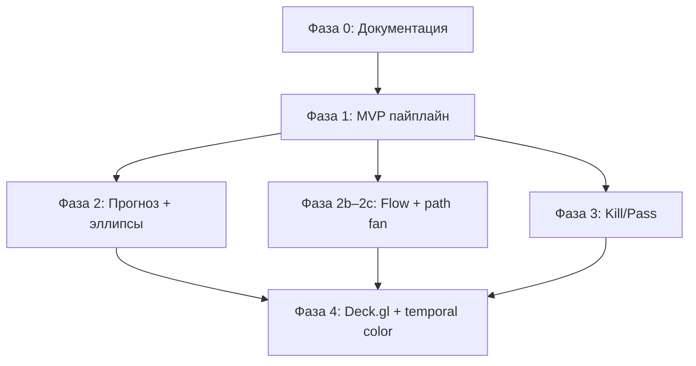
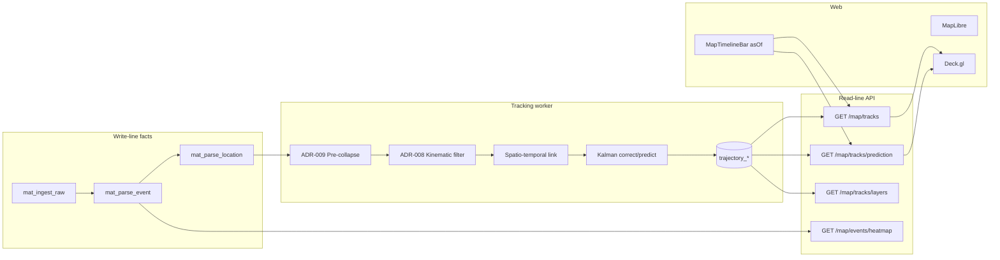

# Роадмеп: трекинг и прогнозирование OSINT «Радар»

Дата: 2026-06-12  
Статус: **Предложено** (документация зафиксирована, код — в фазах RFC)

---

## Vision

Платформа «Радар» накапливает разрозненные OSINT-точки (радар, визуально, перехват, взрывы) без жёстких ID объектов. Цель домена **tracking** — автоматически связать их в направленные траектории, оценить кинематику (скорость, курс) через фильтр Калмана и дать аналитику прогноза: где цель с вероятностью 95% находится прямо сейчас, пока радары молчат, и насколько эффективен перехват (сбития vs прорывы).

Домен **не расширяет** operational fold ([ADR-006](./adr-006-map-read-line-fold.md)); он строится поверх write-line facts (`mat_parse_location`, `mat_parse_event`) и read-line Time Machine (`asOf`).

---

## Текущее состояние кодовой базы

| Компонент | Статус |
|-----------|--------|
| Map read-line + Time Machine | **Готово** — [ADR-006](./adr-006-map-read-line-fold.md), `MapTimelineBar`, `GET /map/snapshot?asOf=` |
| Теплокарта событий | **Частично** — `GET /map/events/heatmap`, [event-heatmap.ts](../packages/shared/src/schemas/map/event-heatmap.ts); **нет** фильтра по `event_type` |
| Типы событий / категории | **Есть** — `mat_parse_event.event_type`, `extras.eventCategory` |
| Macro-отчёты | **Отдельная лента** — `GET /map/pvo-reports`, не связаны с траекториями |
| Kalman / треки / Deck.gl | **Отсутствуют** |

---

## Семь идей (аналитический паспорт)

| ID | Идея | Value | Документ | Фаза RFC | Статус |
|----|------|-------|----------|----------|--------|
| 1 | Фоновая сборка графа траекторий (Kalman) | Высокая | [ADR-007](./adr-007-trajectory-graph-kalman-worker.md) | 1 | Предложено |
| 2 | Мультимодальная селекция (кинематика vs статика) | Высокая | [ADR-008](./adr-008-kinematic-vs-static-events.md) | 1 | Предложено |
| 3 | Предварительное OSINT-схлопывание | Средняя / **критично для MVP** | [ADR-009](./adr-009-osint-pre-collapse.md) | 1 | Предложено |
| 4 | Визуализация эллипсов «Золушки» (ковариация P) | Высокая | [features/tracking-confidence-ellipse.md](./features/tracking-confidence-ellipse.md) | 2 | Предложено |
| 5 | Анализ эффективности перехвата (Kill / Pass) | Очень высокая | [ADR-010](./adr-010-pvo-kill-pass-layers.md) | 3 | Предложено |
| 6 | Временное цветовое кодирование (остывающие треки) | Средняя | [features/tracking-temporal-color.md](./features/tracking-temporal-color.md) | 4 | Предложено |
| 7 | Фильтрация тепловой карты по типу событий | Базовая | [features/tracking-heatmap-filter.md](./features/tracking-heatmap-filter.md) | 1 | Предложено |
| 8 | Flow-коридоры (P2P rollup, частотность) | Высокая | [ADR-013](./adr-013-trajectory-flow-and-path-fan.md), [features/tracking-flow-corridors.md](./features/tracking-flow-corridors.md) | 2b | Предложено |
| 9 | Historical path fan (вероятностные хвосты) | Высокая | [ADR-013](./adr-013-trajectory-flow-and-path-fan.md), [features/tracking-historical-path-fan.md](./features/tracking-historical-path-fan.md) | 2c | Предложено |

Фазы реализации: [rfc/tracking-pipeline-phases.md](./rfc/tracking-pipeline-phases.md).  
План / база SDD: [sdd/tracking/plan.md](./sdd/tracking/plan.md).

---

## Зависимости фаз



Внутри фазы 1 порядок строгий: **ADR-009 → ADR-008 → ADR-007 → Feature-007**.

---

## Рекомендуемый стек

| Слой | Технология |
|------|------------|
| Background worker | Node.js / TypeScript (`packages/worker`) |
| Математика | `kalman-filter` (Q от dt³, dt⁴) + `uuid` |
| SSOT домена | `packages/shared/src/domain/tracking/` |
| API read-side | NestJS + Zod (`packages/api`, `packages/shared`) |
| Карта (база) | MapLibre GL (уже в проекте) |
| Карта (треки) | Deck.gl — [ADR-011](./adr-011-deckgl-track-rendering.md) |

---

## Связь с существующим



- **Вход worker:** `mat_parse_location` с `lat`, `lon`, `occurred_at`, связь с `mat_parse_event`.
- **Time Machine:** `asOf` из [ADR-006](./adr-006-map-read-line-fold.md) — единый курсор для snapshot, треков и эллипсов прогноза.
- **Trust/precision:** иерархия точности при схлопывании — из накопителя [ADR-003](./adr-003-phase-enrichment-accumulator.md).

---

## MVP vs Post-MVP

| Scope | Фазы | Результат |
|-------|------|-----------|
| **MVP** | 0 + 1 | Треки в БД, API `GET /map/tracks`, heatmap с фильтром по типу |
| **Прогноз** | 2 | Эллипсы доверия при `asOf > lastObservation` |
| **Коридоры и fan** | 2b–2c | P2P flow rollup, historical path fan (без fork в Kalman) |
| **Kill/Pass аналитика** | 3 | Слои Kill / Pass / report density heatmap |
| **UX треков** | 4 | Deck.gl, остывающие линии, flow width, path fan |

---

## Следующий инженерный шаг

После фиксации документации (фаза 0):

1. **ADR-007 + ADR-009 + ADR-008** — доменная модель и порядок пайплайна.
2. **Базовый API `GET /map/tracks`** — контракт трека (nodes, velocity, status).
3. Параллельно: спека эллипса (Feature-004) и ADR-010 (Kill/Pass).

**Если выбирать между эллипсами и Kill/Pass после п.1–2:** сначала **Kill/Pass API** ([ADR-010](./adr-010-pvo-kill-pass-layers.md)) — не требует eig(P) и Deck.gl; эллипсы — следующий шаг для Time Machine.

---

## Карта документации

```
docs/
├── roadmap-tracking-forecasting.md   ← вы здесь
├── sdd/
│   ├── README.md                     ← индекс SDD
│   └── tracking/
│       ├── plan.md
│       └── phase-*.md                ← SDD фаз T1–T4
├── rfc/
│   └── tracking-pipeline-phases.md
├── adr-007-trajectory-graph-kalman-worker.md
├── adr-008-kinematic-vs-static-events.md
├── adr-009-osint-pre-collapse.md
├── adr-010-pvo-kill-pass-layers.md
├── adr-011-deckgl-track-rendering.md
├── adr-013-trajectory-flow-and-path-fan.md
└── features/
    ├── tracking-confidence-ellipse.md
    ├── tracking-temporal-color.md
    ├── tracking-heatmap-filter.md
    ├── tracking-flow-corridors.md
    └── tracking-historical-path-fan.md
```

### Принцип ADR vs Feature

| Тип | Когда |
|-----|-------|
| **ADR** | Архитектура, хранение, worker-пайплайн, границы слоёв |
| **Feature** | Read-side контракт, UX, алгоритм отрисовки без смены домена |
