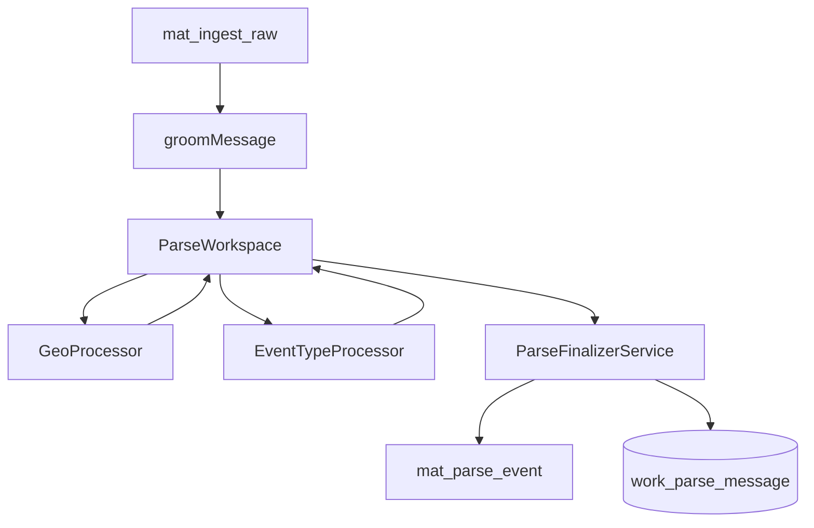

# SDD: Parse — Фаза P1 — Workspace table + Finalizer reconcile

Статус: **ready for implementation**  
RFC: [parse-processor-workspace.md](../../rfc/parse-processor-workspace.md)  
ADR: [012](../../adr-012-geo-scan-without-aliases.md), [003](../../adr-003-phase-enrichment-accumulator.md)

**Критерий входа:** P0 RFC ✅. Текущий `parsePost` / `RuleBasedEventClassifier` работает.

**Связь ODP:** EventTypeProcessor использует **тот же** `parser-rules.v1.yaml` (ODP D1).

---

## 1. Scope / Out of scope

### In scope

- Таблица `work_parse_message`
- `ParseWorkspace` Zod schema (shared)
- `ParseFinalizerService` — reconcile с первого дня (upsert + orphan sweep)
- Минимальный pipeline: grooming stub → GeoProcessor (ADR-012) → EventTypeProcessor → finalize
- Heal CLI: `parse-engine:workspace:finalize`, `parse-engine:workspace:heal`
- Интеграция в eager parse path (без big-bang: feature flag)

### Out of scope

- Trait processors Repeat/Mass (P2)
- Processor registry (P3)
- Semantic segmenter (P4)
- Полный block-context для multi-type per candidate (v1: `all_candidates`)
- `scope: system` — default **B** (extras на workspace, без synthetic event)

---

## 2. Зафиксированные решения (из RFC open questions)

| ID | Решение |
|----|---------|
| P1-O1 | Таблица: `work_parse_message` |
| P1-O2 | **Один active** workspace на `raw_message_id` (`status=finalized`); старые → `superseded` |
| P1-O3 | `orphanPolicy`: **`deactivate`** default; `hard_delete` только heal `--purge` |
| P1-O4 | Stable match key: **`candidate.id`** primary; fallback `(rawMessageId, span.start, anchor.kind, eventType)` |
| P1-O5 | Миграция: **parallel path** — flag `PARSE_WORKSPACE_ENABLED=1`, legacy path остаётся |

---

## 3. Архитектура

```text
mat_ingest_raw
  → groomMessage(text)           // v1: strip promo patterns (reuse geo grooming)
  → ParseWorkspace (in-memory)
  → GeoProcessor (spawn candidates, ADR-012)
  → EventTypeProcessor (ODP parser-rules pack)
  → ParseFinalizerService.finalize()
  → mat_parse_event + mat_parse_location
  → persist work_parse_message (JSONB + maps)
```



---

## 4. Контракты

### 4.1 Zod — `packages/shared/src/schemas/parse/parse-workspace.ts`

```typescript
export const messageBlockSchema = z.object({
  id: z.string(),
  kind: z.enum(["signal", "geo", "stats", "promo", "footer", "unknown"]),
  text: z.string(),
  span: z.object({ start: z.number(), end: z.number() }),
});

export const eventCandidateAnchorSchema = z.object({
  kind: z.enum(["place", "region", "system"]),
  name: z.string(),
  placeId: z.string().uuid().optional(),
  regionCode: z.string().optional(),
  lat: z.number().optional(),
  lon: z.number().optional(),
  span: z.object({
    start: z.number(),
    end: z.number(),
    matchedText: z.string(),
  }),
});

export const eventCandidateSchema = z.object({
  id: z.string(),
  anchor: eventCandidateAnchorSchema,
  eventType: z.string(),
  occurredAt: z.string().datetime().optional(),
  extras: z.record(z.unknown()).default({}),
  provenance: z.object({
    eventTypeSource: z.string(),
    anchorSource: z.string(),
    blockId: z.string().optional(),
  }),
});

export const parseWorkspaceSchema = z.object({
  schemaVersion: z.literal(1),
  rawMessageId: z.string().uuid(),
  groomedText: z.string(),
  blocks: z.array(messageBlockSchema),
  candidates: z.array(eventCandidateSchema),
  traitAttachments: z.array(z.unknown()).default([]),
  namespaces: z.record(z.unknown()).default({}),
  processorLog: z.array(z.object({
    id: z.string(),
    ok: z.boolean(),
    durationMs: z.number(),
  })),
});
```

### 4.2 Finalizer context

```typescript
export type FinalizeMode = "initial" | "refinalize" | "heal";

export type FinalizeContext = {
  mode: FinalizeMode;
  existingSpawnedIds: string[];
  candidateEventMap: Record<string, string>;
  orphanPolicy: "deactivate" | "hard_delete";
};

export type FinalizeResult = {
  inserted: number;
  updated: number;
  deactivated: number;
  deleted: number;
  spawnedEventIds: string[];
  candidateEventMap: Record<string, string>;
};
```

---

## 5. Миграция БД

```sql
CREATE TABLE work_parse_message (
  id uuid PRIMARY KEY DEFAULT gen_random_uuid(),
  raw_message_id uuid NOT NULL REFERENCES mat_ingest_raw(id) ON DELETE CASCADE,
  parser_revision text NOT NULL DEFAULT '1',
  status text NOT NULL DEFAULT 'draft'
    CHECK (status IN ('draft', 'finalized', 'superseded', 'invalid')),
  groomed_text text NOT NULL,
  workspace jsonb NOT NULL,
  spawned_event_ids uuid[] NOT NULL DEFAULT '{}',
  candidate_event_map jsonb NOT NULL DEFAULT '{}',
  finalized_at timestamptz,
  created_at timestamptz NOT NULL DEFAULT now()
);

CREATE UNIQUE INDEX work_parse_message_active_raw_idx
  ON work_parse_message (raw_message_id)
  WHERE status = 'finalized';
```

Wipe/rebuild: добавить таблицу в `geo-clean-rebuild` runbook.

---

## 6. Finalizer алгоритм (SSOT)

`packages/worker/src/domain/parse/ParseFinalizerService.ts`:

1. **Resolve** — для каждого candidate: map → UPDATE; fallback signature → UPDATE; else INSERT
2. **Upsert** — candidate + traits + geo (GeoPolicy v1: `strict` для kinematic types)
3. **Orphan sweep** — ids в `existingSpawnedIds` без candidate → deactivate/delete
4. **Invalid sweep** — candidate failed GeoPolicy → deactivate prior id
5. **Persist workspace row** — supersede previous `finalized`, set new maps

GeoPolicy table — copy from RFC § GeoPolicy (config v1 in TS, YAML v2).

---

## 7. Processors (P1 minimal)

| Processor | Type | Path |
|-----------|------|------|
| `GeoProcessor` | spawn | wrap existing geo scan (ADR-012) |
| `EventTypeProcessor` | enrich all | `classifyEventTypeFromPack(groomedText, odpPack)` |

EventType v1: один тип на **все** candidates (`all_candidates`).

---

## 8. Worker / CLI

```bash
npm run worker -- parse-engine:workspace:finalize --raw-id=<uuid>
npm run worker -- parse-engine:workspace:heal [--channel=] [--dry-run] [--purge]
```

Report: `{ updated, inserted, deactivated, deleted }`.

---

## 9. Тесты

| Fixture | Ожидание |
|---------|----------|
| GF-P1-01 Таганрог + область + опасность | 1 place candidate; facts: place + derived region |
| GF-P1-02 re-finalize LLM coords | same parsed_event_id UPDATE |
| GF-P1-03 3 candidates → 1 | 2 orphans deactivated |
| GF-P1-04 parity | legacy parse vs workspace path same event count |

Location: `packages/shared/src/domain/parse/__fixtures__/`

---

## 10. DoD checklist

- [ ] Migration applied; unique active index works
- [ ] Eager parse with flag writes workspace + facts
- [ ] Heal CLI reconcile без ручных SQL
- [ ] EventTypeProcessor reads ODP pack when D1 ready (fallback legacy)
- [ ] Golden fixtures green
- [ ] Runbook updated

---

## 11. Коммиты

| # | Содержание |
|---|------------|
| C1 | shared schemas + migration |
| C2 | ParseFinalizerService + unit tests |
| C3 | GeoProcessor + EventTypeProcessor + wire parse pipeline |
| C4 | heal CLI + feature flag + fixtures |
