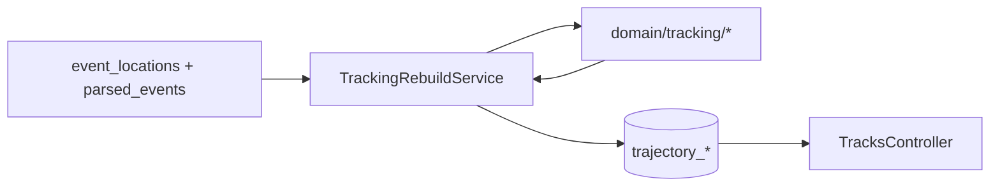

# SDD: Tracking — Фаза 1 — L1 MVP (Kalman backend)

Статус: **ready for implementation**  
Work packages: T1.1–T1.6  
ADR: [007](../../adr-007-trajectory-graph-kalman-worker.md), [008](../../adr-008-kinematic-vs-static-events.md)  
Feature: [heatmap filter](../../features/tracking-heatmap-filter.md)

---

## 1. Scope / Out of scope

### In scope

- Domain pure functions: link, Kalman, DISTINCT, gating, threat profiles, node mode
- Миграции `trajectory_tracks`, `trajectory_nodes`
- Worker `tracking:rebuild` (full rebuild v1)
- API `GET /map/tracks`, `GET /map/tracks/:id`
- Heatmap filter `eventType` / `eventCategory`
- Migration `status_dictionary.affects_kinematics`

### Out of scope

- UI слоя треков, Deck.gl
- Ellipse, flow, path fan, Kill/Pass
- Incremental checkpoint worker (v2)
- Realtime Kalman на parse
- MHT / track split в Kalman

---

## 2. Архитектура

### 2.1 Поток данных



### 2.2 L1 pipeline (SSOT)

```text
1. loadTrackingCandidates(since, until)
     JOIN event_locations, parsed_events, status_dictionary
     ORDER BY occurred_at ASC

2. for each candidate (streaming):
     profile  = resolveThreatProfile(eventType, extras)
     mode     = resolveNodeMode(...)

3. link phase (batch window or full sort):
     activeTracks = linkNodes(candidates, profileKinematics[profile])

4. for each attachment to track:
     if isDistinctDuplicate(lastNode, candidate): merge source_refs; continue
     if mode == attach_only: append node; continue
     if !innovationGate(kalmanState, candidate, profile): orphan or new track
     kalmanState = kalmanStep(state, obs, dt, R(precision, trust))

5. finalize track statuses (active | closed | stale)

6. persist (truncate+insert v1 OR upsert by rebuild generation)
```

---

## 3. Контракты

### 3.1 Zod — `packages/shared/src/schemas/map/tracks.ts`

```typescript
import { z } from "zod";

export const nodeModeSchema = z.enum(["correct", "attach_only"]);
export const trackStatusSchema = z.enum(["active", "closed", "stale"]);
export const threatProfileSchema = z.enum(["uav", "rocket", "balloon", "unknown"]);

export const sourceRefSchema = z.object({
  eventLocationId: z.string().uuid().optional(),
  parsedEventId: z.string().uuid().optional(),
  rawMessageId: z.string().uuid().optional(),
  text: z.string().optional(),
  channelId: z.string().optional(),
});

export const trajectoryNodeSchema = z.object({
  id: z.string().uuid(),
  seq: z.number().int().nonnegative(),
  occurredAt: z.string().datetime(),
  lat: z.number(),
  lon: z.number(),
  placeId: z.string().uuid().nullable(),
  mode: nodeModeSchema,
  sourceRefs: z.array(sourceRefSchema),
});

export const trajectoryTrackSchema = z.object({
  id: z.string().uuid(),
  status: trackStatusSchema,
  threatProfile: threatProfileSchema,
  firstAt: z.string().datetime(),
  lastAt: z.string().datetime(),
  lastLat: z.number(),
  lastLon: z.number(),
  velocityMs: z.number().nullable(),
  bearingDeg: z.number().nullable(),
  nodeCount: z.number().int().positive(),
  nodes: z.array(trajectoryNodeSchema).optional(),
});

export const tracksListQuerySchema = z.object({
  since: z.string().datetime().optional(),
  until: z.string().datetime().optional(),
  asOf: z.string().datetime().optional(),
  bbox: z.string().optional(), // "minLon,minLat,maxLon,maxLat"
  status: trackStatusSchema.optional(),
  threatProfile: threatProfileSchema.optional(),
  limit: z.coerce.number().int().min(1).max(5000).default(500),
});

export const tracksListResponseSchema = z.object({
  tracks: z.array(trajectoryTrackSchema),
  meta: z.object({
    asOf: z.string().datetime(),
    count: z.number().int(),
  }),
});
```

### 3.2 Domain types — `packages/shared/src/domain/tracking/types.ts`

```typescript
export type KalmanStateJson = {
  x: number;
  y: number;
  vx: number;
  vy: number;
  P: number[][]; // 4x4
};

export type TrackingCandidate = {
  eventLocationId: string;
  parsedEventId: string;
  occurredAt: Date;
  lat: number;
  lon: number;
  placeId: string | null;
  precision: string; // merge precision rank
  trust: number;
  eventType: string;
  eventCategory: string | null;
  affectsKinematics: boolean | null;
  threatProfile: ThreatProfile;
  mode: NodeMode;
  sourceRefs: SourceRef[];
};
```

### 3.3 API

| Method | Path | Описание |
|--------|------|----------|
| GET | `/map/tracks` | Список без nodes (summary) |
| GET | `/map/tracks/:id` | Полный трек + nodes + kalman на last node (internal/debug flag v2) |

**asOf semantics:**

- Filter nodes: `occurred_at <= asOf`
- Track included if `first_at <= asOf` and has ≥1 visible node
- `lastAt` / velocity в summary — от last visible node

---

## 4. Алгоритмы (SSOT modules)

### 4.1 `threatProfile.ts`

```typescript
/** Классификация профиля угрозы для link/Q gates. */
export function resolveThreatProfile(input: {
  eventType: string;
  eventCategory?: string | null;
  extras?: Record<string, unknown>;
}): ThreatProfile;
```

| eventType / signal | profile |
|--------------------|---------|
| rocket, missile, … | rocket |
| balloon, … | balloon |
| default movement/threat | uav |
| unknown | unknown → kinematics uav |

### 4.2 `profileKinematics.ts`

```typescript
export type ProfileKinematics = {
  maxVelocityMs: number;
  maxLinkDistanceM: number;
  maxGapMs: number;
  staleAfterMs: number;
  processNoiseScale: number;
};

export const PROFILE_KINEMATICS: Record<ThreatProfile, ProfileKinematics>;
```

| Profile | maxVelocityMs | maxLinkDistanceM | maxGapMs | staleAfterMs |
|---------|---------------|------------------|----------|--------------|
| uav | 80 | 15_000 | 30 min | 2h |
| rocket | 600 | 100_000 | 10 min | 1h |
| balloon | 15 | 5_000 | 60 min | 4h |
| unknown | 80 | 15_000 | 30 min | 2h |

### 4.3 `resolveNodeMode.ts` (ADR-008)

Приоритет: `affectsKinematics` → `eventCategory` → denylist.

### 4.4 `observationCovariance.ts`

```typescript
/** R 2×2 в метрах (local tangent) от precision + trust. */
export function observationCovarianceMeters(
  precision: MergePrecision,
  trust: number,
): { sigmaLatM: number; sigmaLonM: number };
```

| precision | σ base (m) |
|-----------|------------|
| locality_with_coords | 300 |
| locality | 2_000 |
| district | 8_000 |
| region | 50_000 |
| attribute / unknown | 15_000 |

Effective: `σ / sqrt(trust)`.

### 4.5 `isDistinctDuplicate.ts`

```typescript
export function isDistinctDuplicate(
  last: { lat: number; lon: number; placeId: string | null; occurredAt: Date; mode: NodeMode },
  candidate: TrackingCandidate,
  config: { windowMs: number },
): boolean;
```

**True если все:**

- `candidate.mode === correct` и last.mode === correct
- `Δt <= TRACKING_DISTINCT_WINDOW_MS` (600_000)
- `placeId` equal (if both non-null) **OR** haversine ≤ `distinctRadiusM(candidate.precision)`
- `distinctRadiusM`: max(500, σ from observationCovariance)

**Action:** merge `sourceRefs`, no new seq, no Kalman.

### 4.6 `linkNodes.ts`

Greedy v1 (sorted by time):

1. Maintain open tracks (last node + kalman state + profile).
2. For each candidate (mode any):
   - Score open tracks: Δt ≤ maxGapMs, distance ≤ maxLinkDistanceM, bearing consistency optional v1.
   - Pick best score; if none → new track.
3. Multi-child не materialize в L1 — только best match (fork → L2 fan).

### 4.7 `innovationGate.ts`

```typescript
export type GateResult = { accept: true } | { accept: false; reason: string };

export function innovationGate(
  state: KalmanStateJson,
  observation: { lat: number; lon: number; occurredAt: Date },
  R: { sigmaLatM: number; sigmaLonM: number },
  profile: ProfileKinematics,
  config: { chi2Threshold: number },
): GateResult;
```

- Predict state to `observation.occurredAt`
- Mahalanobis² < `TRACKING_GATE_CHI2` (9.21 ≈ 99% 2D)
- Rear-front: `(Δpos · v̂) < -rearThresholdM` → reject (`reason: "rear_front"`)

Rejected kinematic candidate → **new track** (v1), не silent drop.

### 4.8 `kalmanStep.ts`

- Lib: `kalman-filter` npm
- State 4D `[x,y,vx,vy]`, observation 2D position
- Q from `dt` (dt³, dt⁴) × `profile.processNoiseScale`
- Export updated state + P

### 4.9 `buildTrackMetadata.ts`

- `velocityMs = hypot(vx, vy)`
- `bearingDeg` from vx, vy
- `status`:
  - `active` if last kinematic within staleAfterMs
  - `closed` if last node kinematic and gap > staleAfterMs
  - `stale` if only attach_only at tail

---

## 5. Миграции

Файл: `packages/api/src/migrations/XXXX-TrajectoryTrackingL1.ts`

### 5.1 `trajectory_tracks`

```sql
CREATE TABLE trajectory_tracks (
  id              uuid PRIMARY KEY DEFAULT gen_random_uuid(),
  status          text NOT NULL CHECK (status IN ('active','closed','stale')),
  threat_profile  text NOT NULL DEFAULT 'unknown',
  first_at        timestamptz NOT NULL,
  last_at         timestamptz NOT NULL,
  last_lat        double precision NOT NULL,
  last_lon        double precision NOT NULL,
  velocity_ms     double precision,
  bearing_deg     double precision,
  node_count      int NOT NULL DEFAULT 0,
  rebuild_gen     bigint NOT NULL DEFAULT 0,
  created_at      timestamptz NOT NULL DEFAULT now(),
  updated_at      timestamptz NOT NULL DEFAULT now()
);

CREATE INDEX idx_trajectory_tracks_last_at ON trajectory_tracks (last_at DESC);
CREATE INDEX idx_trajectory_tracks_status ON trajectory_tracks (status);
CREATE INDEX idx_trajectory_tracks_bbox ON trajectory_tracks (last_lat, last_lon);
```

### 5.2 `trajectory_nodes`

```sql
CREATE TABLE trajectory_nodes (
  id                  uuid PRIMARY KEY DEFAULT gen_random_uuid(),
  track_id            uuid NOT NULL REFERENCES trajectory_tracks(id) ON DELETE CASCADE,
  seq                 int NOT NULL,
  occurred_at         timestamptz NOT NULL,
  lat                 double precision NOT NULL,
  lon                 double precision NOT NULL,
  place_id            uuid REFERENCES places(id) ON DELETE SET NULL,
  mode                text NOT NULL CHECK (mode IN ('correct','attach_only')),
  event_location_id   uuid REFERENCES event_locations(id) ON DELETE SET NULL,
  kalman_state        jsonb,
  source_refs         jsonb NOT NULL DEFAULT '[]',
  created_at          timestamptz NOT NULL DEFAULT now(),
  UNIQUE (track_id, seq)
);

CREATE INDEX idx_trajectory_nodes_track_seq ON trajectory_nodes (track_id, seq);
CREATE INDEX idx_trajectory_nodes_occurred_at ON trajectory_nodes (occurred_at);
CREATE INDEX idx_trajectory_nodes_place_id ON trajectory_nodes (place_id) WHERE place_id IS NOT NULL;
CREATE UNIQUE INDEX idx_trajectory_nodes_event_location
  ON trajectory_nodes (event_location_id) WHERE event_location_id IS NOT NULL;
```

### 5.3 `status_dictionary`

```sql
ALTER TABLE status_dictionary
  ADD COLUMN IF NOT EXISTS affects_kinematics boolean;
```

### 5.4 TypeORM entities

- `packages/api/src/map/entities/trajectory-track.entity.ts`
- `packages/api/src/map/entities/trajectory-node.entity.ts`

---

## 6. Worker / CLI

### 6.1 `TrackingRebuildService`

Path: `packages/worker/src/application/tracking/trackingRebuildService.ts`

```typescript
export type RebuildOptions = {
  since?: Date;
  until?: Date;
  dryRun?: boolean;
  batchSize?: number;
};

export async function rebuildTrajectoryTracks(opts: RebuildOptions): Promise<RebuildReport>;
```

**RebuildReport:**

```typescript
type RebuildReport = {
  candidatesLoaded: number;
  tracksCreated: number;
  nodesCreated: number;
  distinctSkipped: number;
  gateRejected: number;
  placeIdCoveragePct: number;
  durationMs: number;
};
```

**Persist strategy v1:**

1. Increment `rebuild_gen`
2. Insert new tracks/nodes with current gen
3. Delete rows where `rebuild_gen < current` (transaction)

### 6.2 CLI

`packages/worker/src/cli/trackingRebuildCli.ts`

```bash
npm run worker -- tracking:rebuild [--since ISO] [--until ISO] [--dry-run]
```

Register in worker command catalog + [phase-commands.md](../../phase-commands.md).

### 6.3 Loader SQL

`packages/worker/src/application/tracking/loadTrackingCandidates.ts`

```sql
SELECT el.id, el.parsed_event_id, el.occurred_at, el.lat, el.lon, el.place_id, el.precision,
       pe.event_type, pe.extras, sd.affects_kinematics
FROM event_locations el
JOIN parsed_events pe ON pe.id = el.parsed_event_id
LEFT JOIN status_dictionary sd ON sd.code = pe.event_type
WHERE el.lat IS NOT NULL AND el.lon IS NOT NULL
  AND el.occurred_at >= :since AND el.occurred_at < :until
ORDER BY el.occurred_at ASC;
```

---

## 7. API implementation

### 7.1 Files

- `packages/api/src/map/tracks.controller.ts`
- `packages/api/src/map/tracks-query.service.ts`
- Register routes in `map.module.ts`

### 7.2 `TracksQueryService`

- `listTracks(query)` — summary без nodes
- `getTrackById(id, asOf?)` — with nodes
- bbox filter на `last_lat/last_lon` или node coords (document: last point v1)

### 7.3 Heatmap (T1.5)

Extend `MapQueryService.getEventsHeatmapGeoJson` + `eventHeatmapQuerySchema`.

---

## 8. Тесты

### 8.1 Unit (`packages/shared/src/domain/tracking/*.test.ts`)

| Module | Cases |
|--------|-------|
| resolveNodeMode | GF-03 table ADR-008 |
| isDistinctDuplicate | GF-01 |
| observationCovariance | monotonic σ by precision |
| innovationGate | GF-04 rear-front |
| linkNodes | GF-05 profiles |
| kalmanStep | dt=0 guard, Q scale |
| buildTrackMetadata | status transitions |

### 8.2 Golden fixtures

`__fixtures__/gf-01-distinct-three-channels.json` — input candidates → expected nodes count.

### 8.3 Integration

`packages/api/src/map/tracks-query.service.integration.test.ts`:

1. Seed event_locations fixture
2. Run rebuild (or insert trajectory_* directly)
3. GET /map/tracks assert Zod + counts

---

## 9. DoD checklist

- [ ] All domain modules + unit tests green
- [ ] Migration up/down on clean DB
- [ ] `tracking:rebuild` on prod-like sample → report with placeIdCoveragePct
- [ ] GF-01..GF-05 pass
- [ ] API Swagger updated
- [ ] Heatmap filters backward compatible
- [ ] `npm run typecheck` + lint monorepo
- [ ] Docs: phase-commands entry for CLI

---

## 10. Риски

| Риск | Митигация |
|------|-----------|
| Full rebuild slow | batch insert; index later |
| Greedy link errors | v2 Hungarian / JPDA backlog |
| Sparse place_id | report metric; L2 blocked until D8 |
| Kalman lib API drift | wrap in kalmanStep only |

---

## 11. Коммиты

| # | Содержание |
|---|------------|
| C1 | shared domain + tests + zod schemas |
| C2 | migration + entities |
| C3 | worker rebuild + CLI |
| C4 | API tracks + heatmap filter |
