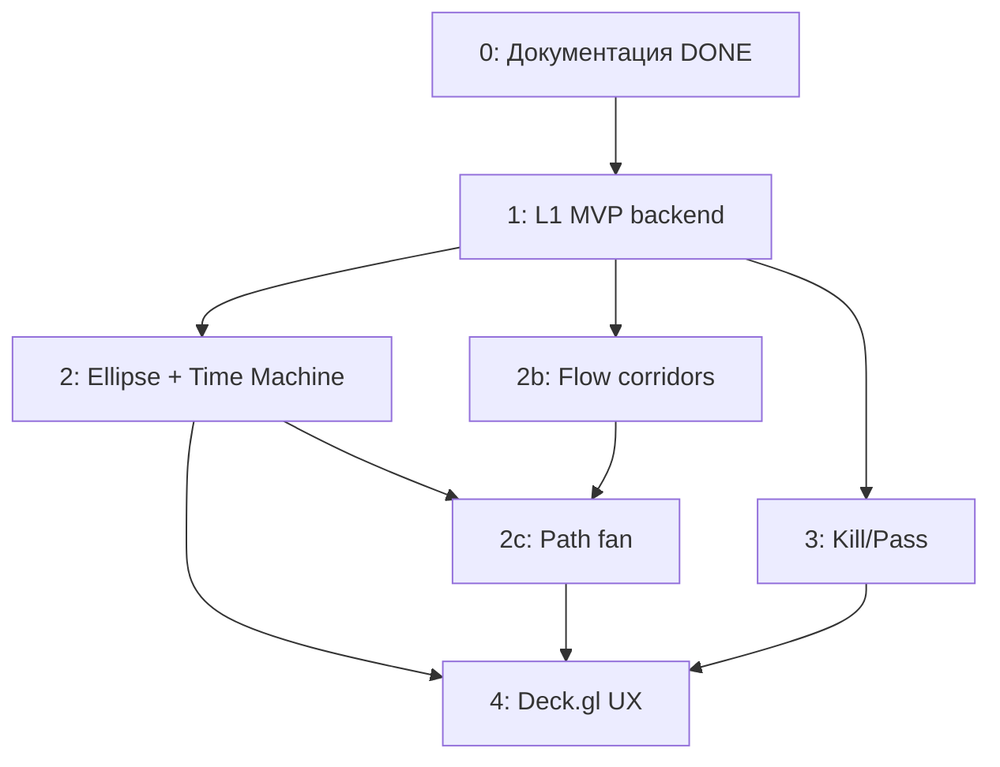

# RFC: Tracking — план реализации (база для SDD)

Статус: **черновик планирования** (2026-06-14)  
Назначение: **не потерять договорённости** из обсуждения; основа для детального SDD по фазам.

См. также: [roadmap](../../roadmap-tracking-forecasting.md), [tracking-pipeline-phases](../../rfc/tracking-pipeline-phases.md), [ADR-013](../../adr-013-trajectory-flow-and-path-fan.md).  
Индекс SDD: [../README.md](../README.md).

---

## Как использовать этот документ

| Этап | Действие |
|------|----------|
| **Сейчас** | SDD по фазам: [README.md](./README.md) |
| **Спринт** | Work package из SDD фазы → задачи в tracker |
| **Ревью** | DoD checklist в конце каждого SDD |

**SDD (полный комплект):**

| Фаза | Документ |
|------|----------|
| 1 | [phase-1-l1-mvp.md](./phase-1-l1-mvp.md) |
| 2 | [phase-2-ellipse-prediction.md](./phase-2-ellipse-prediction.md) |
| 2b | [phase-2b-flow-corridors.md](./phase-2b-flow-corridors.md) |
| 2c | [phase-2c-path-fan.md](./phase-2c-path-fan.md) |
| 3 | [phase-3-kill-pass.md](./phase-3-kill-pass.md) |
| 4 | [phase-4-deckgl-ux.md](./phase-4-deckgl-ux.md) |

Шаблон SDD (исторический) — см. ниже; фазы развёрнуты в [sdd/tracking/](./README.md).

```markdown
# SDD: Tracking — Фаза X.Y — <название>
## Scope / Out of scope
## Контракты (Zod, API, БД)
## Алгоритмы (SSOT paths)
## Миграции
## Worker / CLI
## Тесты (unit, golden, integration)
## DoD checklist
## Риски
```

---

## 1. Архитектурная модель (зафиксировано)

### 1.1 Три слоя данных

```text
Write-line facts          Tracking worker (L1)           Read projections (L2/L2b)
─────────────────         ─────────────────────          ──────────────────────────
mat_parse_location      →    mat_track/nodes    →    /map/tracks
mat_parse_event             Kalman state                      /map/tracks/prediction
places.place_id           threat_profile                    /map/tracks/flow
                                                            /map/tracks/:id/path-fan
```

### 1.2 L1 pipeline (attention assign + Kalman)

```text
load mat_parse_location (pipeline types, geo required, consumed guard)
  → stdbscanDedup (per profile)
  → buildAttentionMatrix()          // linkCost = D_M² / timeDecay
  → assignCandidates (Phase B/C)      // in-locus / soft / seed / intercept
  → resolveNodeMode()               // ADR-008: correct | attach_only
  → innovationGate() → kalmanStep() // full S = H·P·Hᵀ + R
  → persist trajectory_*
```

**Fork / бифуркация — controlled Q only** (soft-assign mutation), не отдельный Kalman fork.  
Подробнее: [phase-1c-attention-assign.md](./phase-1c-attention-assign.md).

### 1.3 L2 pipeline (read projection)

```text
mat_track_node (with place_id)
  → buildTrackEdges()               // P2P segments
  → rollupSegmentCounts()           // flow corridors
  → indexPlaceOccurrences()         // v2: path fan index
```

### 1.4 Пересмотр ADR-009

| Было (ADR-009 v1) | Стало (согласовано) |
|-------------------|---------------------|
| Heavy pre-collapse 10 min / 15 km | **DISTINCT** + **R(precision)** + **gating** |
| Winner координат до Kalman | Вес observation в Kalman |
| Отдельный collapseOsintNodes | Опциональный minimal temporal batch (backlog) |

ADR-009 **не удалять** — пометить «частично superseded» при SDD фазы 1.

---

## 2. Зависимости и порядок фаз



**Параллельно после P1:** P2, P2b, P3 — разные коммиты.  
**Рекомендация приоритета post-MVP:** P2b (flow) → P3 (Kill/Pass) → P2c (fan) → P4 (Deck.gl).

---

## 3. Карта пакетов (SSOT код)

| Домен | Путь |
|-------|------|
| L1 pure | `packages/shared/src/domain/tracking/` |
| L2 pure | `packages/shared/src/domain/tracking/flow/` |
| Zod API | `packages/shared/src/schemas/map/tracks*.ts` |
| Worker jobs | `packages/worker/src/application/tracking/` |
| CLI | `packages/worker/src/cli/tracking*.ts` |
| API | `packages/api/src/map/tracks*.ts` |
| UI | `packages/web/src/widgets/geo-map/` |

---

## 4. Work packages (эпики → SDD)

### Фаза 0 — Документация ✅

| ID | Deliverable | Статус |
|----|-------------|--------|
| T0.1 | ADR-007..011, roadmap | done |
| T0.2 | ADR-013 + features flow/fan | done |
| T0.3 | RFC + SDD комплект | done |

---

### Фаза 1 — L1 MVP (backend)

**Цель:** материализованные треки + heatmap filter. **Без UI треков.**

#### T1.1 — Domain SSOT (shared)

| Задача | Модуль | Тесты |
|--------|--------|-------|
| Threat profiles | `threatProfile.ts`, `profileKinematics.ts` | unit: uav/rocket/balloon gates |
| Node mode | `resolveNodeMode.ts` (ADR-008) | unit: pvo→attach, radar→correct |
| Observation R | `observationCovariance.ts` | unit: precision ranks → σ |
| DISTINCT | `isDistinctDuplicate.ts` | golden: 3 канала same place |
| Link | `linkNodes.ts` | golden: gap, max distance per profile |
| Gate | `innovationGate.ts` | golden: rear-front reject |
| Kalman | `kalmanStep.ts` | unit: dt, Q scale |
| Build track | `buildTrackMetadata.ts` | unit: velocity, bearing, status |

**DoD:** `npm test` green; нет I/O в domain.

#### T1.2 — БД и миграции

| Таблица | Ключевые поля |
|---------|---------------|
| `mat_track` | status, first_at, last_at, velocity_ms, bearing_deg, threat_profile |
| `mat_track_node` | track_id, seq, place_id, mode, kalman_state jsonb, source_refs |

Индексы: `(track_id, seq)`, `(occurred_at)`, `(place_id)`, `(event_location_id)`.

**DoD:** migration up/down; entities TypeORM.

#### T1.3 — Worker

| Job | Описание |
|-----|----------|
| `tracking:rebuild` | full rebuild из mat_parse_location, идемпотентный |
| checkpoint | watermark по `occurred_at` (v1: full only) |

CLI: `tracking:rebuild --since --until --dry-run`.

**DoD:** rebuild на test fixture → N tracks в БД.

#### T1.4 — API

| Endpoint | Контракт |
|----------|----------|
| `GET /map/tracks` | list, query: since/until/asOf/bbox/status/limit |
| `GET /map/tracks/:id` | full track + nodes |

Zod: `TrajectoryTrack`, `TrajectoryNode`.

**DoD:** Swagger; integration test read after rebuild.

#### T1.5 — Heatmap filter (Feature-007)

`GET /map/events/heatmap?eventType=&eventCategory=`

**DoD:** фильтр работает; не ломает существующий heatmap.

#### T1.6 — status_dictionary migration (ADR-008)

Поле `affects_kinematics boolean` на event_type.

---

**Фаза 1 — общий DoD**

- [ ] Worker rebuild идемпотентен
- [ ] DISTINCT режет cross-channel same-place дубли
- [ ] Статичная точка (`attach_only`) посередине трека не обнуляет velocity
- [ ] `place_id` пишется на node где есть в mat_parse_location
- [ ] typecheck + lint green
- [ ] **Без** Deck.gl, flow, fan, Kill/Pass UI

**Коммиты (рекомендация):** T1.1+T1.2 → T1.3 → T1.4 → T1.5

---

### Фаза 2 — Ellipse + Time Machine

#### T2.1 — Domain

`covarianceEllipse.ts` — eig(P) → polygon ring.

#### T2.2 — API

`GET /map/tracks/prediction?asOf=` — GeoJSON polygons для active tracks.

#### T2.3 — Web (minimal)

MapLibre layer `prediction-ellipse`; bind `historicalAsOf$`.

**DoD:** ползунок вперёд → ellipse; pause 9h → controlled Q blow-up.

---

### Фаза 2b — Flow corridors

#### T2b.1 — Domain

`flow/buildTrackEdges.ts`, `flow/rollupSegmentCounts.ts`.

#### T2b.2 — БД

`trajectory_edges`, `trajectory_segment_rollup`.

#### T2b.3 — Worker

`tracking:materialize-edges`, `tracking:rollup-flow` после rebuild.

#### T2b.4 — API

`GET /map/tracks/flow?asOf=&minCount=&threatProfile=&bbox=`

#### T2b.5 — Web (optional v0)

MapLibre line-width от count (до Deck.gl).

**DoD:** 3 трека через A→B → одна толстая артерия count≥3.

---

### Фаза 2c — Historical path fan

#### T2c.1 — Domain

`flow/extractPathSuffixes.ts`, `flow/aggregatePathFan.ts`, `pathSignature.ts`.

#### T2c.2 — Index

`trajectory_place_index` (materialized v2) или on-read v1.

#### T2c.3 — API

`GET /map/tracks/:id/path-fan?n=&topK=&asOf=`

#### T2c.4 — Web

Fan layer + legend; показ только при active + future asOf.

**DoD:** 2 historical suffix → 2 ветки, разный count; asOf назад уменьшает counts.

---

### Фаза 3 — Kill/Pass (ADR-010)

#### T3.1 — Domain

`classifyTrackSegments.ts` — kill / pass / body.

#### T3.2 — API

`GET /map/tracks/layers?layer=kill|pass|pvo_heatmap`

#### T3.3 — Web

MapLibre layers; toggle в MapLayersPanel.

**DoD:** golden pass through PVO zone; golden kill terminal in zone.

---

### Фаза 4 — Deck.gl UX (ADR-011)

#### T4.1 — Infra

`@deck.gl/mapbox` overlay на geo-map.

#### T4.2 — Layers

TripsLayer (temporal color), PathLayer (flow width), PathLayer (fan dashed), GeoJsonLayer (ellipse).

#### T4.3 — SSOT timeline

`historicalAsOf$` → tracks + prediction + flow + fan.

**DoD:** 150k points/month scannable; toggles flow/fan/tracks.

---

## 5. Golden fixtures (SSOT тест-данные)

Создать `packages/shared/src/domain/tracking/__fixtures__/`:

| ID | Сценарий | Проверяет |
|----|----------|-----------|
| GF-01 | 3 канала, same place, 2 min | DISTINCT → 1 node |
| GF-02 | 2 канала, different coords same incident | R weighting, no absurd v |
| GF-03 | PVO node mid-track | velocity preserved (attach_only) |
| GF-04 | Rear observation | innovationGate reject |
| GF-05 | uav vs rocket link thresholds | profile gates |
| GF-06 | 3 tracks share A→B edge | rollup count=3 |
| GF-07 | Anchor P, 2 suffix paths | path fan counts |
| GF-08 | asOf in past | flow/fan counts decrease |
| GF-09 | Track through PVO zone continues | pass segment |
| GF-10 | Track ends in PVO zone | kill node |

---

## 6. Открытые решения — **зафиксированы в SDD**

См. [README.md](./README.md) § «Зафиксированные решения (D1–D8)».

| # | Default |
|---|---------|
| D1 | DISTINCT radius = f(precision) |
| D2 | 10 min |
| D3 | per threat profile |
| D4 | closed after 2h |
| D5 | minCount = 2 |
| D6 | n = 5 nodes |
| D7 | materialized rollup |
| D8 | L2b if place_id coverage ≥ 60% |

---

## 7. Конфиг (env)

| Key | Default | Фаза |
|-----|---------|------|
| `TRACKING_DISTINCT_WINDOW_MS` | 600000 | 1 |
| `TRACKING_DISTINCT_RADIUS_M` | 500 | 1 |
| `TRACKING_GATE_CHI2` | 9.21 | 1 |
| `TRACKING_PROFILE_DEFAULT` | uav | 1 |
| `TRACKING_REBUILD_SINCE` | — | 1 |
| `TRACKING_FLOW_MIN_COUNT` | 2 | 2b |
| `TRACKING_FAN_SUFFIX_N` | 5 | 2c |
| `TRACKING_FAN_TOP_K` | 10 | 2c |

---

## 8. Риски

| Риск | Митигация |
|------|-----------|
| place_id sparse | метрика coverage; L2 только place-based |
| region-level places → fat corridors | min precision filter на L2 |
| rebuild slow | checkpoint incremental v2; index place_id |
| parse workspace меняет events | tracking rebuild идемпотентен от facts |

---

## 9. Связь с parse RFC

[parse-processor-workspace](../../rfc/parse-processor-workspace.md) **не блокирует** фазу 1 tracking, но улучшает:

- стабильные `parsed_event_id` / `place_id`
- per-candidate `eventType` для ADR-008

Tracking читает только **facts** после finalize.

---

## Operational Domain Profile (ADR-014)

Вынос домена БПЛА из хардкода: parser rule packs, UI presets, threat mapping — см. [adr-014-operational-domain-profile.md](../../adr-014-operational-domain-profile.md).  
Data skeleton: [data/domains/](../../../data/domains/README.md).

---

## 10. Следующий шаг (реализация)

1. **Фаза 1** — [phase-1-l1-mvp.md](./phase-1-l1-mvp.md): domain + fixtures → migration → worker → API.
2. Параллельно после P1: SDD 2b / 3 по приоритету продукта.
3. Deck.gl — последним (фаза 4), после стабилизации API.

---

## См. также

- [tracking-pipeline-phases.md](../../rfc/tracking-pipeline-phases.md) — фазы и DoD
- [ADR-007](../../adr-007-trajectory-graph-kalman-worker.md) — L1 storage
- [ADR-008](../../adr-008-kinematic-vs-static-events.md) — node mode
- [ADR-009](../../adr-009-osint-pre-collapse.md) — legacy collapse (partial supersede)
- [ADR-013](../../adr-013-trajectory-flow-and-path-fan.md) — L2/L2b
- [ADR-010](../../adr-010-pvo-kill-pass-layers.md) — Kill/Pass
- [ADR-011](../../adr-011-deckgl-track-rendering.md) — Deck.gl
